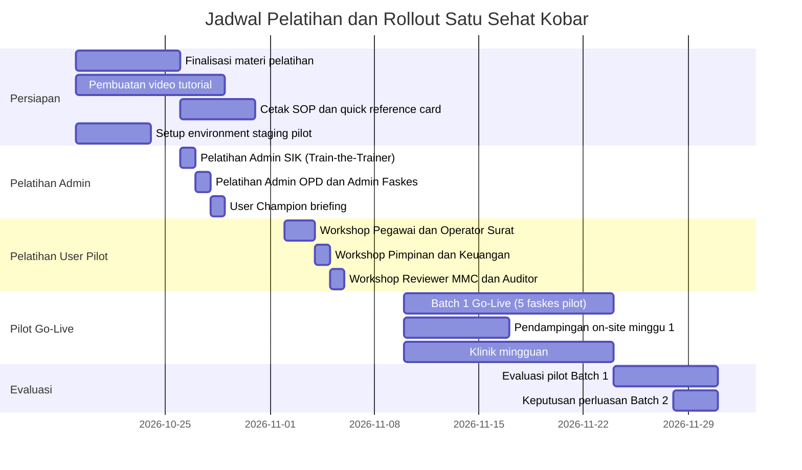

# Training and Rollout Plan — Satu Sehat Kobar

**Versi:** 1.5
**Tanggal:** Juni 2026
**Status:** Active
**Berlaku untuk:** Sprint 6 + Pilot (Nov 2026) dan Rollout Lanjutan

---

## 1. Strategi Pelatihan

### 1.1 Pendekatan Cascade Training

Pelatihan dilakukan secara bertahap menggunakan pendekatan **cascade** agar pengetahuan menyebar secara terstruktur dan terukur:

```
Tim SIK (Trainer Utama)
  → Admin OPD / Admin Faskes (Trainer Unit)
    → User Champion per unit/faskes (Peer Trainer)
      → End User (Pegawai, Operator, Pimpinan)
```

Setiap level harus melewati evaluasi sebelum menjadi trainer bagi level berikutnya.

### 1.2 Format Pelatihan

| Format | Keterangan | Kapan Digunakan |
|--------|------------|-----------------|
| Workshop langsung | Tatap muka, demonstrasi, praktik di sistem nyata/staging | Pelatihan Admin dan User Champion |
| Modul online | Video tutorial per fitur, dapat ditonton ulang | Semua level, terutama untuk referensi |
| SOP cetak | Quick reference card 1 halaman per role, dibawa saat bekerja | Semua user, dibagikan saat workshop |
| Pendampingan on-site | Tim SIK hadir di unit/faskes selama minggu pertama go-live | Batch 1 pilot |
| Klinik mingguan | Sesi tanya jawab via video call setiap Jumat | Selama masa pilot |

### 1.3 Prinsip Pelatihan

1. **Role-based** — Materi disesuaikan ketat dengan role masing-masing, tidak semua user belajar semua fitur
2. **Praktik langsung** — User mencoba skenario nyata di environment staging, bukan hanya menonton
3. **Data aman** — Pelatihan menggunakan data dummy, bukan data produksi real
4. **Tidak melebar dari MVP** — Pelatihan tidak membahas integrasi Phase 2 yang belum ada
5. **Feedback dicatat** — Masukan user selama pelatihan dipilah: bug, perbaikan UX, SOP, atau backlog
6. **Evaluasi terukur** — Keberhasilan diukur dari post-test dan observasi penggunaan sistem 2 minggu setelah pelatihan

---

## 2. Segmen Pelatihan per Role

| Role | Materi Pelatihan Utama | Durasi | Format | Prasyarat |
|------|------------------------|--------|--------|-----------|
| Admin SIK | Setup sistem, user management, konfigurasi plugin, backup/restore, monitoring, reset password | 1 hari (8 jam) | Workshop + praktik | Akses wrangler CLI, akun Cloudflare |
| Admin OPD | Master data pengguna, kelola role, template dokumen, konfigurasi penomoran surat | 4 jam | Workshop + praktik | Akun Admin OPD aktif |
| Admin Faskes | Master data faskes, kelola user faskes, template dokumen faskes | 4 jam | Workshop + praktik | Akun Admin Faskes aktif |
| Operator Surat | Generate PDF ST/SPPD, nomor surat, upload dokumen final bertanda tangan | 3 jam | Workshop + praktik | Akun Operator Surat aktif, ST sudah approved |
| Pegawai / Pelaksana | Buat agenda, buat ST dari agenda, buat ST manual, isi SPPD, upload bukti, lihat jurnal | 3 jam | Workshop + praktik | Akun Pegawai aktif |
| Atasan Langsung | Menyetujui atau mengembalikan ST, melihat antrian approval, dashboard tim | 2 jam | Workshop + demo | Akun Atasan aktif |
| Kabid / Sekretaris / Kadis | Antrian approval senior, approval dengan catatan, penolakan dengan alasan, dashboard kepemimpinan | 2 jam | Workshop + demo | Akun Kabid/Sekretaris/Kadis aktif |
| Keuangan | Validasi rincian SPPD berbiaya, menyetujui atau mengembalikan dengan catatan anggaran | 2 jam | Workshop + demo | Akun Keuangan aktif |
| Reviewer MMC | Draft publikasi MMC, review konten, penghapusan data sensitif sebelum publish | 2 jam | Workshop + praktik | Akun Reviewer MMC aktif |
| Kepala Faskes / Kepala TU Faskes | Approval ST faskes, monitoring kegiatan faskes, dashboard faskes | 2 jam | Workshop + demo | Akun Kepala Faskes aktif |
| Auditor | Akses audit trail, filter log per user/aksi/waktu, unduh laporan audit | 1 jam | Demo + panduan | Akun Auditor aktif (read-only) |

---

## 3. Jadwal Rollout (Sprint 6 + Pilot)



---

## 4. Strategi Rollout Bertahap

### 4.1 Batch 1 — Pilot Terbatas

**Peserta:** 5 faskes terpilih + Dinas Kesehatan Pusat (kantor Kobar)
**Timeline:** November 2026 (Sprint 6 + 2 minggu pasca-sprint)
**Tujuan:** Validasi sistem di kondisi nyata dengan volume terbatas

Faskes pilot dipilih berdasarkan kriteria:
- Memiliki Admin Faskes yang sudah terlatih
- Memiliki volume ST/SPPD minimal (tidak terlalu sepi, tidak terlalu ramai)
- Pimpinan faskes mendukung pilot
- Tim SIK dapat menjangkau faskes untuk pendampingan

**Dukungan selama Batch 1:**
- Pendampingan on-site minggu pertama
- Grup WhatsApp khusus pilot (Tim SIK + User Champion Batch 1)
- Klinik mingguan setiap Jumat jam 13:00-14:00

### 4.2 Batch 2 — Ekspansi Puskesmas

**Peserta:** Semua puskesmas Kabupaten Kotawaringin Barat
**Timeline:** Desember 2026 – Januari 2027 (jika Batch 1 memenuhi kriteria)
**Tujuan:** Skalasi ke seluruh puskesmas

### 4.3 Batch 3 — Faskes Swasta Mitra

**Peserta:** Faskes swasta yang bermitra dengan Dinkes Kobar
**Timeline:** Q1 2027
**Tujuan:** Perluasan ke ekosistem faskes mitra

### 4.4 Kriteria Naik ke Batch Berikutnya

Batch berikutnya hanya dibuka jika batch sebelumnya memenuhi:

| Kriteria | Target |
|----------|--------|
| User aktif batch sebelumnya | ≥ 80% user terdaftar login minimal 1x per minggu |
| Bug P1 terbuka | 0 bug critical terbuka |
| Bug P2 terbuka | ≤ 3 bug high, semua sedang ditangani |
| Kepuasan user (survey) | ≥ 70% menyatakan sistem mudah digunakan |
| Alur utama berjalan | 100% skenario Must Have UAT dapat dilakukan user nyata |
| Persetujuan | Product Owner menyetujui perluasan secara tertulis |

---

## 5. Materi Pelatihan (Daftar Lengkap)

### 5.1 Dokumen SOP

| Dokumen | Format | Untuk Role |
|---------|--------|------------|
| SOP Pegawai — Buat Agenda dan ST | PDF + cetak | Pegawai, Pelaksana |
| SOP Pegawai — Upload Bukti dan Laporan | PDF + cetak | Pegawai, Pelaksana |
| SOP Atasan — Approval ST | PDF + cetak | Atasan Langsung, Kabid, Sekretaris, Kadis |
| SOP Operator Surat — Generate dan Upload PDF | PDF + cetak | Operator Surat |
| SOP Keuangan — Validasi SPPD | PDF + cetak | Keuangan |
| SOP Admin — Kelola User dan Template | PDF + cetak | Admin OPD, Admin Faskes |
| SOP Auditor — Audit Trail | PDF + cetak | Auditor |

### 5.2 Video Tutorial

| Video | Durasi Estimasi | Topik |
|-------|----------------|-------|
| 01 — Login dan Navigasi Dasar | 5 menit | Login, dashboard, logout, reset password |
| 02 — Membuat Agenda Kegiatan | 8 menit | Input agenda, tambah peserta, lampiran |
| 03 — Membuat ST dari Agenda | 8 menit | Wizard ST, pilih agenda, input peserta, submit |
| 04 — Membuat ST Manual | 6 menit | ST tanpa agenda, input manual |
| 05 — Proses Approval ST | 8 menit | Menerima notifikasi, review, approve/tolak/revisi |
| 06 — Generate dan Download PDF | 5 menit | Generate PDF ST/SPPD, download, verifikasi |
| 07 — Upload Dokumen Final Bertanda Tangan | 5 menit | Upload PDF final, format yang diterima |
| 08 — Upload Bukti Tugas | 6 menit | Upload foto/dokumen bukti, semua peserta bisa upload |
| 09 — Dashboard dan Jurnal | 5 menit | Melihat jurnal pegawai, dashboard tim |
| 10 — Admin: Kelola User dan Role | 10 menit | Tambah user, ubah role, nonaktifkan |

### 5.3 Quick Reference Card (1 halaman per role)

Setiap role mendapat kartu referensi cepat berisi:
- Alur kerja utama dalam 5-7 langkah
- Tombol/menu yang sering digunakan
- Nomor WhatsApp dan email helpdesk
- Kode error yang sering muncul dan solusinya

---

## 6. Evaluasi Pelatihan

### 6.1 Pre-Test

Dilakukan sebelum workshop:
- 10 pertanyaan pilihan ganda tentang alur kerja (agenda, ST, approval, bukti)
- Tujuan: baseline knowledge sebelum pelatihan
- Nilai tidak mempengaruhi keikutsertaan

### 6.2 Post-Test

Dilakukan segera setelah workshop:
- 10 pertanyaan + 2 skenario praktik di sistem staging
- Peserta harus dapat menyelesaikan skenario praktik tanpa bantuan
- **KPI:** ≥ 80% peserta mendapat nilai post-test ≥ 70

### 6.3 Observasi 2 Minggu

Dua minggu setelah go-live pilot:
- Tim SIK memantau log penggunaan: apakah user mencoba seluruh alur?
- Apakah ada step yang sering macet atau menghasilkan error?
- Apakah ada user yang tidak login sama sekali?
- Hasil observasi menjadi bahan perbaikan SOP dan UX

### 6.4 Survey Kepuasan

Survey singkat 5-7 pertanyaan via Google Form:
- Kemudahan penggunaan sistem (skala 1-5)
- Apakah pelatihan cukup?
- Fitur yang paling sering digunakan
- Fitur yang paling membingungkan
- Saran perbaikan

**KPI:** ≥ 70% responden memberi nilai ≥ 4 untuk kemudahan penggunaan

---

## 7. Help Desk dan Support Pasca-Pelatihan

### 7.1 Kanal Support

| Kanal | Keterangan | Jam Operasional |
|-------|------------|-----------------|
| Grup WhatsApp Pilot | Grup per batch, admin adalah User Champion | 08:00–16:00 WIB |
| Email Tim SIK | Untuk laporan kendala formal dan bug | 08:00–16:00 WIB |
| In-app feedback | Tombol "Laporkan Masalah" di dalam sistem | 24/7 (ditinjau jam kerja) |
| Klinik mingguan | Video call Jumat 13:00–14:00 | Setiap Jumat selama pilot |

### 7.2 Eskalasi Support

```
User melaporkan masalah
  → User Champion unit/faskes (Level 0 — sering bisa bantu sesama)
    → Helpdesk Tim SIK (Level 1 — triage dan solusi umum)
      → Admin Teknis (Level 2 — bug teknis, permission, DB)
        → Vendor AWCMS-Micro (Level 3 — isu platform Cloudflare)
```

### 7.3 SLA Support selama Pilot

| Level | Contoh | Response Time |
|-------|--------|---------------|
| P1 Critical | Sistem tidak bisa diakses, data bocor | ≤ 1 jam (on-call) |
| P2 High | ST tidak bisa submit, PDF gagal | ≤ 4 jam |
| P3 Medium | Dashboard salah angka, validasi kurang jelas | ≤ 1 hari kerja |
| P4 Low | Pertanyaan penggunaan, typo label | ≤ 3 hari kerja |

---

## 8. Dokumen Terkait

| Dokumen | Relevansi |
|---------|-----------|
| `11.USER_MANUAL_AND_SOP_DRAFT.docx.md` | SOP per role yang menjadi dasar materi pelatihan |
| `06.UAT and Deployment Checklist.docx.md` | Skenario uji yang juga digunakan dalam pelatihan |
| `15.Monitoring Evaluation and KPI MVP.docx.md` | KPI yang dipantau selama dan setelah pilot |
| `19.Operations Support and Maintenance Plan.docx.md` | Model operasional helpdesk dan eskalasi |
| `16.Risk Register and Mitigation Plan.docx.md` | Risiko terkait adopsi dan pelatihan |
