# Monitoring, Evaluasi, dan KPI MVP — Satu Sehat Kobar

Versi: 2.0 | Tanggal: 2026-06-13 | Status: Final MVP

Platform: AWCMS-Micro (Cloudflare Workers/D1/R2/KV)
Organisasi: Dinas Kesehatan Kabupaten Kotawaringin Barat

---

## 1. Kerangka Monitoring (Theory of Change)

Kerangka Theory of Change menggambarkan bagaimana input dan aktivitas sistem menghasilkan outcome dan dampak jangka panjang bagi tata kelola kesehatan Kobar.

```mermaid
flowchart LR
    subgraph INPUT["INPUT"]
        I1[Infrastruktur\nCloudflare Workers/D1/R2/KV]
        I2[7 Plugin MVP\nAgenda/ST/SPPD/Dashboard/SPM/MMC/Arsip]
        I3[17 Role Pengguna\nTerlatih]
        I4[SOP & Template\nDokumen]
    end

    subgraph AKTIVITAS["AKTIVITAS"]
        A1[Pembuatan Agenda\nKegiatan Dinkes]
        A2[Pengajuan ST/SPPD\n& Approval Chain]
        A3[Upload Bukti Tugas\n& Verifikasi]
        A4[Generate PDF\n& Arsip Digital]
        A5[Pemantauan KPI\nSPM di Dashboard]
        A6[Publikasi Laporan\nMMC Terkurasi]
    end

    subgraph OUTPUT["OUTPUT"]
        O1[Agenda Terdokumentasi\nDigital]
        O2[ST/SPPD Final\nBertanda Tangan]
        O3[Bukti Tugas\nTerverifikasi]
        O4[Arsip Dokumen\nDigital Terindeks]
        O5[Dashboard KPI\nReal-time]
        O6[Konten MMC\nTerpublikasi]
    end

    subgraph OUTCOME["OUTCOME"]
        OC1[Proses Administrasi\nLebih Cepat & Tertib]
        OC2[Akuntabilitas\nBukti Kegiatan Meningkat]
        OC3[Pimpinan Punya Data\nUntuk Keputusan]
        OC4[Pencapaian SPM\nTerpantau Reguler]
    end

    subgraph IMPACT["IMPACT (Jangka Panjang)"]
        IM1[Tata Kelola Kesehatan\nKobar Lebih Akuntabel]
        IM2[Capaian SPM\nMeningkat]
        IM3[Kepercayaan Publik\nPada Dinkes Meningkat]
    end

    INPUT --> AKTIVITAS
    AKTIVITAS --> OUTPUT
    OUTPUT --> OUTCOME
    OUTCOME --> IMPACT
```



---

## 2. KPI Teknis (System Performance)

KPI teknis diukur secara otomatis dari Cloudflare Analytics dan query D1.

| KPI | Target | Frekuensi Ukur | Sumber Data | Threshold Alert |
| :--- | :--- | :--- | :--- | :--- |
| System Uptime | ≥ 99,5% per bulan | Real-time | Cloudflare Analytics | < 99,0% → alert admin |
| API p95 Response Time | < 500 ms | Per jam | Cloudflare Workers metrics | > 1.000 ms → alert |
| Dashboard Load Time | < 3 detik | Harian | Cloudflare RUM / manual test | > 5 detik → investigate |
| API Error Rate (5xx) | < 0,5% | Per jam | Cloudflare Analytics | > 1% dalam 5 menit → alert |
| HTTP 403 Rate per User | < 5/menit/user | Per jam | Audit log query | > 20/menit → flag security |
| PDF Generation Time | < 5 detik | Per event | Worker execution time | > 10 detik → optimize |
| D1 Storage Usage | < 80% kapasitas | Harian | D1 metrics / background job | > 80% → alert kapasitas |
| R2 Storage Usage | < 80% kapasitas | Harian | R2 metrics | > 80% → alert kapasitas |
| KV Cache Hit Rate | > 70% | Harian | KV metrics | < 50% → review cache strategy |
| Audit Log Write Rate | 100% event tercatat | Per event | D1 audit table count | Gap terdeteksi → alert |

### 2.1 Definisi Uptime

Uptime dihitung sebagai persentase waktu sistem dapat melayani request API dengan HTTP 2xx atau 4xx (bukan 5xx) dalam satu bulan kalender. Periode maintenance terencana (maksimal 2 jam/bulan, dengan notifikasi ≥24 jam) dikecualikan dari perhitungan downtime.

### 2.2 Monitoring Dashboard Teknis

Data teknis tersedia di:

- **Cloudflare Analytics Dashboard** — traffic, error rate, latency per endpoint
- **D1 Query Dashboard** — slow query log, row counts per tabel
- **R2 Metrics** — storage usage, request count
- **Worker CPU Time** — average dan p95 execution time

---

## 3. KPI Operasional (Adoption dan Usage)

KPI operasional mengukur sejauh mana sistem digunakan oleh pengguna nyata dalam alur kerja harian.

| KPI | Target Bulan 1 Pilot | Target Bulan 3 | Frekuensi Ukur | Sumber Data |
| :--- | :--- | :--- | :--- | :--- |
| Pengguna aktif per bulan | ≥ 20 user | ≥ 50 user | Bulanan | D1: users login dalam 30 hari |
| Jumlah Agenda dibuat per bulan | ≥ 15 agenda | ≥ 40 agenda | Bulanan | D1: agenda_events count |
| Jumlah ST/SPPD diajukan per bulan | ≥ 10 pengajuan | ≥ 30 pengajuan | Bulanan | D1: duty_requests count |
| Rata-rata waktu approval ST | ≤ 5 hari kerja | ≤ 3 hari kerja | Bulanan | D1: avg(approved_at - submitted_at) |
| % bukti tugas diverifikasi dalam 5 hari | ≥ 60% | ≥ 85% | Bulanan | D1: verified evidence / total evidence |
| % agenda dengan ST tertaut | ≥ 40% | ≥ 70% | Bulanan | D1: agenda linked ke duty_request |
| Jumlah dokumen final di-upload per bulan | ≥ 8 dokumen | ≥ 25 dokumen | Bulanan | D1: duty_documents final_uploaded |
| Jumlah arsip final terbentuk per bulan | ≥ 8 arsip | ≥ 25 arsip | Bulanan | D1: document_archives count |
| Draft MMC dibuat per bulan | ≥ 2 draft | ≥ 6 draft | Bulanan | D1: mmc_publications count |
| % ST dengan bukti complete (semua tipe) | ≥ 50% | ≥ 80% | Bulanan | D1: evidence completeness check |

### 3.1 Definisi Pengguna Aktif

Pengguna aktif adalah user yang melakukan minimal satu aksi bermakna (bukan sekadar login) dalam periode 30 hari: membuat agenda, mengajukan ST, melakukan approval, upload bukti, atau mengakses dashboard KPI.

### 3.2 Perhitungan Rata-rata Waktu Approval

```sql
SELECT
  AVG(
    julianday(approved_at) - julianday(submitted_at)
  ) * 24 AS avg_hours_to_approval
FROM duty_requests
WHERE status = 'approved'
  AND submitted_at >= date('now', '-30 days');
```

Target konversi: ≤ 3 hari kerja = ≤ 72 jam kerja efektif (dengan asumsi 8 jam/hari kerja).

---

## 4. KPI Program (SPM Health)

KPI program mengukur capaian 12 Indikator Standar Pelayanan Minimal (SPM) Bidang Kesehatan sesuai Permenkes No. 4/2019.

| No | Indikator SPM | Target Capaian | Frekuensi Lapor | Sumber Data |
| ---: | :--- | :--- | :--- | :--- |
| 1 | Pelayanan Kesehatan Ibu Hamil | 100% sasaran | Bulanan | Faskes → Dashboard |
| 2 | Pelayanan Kesehatan Ibu Bersalin | 100% sasaran | Bulanan | Faskes → Dashboard |
| 3 | Pelayanan Kesehatan Bayi Baru Lahir | 100% sasaran | Bulanan | Faskes → Dashboard |
| 4 | Pelayanan Kesehatan Balita | 100% sasaran | Bulanan | Faskes → Dashboard |
| 5 | Pelayanan Kesehatan pada Usia Pendidikan Dasar | 100% sasaran | Triwulanan | Faskes → Dashboard |
| 6 | Pelayanan Kesehatan pada Usia Produktif | 100% sasaran | Triwulanan | Faskes → Dashboard |
| 7 | Pelayanan Kesehatan pada Usia Lanjut | 100% sasaran | Bulanan | Faskes → Dashboard |
| 8 | Pelayanan Kesehatan Penderita Hipertensi | 100% sasaran | Bulanan | Faskes → Dashboard |
| 9 | Pelayanan Kesehatan Penderita Diabetes Melitus | 100% sasaran | Bulanan | Faskes → Dashboard |
| 10 | Pelayanan Kesehatan ODGJ Berat | 100% sasaran | Triwulanan | Faskes → Dashboard |
| 11 | Pelayanan Kesehatan Orang Terduga TBC | 100% sasaran | Bulanan | Faskes → Dashboard |
| 12 | Pelayanan Kesehatan Orang dengan Risiko HIV | 100% sasaran | Bulanan | Faskes → Dashboard |

### 4.1 Metrik SPM dalam Dashboard

- **% Kegiatan SPM Terdokumentasi:** Jumlah agenda/ST yang terklasifikasi ke indikator SPM / total kegiatan SPM yang dilaporkan × 100%
- **Trend Capaian SPM per Bulan:** Grafik line per indikator, dibandingkan target 100%
- **Gap Analysis:** Indikator dengan capaian < 80% target ditandai merah di dashboard
- **Faskes Berkontribusi:** Berapa faskes yang sudah menginput data untuk setiap indikator

### 4.2 Catatan Data SPM di MVP

Data SPM di Phase 1 diinput secara manual oleh Admin Faskes melalui plugin `spm-health`. Data ini **bukan** data rekam medis pasien — hanya data agregat capaian kegiatan per indikator per bulan. Integrasi dengan SATUSEHAT Kemenkes dan sistem klinis direncanakan di Phase 3.

---

## 5. Metode Pengukuran

### 5.1 Dashboard Real-time

- **Cloudflare Analytics:** Traffic, error rate, latency — tersedia di Cloudflare Dashboard tanpa konfigurasi tambahan
- **D1 Aggregate Queries via Plugin `satusehat-dashboard`:** Query agregat ter-cache di KV (TTL 15 menit) untuk performa optimal
- **Widget KPI di Admin Dashboard:** Ditampilkan kepada role Kadis, Kabid, Admin SIK, dan Admin SSK

### 5.2 Laporan Bulanan

Laporan bulanan dihasilkan dari:

1. **Export CSV** dari plugin `satusehat-dashboard` — endpoint `/api/dashboard/export?period=YYYY-MM`
2. **Manual query** oleh Admin SIK menggunakan Cloudflare D1 console untuk validasi
3. **Audit log summary** untuk akuntabilitas penggunaan sistem

Format laporan:

- Tabel KPI teknis vs target
- Tabel KPI operasional vs target
- Grafik tren 3 bulan terakhir
- Daftar kendala dan tindak lanjut

### 5.3 Review Bulanan Bersama Tim SIK

Setiap bulan pada minggu pertama:

1. Admin SIK menyiapkan laporan 3 hari sebelum review
2. Review dihadiri: Admin SIK, Admin SSK, Kabid terkait, perwakilan Kadis
3. Output: keputusan tindak lanjut, update backlog, eskalasi ke Kadis jika diperlukan

---

## 6. Dashboard Monitoring

### 6.1 Layout Dashboard KPI (Wireframe Konseptual)

```
┌─────────────────────────────────────────────────────────────┐
│  SATU SEHAT KOBAR — Dashboard Monitoring                     │
│  Filter: [Bulan ▼] [Faskes ▼] [Indikator SPM ▼]  [Export]  │
├───────────────┬───────────────┬───────────────┬─────────────┤
│  Uptime       │  Pengguna     │  ST Diajukan  │  Avg Waktu  │
│  99,8%        │  Aktif: 47    │  Bulan ini:28 │  Approval   │
│  ✅ On Target  │  ✅ On Target │  ✅ On Target │  2,1 hari   │
├───────────────┴───────────────┴───────────────┴─────────────┤
│  TREND PENGAJUAN ST/SPPD (3 Bulan Terakhir)                  │
│  [===Bar Chart: Jan=10, Feb=18, Mar=28===]                   │
├─────────────────────────────────────────────┬───────────────┤
│  CAPAIAN SPM PER INDIKATOR (Bulan Ini)       │  BUKTI TUGAS  │
│  ● Ibu Hamil         : 87% ⚠️               │  Total   : 45  │
│  ● Ibu Bersalin      : 92% ⚠️               │  Verified: 38  │
│  ● Bayi Baru Lahir   : 100% ✅              │  Pending : 5   │
│  ● Balita            : 78% 🔴               │  Returned: 2   │
│  ● Usia Produktif    : 65% 🔴               │               │
│  ● Hipertensi        : 91% ⚠️               │  % Verified   │
│  ● Diabetes          : 88% ⚠️               │  84% ✅        │
│  [Lihat Semua 12 Indikator →]               │               │
├─────────────────────────────────────────────┴───────────────┤
│  APPROVAL PENDING (Perlu Tindakan Segera)                    │
│  [Daftar pengajuan pending >3 hari kerja dengan link aksi]   │
└─────────────────────────────────────────────────────────────┘
```

### 6.2 Filter yang Tersedia

| Filter | Nilai | Role yang Dapat Menggunakan |
| :--- | :--- | :--- |
| Periode | Bulan/tahun, rentang tanggal | Semua role dengan akses dashboard |
| Faskes | Semua faskes / faskes tertentu | Admin SSK, Admin SIK, Kadis (semua); Admin Faskes (faskes sendiri) |
| Indikator SPM | Semua / per indikator | Semua role dengan akses dashboard |
| Unit Kerja | Semua unit / unit tertentu | Admin SSK, Admin SIK (semua); Kabid (bidang sendiri) |

### 6.3 Hak Akses Dashboard

- **Kadis:** Seluruh data agregat semua faskes dan unit — tidak ada data detail individu
- **Kabid:** Data agregat bidang sendiri + faskes yang berada di bawah bidang
- **Admin SIK / Admin SSK:** Full access + kemampuan export
- **Kepala Faskes:** Data faskes sendiri saja
- **Pegawai/Pelaksana:** Tidak ada akses ke dashboard KPI

---

## 7. Evaluasi Berkala

| Periode | Jenis Evaluasi | Peserta | Output | Dokumen |
| :--- | :--- | :--- | :--- | :--- |
| Harian (minggu 1 pilot) | Monitoring error dan blocking issue | Admin Teknis, Tim SIK | Daily standup log | Catatan Slack/WA |
| Mingguan (bulan 1) | Tech Lead review: error rate, query performance, bug | Admin Teknis, Tech Lead | Weekly tech notes | GitHub Issues update |
| Bulanan | Review KPI operasional + SPM bersama Kadis | Tim SIK, Kabid, Kadis | Laporan bulanan | PDF laporan |
| Per Sprint (setiap 2 minggu) | Sprint Review + Retrospective | Semua stakeholder | Sprint report, backlog update | Sprint doc |
| Kuartalan | Evaluasi program SPM + roadmap update + risk review | Product Owner, Tim SIK, Kadis | Roadmap Q+1, risk register update | Quarterly review doc |

### 7.1 Sprint Review Checklist

Setiap Sprint Review harus memverifikasi:

- KPI teknis: uptime, error rate, response time — apakah on target?
- KPI operasional: pengguna aktif, ST diajukan, waktu approval — tren naik atau turun?
- Bug critical/high terbuka: berapa? Sudah ada PIC?
- Risiko baru yang ditemukan sprint ini?
- Fitur yang selesai vs yang direncanakan — berapa persen delivery?
- Apa yang harus diperbaiki di sprint berikutnya?

### 7.2 Evaluasi Kuartalan

Evaluasi kuartalan mencakup:

1. **Review capaian SPM:** Apakah trend positif? Indikator mana yang perlu intervensi?
2. **Review adopsi sistem:** Apakah pengguna aktif meningkat? Hambatan apa yang ada?
3. **Review roadmap:** Apakah Phase 2 siap dimulai? Integrasi mana yang diprioritaskan?
4. **Review risiko:** Risiko mana yang sudah closed? Risiko baru apa yang muncul?
5. **Keputusan rollout:** Apakah pilot diperluas ke faskes tambahan?

---

## 8. Eskalasi dan Tindak Lanjut

### 8.1 Kondisi yang Memerlukan Eskalasi ke Kadis

| Kondisi | Threshold | Waktu Eskalasi |
| :--- | :--- | :--- |
| Uptime sistem di bawah target | < 99,0% dalam satu minggu | Dalam 24 jam |
| Pengguna aktif sangat rendah | < 50% target bulan ke-2 | Saat review bulanan |
| Capaian SPM kritis | < 50% target untuk ≥ 3 indikator | Saat review bulanan |
| Risiko baru score ≥ 15 (CRITICAL) | — | Dalam 48 jam |
| Insiden keamanan (data breach, ABAC bypass) | Satu kali kejadian | Segera (dalam 4 jam) |
| Approval bottleneck masif | > 30% pengajuan pending > 5 hari kerja | Saat review mingguan |

### 8.2 Template Laporan Bulanan ke Kadis

```markdown
# Laporan Monitoring Satu Sehat Kobar
## Periode: [Bulan Tahun]
## Dibuat oleh: Tim SIK Dinkes Kobar
## Tanggal: [Tanggal]

### 1. Ringkasan Eksekutif
[2-3 kalimat: kondisi umum sistem, capaian utama, kendala utama]

### 2. KPI Teknis
| KPI | Target | Capaian | Status |
|---|---|---|---|
| Uptime | ≥99,5% | [x]% | ✅/⚠️/🔴 |
| API Response | <500ms | [x]ms | ✅/⚠️/🔴 |
| Error Rate | <0,5% | [x]% | ✅/⚠️/🔴 |

### 3. KPI Operasional
| KPI | Target | Capaian | Status |
|---|---|---|---|
| Pengguna Aktif | [n] | [x] | ✅/⚠️/🔴 |
| ST Diajukan | [n] | [x] | ✅/⚠️/🔴 |
| Avg Waktu Approval | ≤3 hari | [x] hari | ✅/⚠️/🔴 |
| Bukti Verified | ≥85% | [x]% | ✅/⚠️/🔴 |

### 4. Capaian SPM
[Tabel 12 indikator dengan status capaian]

### 5. Kendala Utama
1. [Kendala 1 + status tindak lanjut]
2. [Kendala 2 + status tindak lanjut]

### 6. Rencana Bulan Depan
1. [Target/fokus utama]
2. [Pengembangan atau perbaikan]

### 7. Keputusan yang Diperlukan Kadis
[Jika ada keputusan yang perlu pimpinan]
```

---

*Dokumen ini direview setiap Sprint Review dan diperbarui setiap kuartal.*
*KPI target dapat dievaluasi ulang setelah 3 bulan pilot berdasarkan data aktual.*
