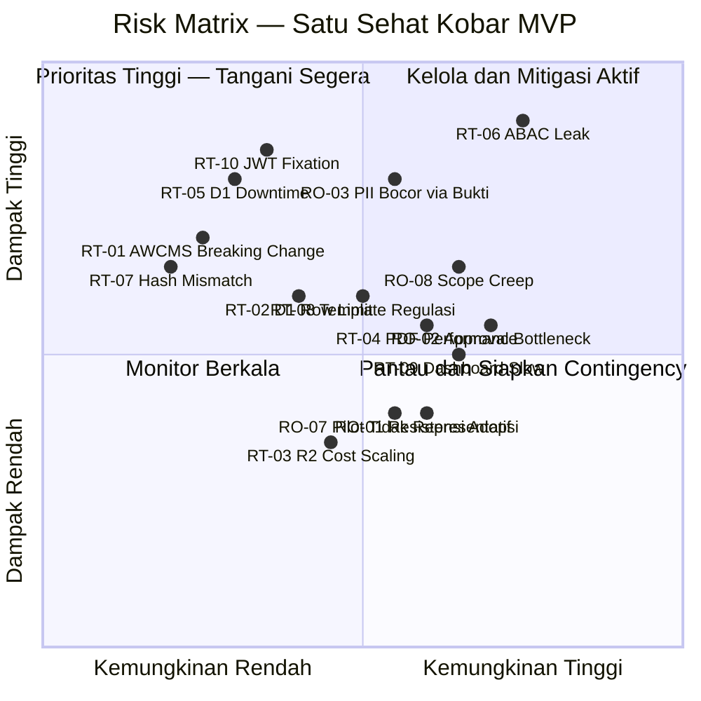

# Risk Register and Mitigation Plan — Satu Sehat Kobar

Versi: 2.0 | Tanggal: 2026-06-13 | Status: Final MVP

Platform: AWCMS-Micro (Cloudflare Workers/D1/R2/KV)
Organisasi: Dinas Kesehatan Kabupaten Kotawaringin Barat

---

## 1. Metodologi Penilaian Risiko

### 1.1 Skala Dampak

| Skor | Level | Definisi |
| ---: | :--- | :--- |
| 1 | Sangat Rendah | Tidak berpengaruh pada fitur utama, hanya estetika atau kenyamanan |
| 2 | Rendah | Mengganggu fitur minor, ada workaround mudah |
| 3 | Sedang | Mengganggu fitur utama sebagian, butuh effort perbaikan |
| 4 | Tinggi | Menghambat alur utama MVP, atau berdampak ke data/keamanan |
| 5 | Sangat Tinggi | Sistem tidak dapat digunakan, kebocoran data, atau go-live harus dihentikan |

### 1.2 Skala Kemungkinan

| Skor | Level | Definisi |
| ---: | :--- | :--- |
| 1 | Sangat Rendah | Hampir tidak mungkin terjadi dalam konteks MVP ini |
| 2 | Rendah | Bisa terjadi hanya pada kondisi khusus |
| 3 | Sedang | Mungkin terjadi — perlu diwaspadai |
| 4 | Tinggi | Besar kemungkinan terjadi jika tidak dimitigasi |
| 5 | Sangat Tinggi | Hampir pasti terjadi tanpa tindakan pencegahan |

### 1.3 Risk Score dan Kategori

```text
Risk Score = Dampak × Kemungkinan
```

| Risk Score | Kategori | Tindakan Wajib |
| :--- | :--- | :--- |
| ≥ 15 | CRITICAL | Hentikan pekerjaan/rollout — tangani segera sebelum lanjut |
| 10–14 | HIGH | Mitigasi wajib sebelum go-live pilot |
| 5–9 | MEDIUM | Buat rencana mitigasi dan pantau di setiap sprint review |
| 1–4 | LOW | Monitor berkala — terima jika ada workaround |

### 1.4 Status Risiko

```text
identified        → Risiko baru teridentifikasi
analyzed          → Dampak dan kemungkinan sudah dinilai
mitigation-planned → Rencana mitigasi sudah disusun
in-progress       → Mitigasi sedang diimplementasikan
mitigated         → Mitigasi selesai, risiko residual rendah
accepted          → Diterima dengan catatan (Product Owner)
escalated         → Dieskalasi ke Kadis/pimpinan
closed            → Risiko tidak relevan lagi
```

---

## 2. Mermaid Risk Matrix



---

## 3. Register Risiko Teknis

| ID | Risiko | Dampak | Kemungkinan | Score | Kategori | Mitigasi Utama | Kontingensi | Owner |
| :--- | :--- | ---: | ---: | ---: | :--- | :--- | :--- | :--- |
| RT-01 | AWCMS-Micro breaking change saat update | 4 | 2 | 8 | MEDIUM | Pin versi, isolasi plugin, update staging dahulu | Rollback ke versi sebelumnya | Admin Teknis |
| RT-02 | D1 SQLite row limit (~100K/tabel) | 4 | 3 | 12 | HIGH | Monitoring row count, archiving strategy, partisi data | Migrasi arsip lama ke R2 JSON | Admin Teknis |
| RT-03 | R2 storage cost scaling tinggi | 2 | 3 | 6 | MEDIUM | Batas ukuran upload, lifecycle policy, monitoring | Kompresi file, cleanup stale uploads | Admin Teknis |
| RT-04 | PDF generation performance lambat (>5s) | 3 | 3 | 9 | MEDIUM | Template ringan, async generation, queue job | Notifikasi user bahwa PDF sedang diproses | Admin Teknis |
| RT-05 | D1 downtime/outage Cloudflare | 5 | 2 | 10 | HIGH | KV cache untuk data kritikal, graceful degradation | Komunikasi ke user, manual fallback sementara | Admin Teknis |
| RT-06 | ABAC leak — cross-unit data exposure | 5 | 3 | 15 | CRITICAL | 8 ABAC rules diuji penuh, IDOR test wajib | Audit log review, revoke akses, patch darurat | Admin Teknis |
| RT-07 | File hash mismatch (R2 corruption) | 4 | 1 | 4 | LOW | SHA-256 hash pada upload, verifikasi saat download | Re-upload dari sumber, audit trail | Admin Teknis |
| RT-08 | Template format tidak sesuai regulasi tata naskah | 4 | 3 | 12 | HIGH | Validasi template dengan Sekretariat sebelum UAT | Operator surat buat manual sementara | Sekretariat/Admin Teknis |
| RT-09 | Dashboard slow query (>3s) | 3 | 3 | 9 | MEDIUM | KV cache 15 menit, aggregate service, indeks D1 | Reduce scope dashboard sementara | Admin Teknis |
| RT-10 | JWT session fixation attack | 5 | 2 | 10 | HIGH | Rotasi token setiap login, HttpOnly cookie, HTTPS only | Invalidasi semua session aktif, rotasi secret | Admin Teknis |

### Detail RT-01: AWCMS-Micro Breaking Change

**Deskripsi:** Update AWCMS-Micro core dapat memperkenalkan perubahan yang tidak kompatibel dengan plugin yang sudah dikembangkan.

**Trigger Kondisi:** Upstream merilis versi mayor baru dengan perubahan API core.

**Rencana Mitigasi:**

1. Pin versi AWCMS-Micro di `package.json` dengan versi eksak (bukan range)
2. Update hanya dilakukan setelah test di environment staging
3. Buat changelogs dan diff review sebelum update
4. Plugin dibuat dengan kontrak yang terisolasi dari core internals
5. ADR (Architecture Decision Record) wajib untuk setiap update core

**Timeline:** Evaluasi update setiap 4 minggu atau saat ada security patch.

**Kontingensi:** Rollback ke commit sebelumnya via git, redeploy ke Cloudflare Workers.

---

### Detail RT-02: D1 SQLite Row Limit

**Deskripsi:** D1 SQLite memiliki karakteristik performa yang menurun mendekati 100.000 baris per tabel. Tabel audit_logs, duty_requests, dan duty_evidences berpotensi tumbuh cepat.

**Trigger Kondisi:** Tabel `satusehat_audit_logs` mencapai 50.000 baris, atau query mulai >500ms.

**Rencana Mitigasi:**

1. Background job harian untuk monitoring row count per tabel
2. Arsip audit log lama (>2 tahun) ke R2 dalam format JSON
3. Indeks pada kolom `entity_id`, `action`, `actor_id`, `created_at`
4. Pagination wajib di semua list endpoint (max 100 per page)

**Timeline:** Implementasi background job monitoring di Sprint 5.

**Kontingensi:** Export dan hapus data audit inaktif ke R2, truncate dengan backup.

---

### Detail RT-06: ABAC Leak (Cross-Unit Data Exposure)

**Deskripsi:** User dari Faskes A atau Unit B dapat mengakses data yang seharusnya hanya untuk Faskes B atau Unit A, jika ABAC tidak diimplementasikan dengan benar di semua route handler.

**Trigger Kondisi:** Ditemukan akses berhasil ke resource lintas faskes/unit dalam IDOR testing.

**Rencana Mitigasi:**

1. Implementasi 8 ABAC rules di layer middleware sebelum handler
2. IDOR test wajib untuk semua endpoint yang melibatkan `entity_id`
3. Review code untuk setiap PR yang menyentuh route handler
4. Automated test: akses silang faskes harus menghasilkan 403

**Timeline:** ABAC rules diimplementasikan Sprint 2-3, diuji penuh Sprint 5-6.

**Kontingensi:** Revoke token semua user, patch darurat, audit retrospektif log.

---

### Detail RT-10: JWT Session Fixation

**Deskripsi:** Jika token tidak dirotasi setelah login atau tidak diinvalidasi setelah logout, attacker yang mencuri token lama dapat terus menggunakannya.

**Trigger Kondisi:** Token lama masih valid setelah logout; atau token pre-login digunakan setelah login.

**Rencana Mitigasi:**

1. Token diinvalidasi server-side saat logout (blocklist di KV)
2. Token baru diterbitkan setiap login — tidak recycle token lama
3. `HttpOnly; Secure; SameSite=Strict` cookie
4. Token expire 8 jam (rolling), refresh hanya jika masih aktif

**Timeline:** Implementasi Sprint 1 (authentication core).

**Kontingensi:** Invalidasi semua session via KV flush, rotasi JWT signing secret.

---

## 4. Register Risiko Organisasi/Operasional

| ID | Risiko | Dampak | Kemungkinan | Score | Kategori | Mitigasi Utama | Kontingensi | Owner |
| :--- | :--- | ---: | ---: | ---: | :--- | :--- | :--- | :--- |
| RO-01 | Resistensi adopsi pengguna | 3 | 3 | 9 | MEDIUM | Training role-based, pendampingan pilot, quick wins | Proses paralel manual + digital sementara | Tim SIK |
| RO-02 | Approval bottleneck (approver tidak responsif) | 4 | 4 | 16 | CRITICAL | Dashboard pending approval, notifikasi in-app, SOP eskalasi | Delegasi sementara oleh Kadis | Sekretariat |
| RO-03 | Data PII bocor via bukti foto | 4 | 3 | 12 | HIGH | Peringatan upload, klasifikasi restricted, ABAC ketat | Hapus dan re-upload, audit retrospektif | Tim SIK/Admin Teknis |
| RO-04 | Perubahan regulasi format ST/SPPD | 4 | 2 | 8 | MEDIUM | Template versioning, parameter template via admin | Update template tanpa deploy ulang | Sekretariat |
| RO-05 | SDM teknis tidak tersedia (vendor lock-in) | 4 | 2 | 8 | MEDIUM | Dokumentasi teknis lengkap, AWCMS-Micro open source | Kontrak support jangka pendek | Product Owner |
| RO-06 | Kegagalan backup/restore | 5 | 2 | 10 | HIGH | Restore test wajib sebelum pilot, backup harian | Recovery manual dari D1 export, R2 versioning | Admin Teknis |
| RO-07 | Pilot faskes tidak representatif | 3 | 3 | 9 | MEDIUM | Pilih faskes dengan volume kegiatan beragam | Tambah faskes pilot di bulan ke-2 | Product Owner |
| RO-08 | Scope creep tanpa change control | 4 | 4 | 16 | CRITICAL | Change control log, MoSCoW, future backlog | Stop implementasi fitur baru, eskalasi ke Kadis | Product Owner |

### Detail RO-02: Approval Bottleneck

**Deskripsi:** Pengajuan ST/SPPD tertahan karena approver (Atasan Langsung, Kabid, Sekretaris, Kadis) tidak merespons dalam batas waktu yang wajar, sehingga kegiatan tertunda dan user frustrasi.

**Trigger Kondisi:** Ada pengajuan dengan status `pending_approval` selama >3 hari kerja tanpa tindakan.

**Rencana Mitigasi:**
1. Dashboard khusus untuk setiap approver: daftar pengajuan pending + berapa hari
2. Notifikasi in-app saat pengajuan masuk ke tahap approval mereka
3. SOP eskalasi: jika >3 hari kerja tidak direspons → lapor ke Kadis
4. Pelatihan approver khusus tentang alur approval dan mobile access

**Timeline:** Dashboard pending approval diimplementasi Sprint 4; Phase 2: notifikasi WhatsApp/email.

**Kontingensi:** Kadis dapat mendelegasikan approval sementara via keputusan tertulis.

---

### Detail RO-08: Scope Creep

**Deskripsi:** Permintaan fitur baru yang masuk selama implementasi MVP (TTE penuh, SRIKANDI, SIMPEG, SIPD, mobile app, AI detection) dapat mendistraksi tim dan menghambat penyelesaian core MVP.

**Trigger Kondisi:** Issue baru tidak berlabel `mvp` masuk sprint aktif; atau tim mulai mengerjakan integrasi yang tidak ada di backlog.

**Rencana Mitigasi:**
1. Semua permintaan fitur baru melalui Change Control Log
2. Label `priority:wont-mvp` untuk semua yang bukan MVP
3. Product Owner memiliki hak veto — tidak ada fitur baru tanpa persetujuan
4. Sprint Review selalu memeriksa scope adherence

**Timeline:** Change control aktif sejak Sprint 0.

**Kontingensi:** Stop semua pekerjaan non-MVP, rollback pekerjaan yang sudah keluar scope.

---

## 5. Register Risiko Integrasi (Phase 2)

| ID | Risiko | Dampak | Kemungkinan | Score | Kategori | Mitigasi | Kontingensi | Owner |
| :--- | :--- | ---: | ---: | ---: | :--- | :--- | :--- | :--- |
| RI-01 | TTE/BSrE API tidak stabil atau unavailable | 4 | 3 | 12 | HIGH | Fallback ke TTD manual, retry otomatis, timeout handling | Dokumen dicetak dan ditandatangani manual | Admin Teknis |
| RI-02 | SIMPEG data tidak konsisten dengan data lokal | 3 | 4 | 12 | HIGH | SIMPEG sebagai sumber otoritatif, sinkronisasi nightly, conflict log | Konfirmasi manual ke admin, lock data konflik | Admin Teknis |
| RI-03 | SIPD kode anggaran berubah di tengah tahun | 3 | 3 | 9 | MEDIUM | Import manual per perubahan, version lock kode anggaran aktif | Admin update manual, notifikasi ke Keuangan | Keuangan |
| RI-04 | SRIKANDI format arsip berbeda dari yang diekspor | 3 | 3 | 9 | MEDIUM | Adapter layer, test format sebelum go-live integrasi | Export manual dalam format yang diterima SRIKANDI | Admin Teknis |

### Catatan: Semua RI-xx adalah Phase 2

Risiko integrasi Phase 2 belum aktif di MVP. Namun dicatat sejak dini untuk:
1. Memastikan arsitektur MVP mendukung penambahan integrasi tanpa perombakan besar
2. Adapter pattern dipersiapkan sejak desain awal (tanpa implementasi)
3. Tidak ada kode integrasi yang masuk MVP tanpa persetujuan change control

---

## 6. Rencana Respons Risiko (Risk Response Plan)

### 6.1 Risiko CRITICAL

**RO-02 — Approval Bottleneck**

| Aspek | Detail |
| :--- | :--- |
| Action Plan | 1. Implementasi dashboard pending approval di Sprint 4. 2. SOP eskalasi approval (3 hari kerja). 3. Training approver khusus. 4. Phase 2: notifikasi WhatsApp/email |
| Timeline | Dashboard: Sprint 4 | SOP: sebelum pilot |
| Trigger | Pengajuan pending >3 hari kerja |
| Eskalasi | Tim SIK → Kadis dalam 1 hari kerja |
| Ukuran Sukses | Rata-rata waktu approval ≤3 hari kerja |

**RO-08 — Scope Creep**

| Aspek | Detail |
| :--- | :--- |
| Action Plan | 1. Change control log aktif sejak Sprint 0. 2. Product Owner memutuskan dalam 48 jam untuk setiap permintaan baru. 3. Label `priority:wont-mvp`. 4. Sprint Review wajib cek scope |
| Timeline | Aktif sejak Sprint 0 |
| Trigger | Issue non-MVP mulai dikerjakan tanpa keputusan |
| Eskalasi | Admin Teknis → Product Owner → Kadis |
| Ukuran Sukses | Zero fitur non-MVP masuk sprint tanpa keputusan tertulis |

**RT-06 — ABAC Leak**

| Aspek | Detail |
| :--- | :--- |
| Action Plan | 1. Implementasi 8 ABAC rules sebagai middleware Sprint 2-3. 2. IDOR test wajib semua endpoint Sprint 5. 3. Automated ABAC test di CI. 4. Code review wajib untuk semua route handler |
| Timeline | Implementasi: Sprint 2-3 | Pengujian penuh: Sprint 5-6 |
| Trigger | Akses berhasil ke resource lintas faskes/unit dalam testing |
| Eskalasi | Hentikan go-live pilot sampai patch selesai |
| Ukuran Sukses | Zero ABAC bypass dalam semua skenario IDOR test |

### 6.2 Risiko HIGH

**RT-02 — D1 Row Limit**

| Aspek | Detail |
| :--- | :--- |
| Action Plan | 1. Background job monitoring row count harian. 2. Alert saat 70% kapasitas. 3. Archiving policy untuk audit log >2 tahun. 4. Indeks optimal per tabel |
| Timeline | Sprint 5 |
| Trigger | Tabel mencapai 50.000 baris |
| Eskalasi | Admin Teknis → Product Owner untuk keputusan arsip |

**RT-05 — D1 Downtime**

| Aspek | Detail |
| :--- | :--- |
| Action Plan | 1. KV cache untuk data dashboard kritikal. 2. Graceful degradation: tampilkan data cached saat DB unavailable. 3. Status page monitoring. 4. SOP komunikasi ke user saat downtime |
| Timeline | Implementasi cache: Sprint 3 |
| Trigger | D1 latency >2s atau error rate >5% |
| Eskalasi | Admin Teknis → komunikasi ke semua pengguna aktif |

**RT-08 — Template Format Regulasi**

| Aspek | Detail |
| :--- | :--- |
| Action Plan | 1. Presentasikan preview template ke Sekretariat di Sprint 3. 2. Revisi sebelum Sprint 4. 3. Template parameter disimpan di konfigurasi (dapat diubah tanpa deploy). 4. UAT template khusus |
| Timeline | Validasi: Sprint 3 | Final template: Sprint 4 |
| Trigger | Sekretariat menolak format dokumen |
| Eskalasi | Operator Surat → Sekretariat → Product Owner |

---

## 7. Monitoring Risiko

### 7.1 Frekuensi Review

| Frekuensi | Aktivitas | Peserta | Output |
| :--- | :--- | :--- | :--- |
| Harian (minggu pertama pilot) | Cek error critical, user blocking issue, login/approval/PDF | Admin Teknis, Tim SIK | Daily standup notes |
| Setiap Sprint Review | Update risk register, cek risiko baru, tutup risiko yang selesai | Semua stakeholder | Risk register update |
| Bulanan | Tren risiko, risiko residual, kesiapan Phase 2 | Product Owner, Tim SIK, Kadis | Risk report bulanan |

### 7.2 Eskalasi Risiko Baru

Risiko baru dengan score **≥ 10** wajib:
1. Dicatat di risk register dalam **24 jam** setelah ditemukan
2. Dilaporkan ke **Admin Teknis** segera
3. Dilaporkan ke **Product Owner** dalam **48 jam**
4. Jika score ≥ 15 (CRITICAL): dilaporkan ke **Kadis** dalam **48 jam**

### 7.3 Template Risk Report Bulanan

```
# Risk Report Bulanan — Satu Sehat Kobar

Periode       : [Bulan Tahun]
Dibuat oleh   : [PIC]
Tanggal review: [Tanggal]

## Ringkasan Status Risiko
- CRITICAL : [jumlah] (open/closed)
- HIGH     : [jumlah] (open/closed)
- MEDIUM   : [jumlah] (open/closed)
- LOW      : [jumlah] (open/closed)

## Risiko Baru Periode Ini
| ID | Risiko | Score | Tindakan |
|---|---|---|---|

## Risiko Yang Memburuk
| ID | Dari | Menjadi | Penyebab |
|---|---|---|---|

## Risiko Yang Membaik / Ditutup
| ID | Status Baru | Catatan |
|---|---|---|

## Risiko Masih Open CRITICAL/HIGH
| ID | Risiko | PIC | Target Mitigasi |
|---|---|---|---|

## Rekomendasi
[Tindakan yang perlu keputusan Product Owner/Kadis]
```

### 7.4 Go-Live Risk Gate

MVP tidak boleh go-live pilot sebelum semua kondisi berikut terpenuhi:

```
[ ] Zero bug critical terbuka
[ ] ABAC 8 rules diuji dan lulus
[ ] Permission bypass tidak berhasil dalam semua test
[ ] Dokumen finance tidak dapat diakses user tidak berwenang
[ ] PDF ST dapat dibuat dari pengajuan yang sudah approved
[ ] Upload final berjalan dengan hash verification
[ ] Backup berhasil dan restore test berhasil
[ ] Audit trail mencatat minimal 23 event types
[ ] Template dokumen divalidasi Sekretariat
[ ] Training user pilot selesai
[ ] SOP pilot tersedia
[ ] Rollback plan tersedia dan diuji
[ ] Dashboard data uji valid (tidak ada selisih)
[ ] Product Owner menyetujui secara eksplisit
```

---

*Risk register ini direview di setiap Sprint Review dan diperbarui oleh Admin Teknis bersama Product Owner.*
*Risiko baru score ≥ 10 wajib dilaporkan ke Kadis dalam 48 jam.*
