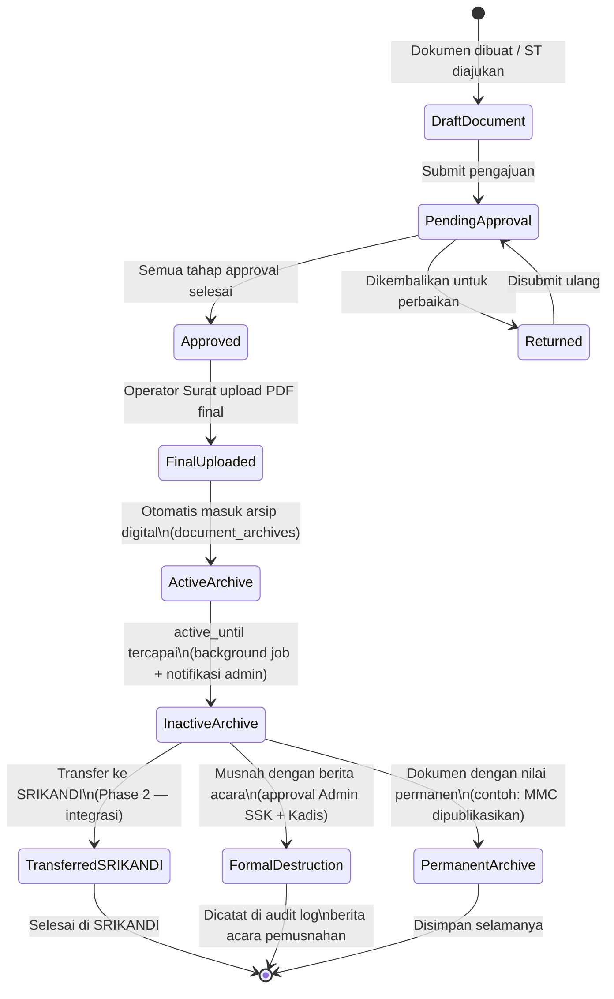

# Data Governance and Retention Policy — Satu Sehat Kobar

Versi: 2.0 | Tanggal: 2026-06-13 | Status: Final MVP

Platform: AWCMS-Micro (Cloudflare Workers/D1/R2/KV)
Organisasi: Dinas Kesehatan Kabupaten Kotawaringin Barat

---

## 1. Kerangka Tata Kelola Data

### 1.1 Prinsip Dasar

Tata kelola data Satu Sehat Kobar dibangun di atas empat prinsip utama:

**Minimal Necessary (Data Minimization)**
Sistem hanya mengumpulkan dan menyimpan data yang benar-benar diperlukan untuk menjalankan fungsi Agenda, ST/SPPD, bukti tugas, jurnal pegawai, dashboard KPI, MMC, dan arsip digital. Tidak ada pengumpulan data yang melebihi kebutuhan operasional yang terdefinisi.

**Purpose Limitation**
Data yang dikumpulkan digunakan hanya untuk tujuan yang sudah ditetapkan. Data pegawai digunakan untuk manajemen pengajuan dan approval — tidak digunakan untuk tujuan lain tanpa keputusan formal yang terdokumentasi di Change Control Log.

**Data Quality (Akurasi dan Konsistensi)**
Data dalam sistem harus akurat, lengkap, dan konsisten. Snapshot PII dalam dokumen final mencerminkan kondisi saat dokumen diterbitkan — ini disengaja untuk kebutuhan audit historis. Integritas data dijaga melalui hash file (SHA-256) dan validasi input.

**Accountability (Akuntabilitas)**
Setiap aksi penting terhadap data dicatat dalam audit log yang tidak dapat diubah. Setiap entitas data memiliki pemilik yang jelas. Keputusan tata kelola data didokumentasikan dalam change control log.

### 1.2 Peran dalam Tata Kelola Data

| Peran | Tanggung Jawab |
| :--- | :--- |
| Product Owner | Menyetujui kebijakan data, memutuskan perubahan klasifikasi |
| Admin SSK | Mengelola konfigurasi akses, mengelola user dan role |
| Admin SIK | Mengawasi kualitas data operasional, menyiapkan laporan |
| Auditor | Memeriksa audit trail dan kepatuhan kebijakan data |
| Keuangan | Pemilik data finance — memastikan data SPPD dan bukti biaya tepat |
| Sekretariat | Memastikan format dokumen sesuai tata naskah |
| Admin Teknis | Mengelola infrastruktur, backup, restore, dan lifecycle data |

---

## 2. Klasifikasi Data

Setiap data dan dokumen dalam sistem diklasifikasikan ke dalam salah satu dari lima tingkat klasifikasi:

| Klasifikasi | Definisi | Contoh Data | Hak Akses |
| :--- | :--- | :--- | :--- |
| **public** | Data yang dapat diakses publik tanpa login | Berita MMC yang sudah dipublikasikan, informasi umum Dinkes | Siapa saja (termasuk tanpa login) |
| **internal** | Data yang hanya boleh diakses oleh pegawai yang sudah login | Agenda kegiatan, daftar ST umum, jurnal ringkasan | Semua pegawai sistem yang sudah login |
| **restricted** | Data yang hanya boleh diakses oleh pihak terkait dengan justifikasi peran | ST final, SPPD draft, bukti tugas non-biaya, lampiran internal | Pemilik dokumen + atasan langsung + operator surat + admin |
| **confidential** | Data sangat sensitif — akses sangat terbatas | Catatan khusus pimpinan, dokumen kepegawaian sensitif | Admin SSK, Kadis, Sekretaris |
| **finance** | Data keuangan yang hanya boleh diakses role keuangan dan yang diberi wewenang | SPPD final, bukti biaya, rincian komponen biaya | Keuangan (sesuai scope) + Auditor + Admin SSK + Kadis |

### 2.1 Klasifikasi Default per Jenis Data

| Jenis Data/Dokumen | Klasifikasi Default | Dapat Diubah Oleh |
| :--- | :--- | :--- |
| Agenda kegiatan | internal | Admin SSK |
| Lampiran agenda | internal / restricted | Admin SSK |
| Draft ST/SPPD | restricted | — |
| ST final (ditandatangani) | restricted | — |
| SPPD draft | finance | — |
| SPPD final | finance | — |
| Bukti tugas umum (foto, laporan) | restricted | — |
| Bukti biaya | finance | — |
| Jurnal pegawai | internal / restricted | Admin SSK |
| Draft MMC | internal | — |
| MMC yang dipublikasikan | public | Reviewer MMC |
| Arsip dokumen final | Mengikuti klasifikasi sumber | Admin SSK dengan ADR |
| Audit log | audit (setara confidential) | Tidak dapat diubah |
| Data SPM agregat | internal | Admin SSK |
| Template dokumen | internal | Admin SSK |

### 2.2 Aturan Perubahan Klasifikasi

- Klasifikasi **hanya bisa diturunkan** (dari lebih ketat ke lebih longgar) oleh Admin SSK dengan persetujuan Product Owner
- Klasifikasi **tidak bisa dinaikkan** secara otomatis — harus melalui kebijakan
- Setiap perubahan klasifikasi **dicatat di audit log** dengan alasan
- Dokumen final yang sudah masuk arsip **tidak boleh diubah klasifikasinya** tanpa ADR formal

---

## 3. Inventaris Data (Data Inventory)

| Entitas | Lokasi | Field PII | Klasifikasi | Pemilik Data |
| :--- | :--- | :--- | :--- | :--- |
| `satusehat_users` | D1 | nama, email, nip, jabatan, unit_id | internal | Admin SSK |
| `satusehat_units` | D1 | nama_unit, kode_unit | internal | Admin SSK |
| `satusehat_health_facilities` | D1 | nama_faskes, alamat, kode_faskes | internal | Admin Faskes |
| `agenda_events` | D1 | — (tidak langsung PII) | internal | Admin SIK |
| `agenda_participants` | D1 | user_id (FK ke users) | internal | Admin SIK |
| `agenda_attachments` | D1 + R2 | — | internal/restricted | Admin SIK |
| `duty_requests` | D1 | requester_user_id, snapshots nama/NIP | restricted | Pegawai pemohon |
| `duty_participants` | D1 | user_id, nama_snapshot, nip_snapshot | restricted | Pegawai pemohon |
| `duty_approvals` | D1 | approver_user_id, nama_snapshot | restricted | Admin SSK |
| `duty_documents` | D1 + R2 | nama dalam PDF, NIP dalam PDF | restricted / finance | Operator Surat |
| `duty_evidences` | D1 + R2 | upload_user_id, foto mungkin ada wajah | restricted / finance | Pelaksana |
| `duty_journals` | D1 | user_id, isi jurnal (narasi pribadi) | restricted | Pegawai pemilik |
| `mmc_publications` | D1 + R2 | — (tidak boleh ada PII sensitif) | internal → public | Reviewer MMC |
| `document_archives` | D1 + R2 | Snapshot dari dokumen sumber | restricted / finance | Admin SSK |
| `satusehat_audit_logs` | D1 | actor_id, actor_name_snapshot, ip_address | audit | Auditor / Admin SSK |
| `spm_indicators` | D1 | — (data agregat, bukan individu) | internal | Admin SIK |

### 3.1 Catatan Penting: Snapshot PII dalam Dokumen

Snapshot PII (nama, NIP, jabatan) dalam dokumen ST/SPPD adalah **disengaja dan diizinkan** karena:

1. Diperlukan untuk dokumen administrasi yang sah secara hukum
2. Diperlukan untuk audit historis — data master bisa berubah, dokumen harus stabil
3. Mengikuti praktik standar tata naskah dinas pemerintah

Snapshot PII mengikuti klasifikasi dokumen induknya (restricted atau finance) dan tidak dapat diubah setelah dokumen final.

---

## 4. Kebijakan Retensi

### 4.1 Tabel Retensi per Tipe Dokumen

| Tipe Dokumen | Masa Aktif | Masa Inaktif | Aksi Final | Dasar Kebijakan |
| :--- | :--- | :--- | :--- | :--- |
| ST (Surat Tugas) | 5 tahun | 5 tahun | Musnah dengan berita acara | JRA Dinkes |
| SPPD (Surat Perjalanan Dinas) | 5 tahun | 5 tahun | Musnah dengan berita acara | JRA Keuangan |
| Bukti Tugas | 5 tahun | 5 tahun | Musnah dengan ST-nya | Mengikuti ST |
| Agenda Kegiatan | 2 tahun | 3 tahun | Musnah | JRA Dinkes |
| Jurnal Pegawai | 2 tahun | 3 tahun | Musnah | JRA Internal |
| Audit Log | 2 tahun aktif di D1 | 3 tahun di R2 JSON | Musnah formal | Kebijakan SPBE |
| Draft MMC | 1 tahun | — | Hapus otomatis jika tidak dipublikasikan | Kebijakan internal |
| MMC Dipublikasikan | Permanen | — | Permanen (archived) | Kebijakan Komunikasi |
| Template Dokumen | Sesuai versi aktif | 3 tahun versi lama | Review dan musnah jika sudah tidak relevan | Kebijakan internal |
| Data SPM Agregat | 5 tahun | 5 tahun | Musnah | JRA SPM |

### 4.2 Definisi Masa Aktif dan Inaktif

- **Masa Aktif:** Dokumen sering diakses dan digunakan sebagai referensi operasional. Tersimpan di D1 + R2 dengan akses cepat.
- **Masa Inaktif:** Dokumen jarang diakses tetapi masih harus disimpan untuk keperluan audit/hukum. Dapat dipindahkan ke R2 cold storage atau R2 JSON export.
- **Aksi Final:** Tindakan yang dilakukan setelah masa inaktif habis — musnah formal (dengan berita acara), transfer ke SRIKANDI (Phase 2), atau tetap permanen.

### 4.3 Catatan MVP vs Phase 2

Pada MVP Phase 1:
- Retensi hanya diterapkan pada level **metadata** (field `active_until`, `inactive_until` di tabel arsip)
- Background job memantau tanggal dan mengirim notifikasi — **tidak** otomatis musnah
- Pemusnahan dilakukan secara manual oleh Admin SSK setelah persetujuan formal

Pada Phase 2:
- Transfer arsip inaktif ke SRIKANDI (integrasi)
- Scheduled job untuk flagging dan notifikasi eskalasi musnah

---

## 5. Siklus Hidup Arsip



### 5.1 Pemicu Transisi Status Arsip

| Dari | Ke | Pemicu | Siapa yang Bertindak |
| :--- | :--- | :--- | :--- |
| `FinalUploaded` | `ActiveArchive` | Otomatis saat upload final berhasil | Sistem (otomatis) |
| `ActiveArchive` | `InactiveArchive` | Background job: `active_until` ≤ hari ini | Background job + notifikasi Admin SSK |
| `InactiveArchive` | `TransferredSRIKANDI` | Manual trigger + Phase 2 integrasi | Admin SSK |
| `InactiveArchive` | `FormalDestruction` | Persetujuan formal Admin SSK + Kadis | Admin SSK (diaudit) |
| `InactiveArchive` | `PermanentArchive` | Keputusan Admin SSK berdasarkan nilai dokumen | Admin SSK |

---

## 6. Prosedur Retensi

### 6.1 Background Job Monitoring Retensi

Background job berjalan **setiap hari** pukul 02.00 WIB (Cloudflare Cron Trigger) untuk:

1. Query semua arsip dengan `active_until <= today + 30 days` → kirim notifikasi ke Admin SSK
2. Query semua arsip dengan `active_until <= today` dan status masih `active` → ubah status ke `inactive`, kirim notifikasi eskalasi
3. Query semua arsip dengan `inactive_until <= today` → kirim notifikasi final untuk tindakan musnah/transfer

```sql
-- Arsip yang akan jatuh tempo masa aktif dalam 30 hari
SELECT id, document_type, document_number, active_until, archive_classification
FROM document_archives
WHERE active_until <= date('now', '+30 days')
  AND status = 'active'
ORDER BY active_until ASC;
```

### 6.2 Notifikasi Admin (30 Hari Sebelum Masa Aktif Habis)

Notifikasi in-app dikirim ke Admin SSK berisi:

- Daftar dokumen yang akan memasuki masa inaktif dalam 30 hari
- Nomor dokumen, jenis, unit, tanggal aktif berakhir
- Link ke halaman arsip untuk tindak lanjut
- Rekomendasi tindakan (perpanjang, transfer, atau musnah)

### 6.3 Prosedur Transfer ke SRIKANDI (Phase 2)

1. Admin SSK memilih arsip inaktif yang akan ditransfer
2. Sistem mengekspor metadata + file ke format yang diterima SRIKANDI
3. Integrasi SRIKANDI API mengirimkan paket arsip
4. SRIKANDI mengonfirmasi penerimaan → status di sistem berubah ke `transferred`
5. File di R2 dapat dihapus setelah konfirmasi SRIKANDI berhasil
6. Seluruh proses dicatat di audit log

### 6.4 Prosedur Pemusnahan Formal

Pemusnahan arsip harus melalui tahapan berikut:

1. **Identifikasi:** Admin SSK mengidentifikasi arsip yang telah melewati masa inaktif
2. **Verifikasi:** Konfirmasi tidak ada sengketa hukum atau kebutuhan audit aktif
3. **Persetujuan:** Kadis atau yang dikuasakan menandatangani berita acara pemusnahan
4. **Eksekusi:** Admin SSK menjalankan proses hapus — file di R2 dihapus, record di D1 di-soft-delete
5. **Pencatatan:** Audit log mencatat event `archive.document.destroyed` dengan referensi berita acara
6. **Berita Acara:** Dokumen formal pemusnahan disimpan sebagai arsip permanen terpisah

---

## 7. Penanganan PII

### 7.1 Inventaris Field PII dalam Sistem

| Field | Tabel | Tipe PII | Penggunaan |
| :--- | :--- | :--- | :--- |
| `nama` | `satusehat_users` | Nama lengkap | Identitas user, snapshot dokumen |
| `nip` | `satusehat_users` | Nomor Induk Pegawai | Identitas ASN, snapshot dokumen |
| `jabatan` | `satusehat_users` | Jabatan struktural | Snapshot dokumen |
| `email` | `satusehat_users` | Email dinas | Komunikasi, login |
| `nama_snapshot` | `duty_participants`, `duty_approvals` | Nama saat dokumen dibuat | Dokumen historis |
| `nip_snapshot` | `duty_participants` | NIP saat dokumen dibuat | Dokumen historis |
| `ip_address` | `satusehat_audit_logs` | IP pengguna | Audit keamanan |
| `actor_name_snapshot` | `satusehat_audit_logs` | Nama saat aksi terjadi | Audit historis |

### 7.2 Prinsip Akses PII

- PII pengguna hanya dapat dilihat oleh pengguna itu sendiri, atasan langsungnya, dan Admin
- NIP tidak ditampilkan di interface pengguna umum — hanya di dokumen formal dan laporan admin
- IP address di audit log hanya dapat dilihat oleh Auditor dan Admin SSK
- Export data yang mengandung PII dibatasi role Admin SSK dan Auditor

### 7.3 Hak Subjek Data

Dalam konteks sistem pemerintahan, hak subjek data diimplementasikan sebagai:

- **Akses:** Pegawai dapat melihat data profilnya sendiri dan riwayat pengajuannya
- **Koreksi:** Perubahan data profil melalui Admin SSK (bukan self-service langsung ke produksi)
- **Portabilitas:** Export riwayat pengajuan pribadi dalam format CSV — tersedia melalui Admin SSK
- **Penghapusan:** Tidak tersedia untuk dokumen formal yang sudah final — sesuai kewajiban kearsipan pemerintah

### 7.4 Prosedur Pelanggaran Data (Data Breach)

Jika terjadi kebocoran atau akses tidak sah terhadap data PII:

1. **Deteksi** — Admin Teknis atau Auditor mendeteksi insiden (dari audit log atau laporan user)
2. **Containment** — Revoke akses yang bermasalah, nonaktifkan akun yang terdampak jika perlu
3. **Assessment** — Identifikasi data apa yang terdampak, berapa user, dan bagaimana caranya
4. **Notifikasi Internal** — Lapor ke Product Owner dan Kadis dalam **4 jam**
5. **Notifikasi Eksternal** — Jika melibatkan data PII skala besar, lapor ke Kominfo sesuai UU PDP
6. **Remediasi** — Perbaiki celah keamanan, rotasi credential jika perlu
7. **Dokumentasi** — Buat incident report lengkap, simpan sebagai arsip permanen
8. **Review** — Post-incident review dalam 7 hari, update security checklist

---

## 8. Kepatuhan Regulasi Arsip

### 8.1 PP No. 28/2012 tentang Kearsipan

- Sistem menyediakan arsip digital dokumen final dengan metadata lengkap sesuai standar kearsipan
- Setiap arsip memiliki: nomor dokumen, tanggal, jenis, unit asal, klasifikasi, hash integritas
- Masa retensi mengikuti Jadwal Retensi Arsip (JRA) yang berlaku untuk Dinkes
- Pemusnahan arsip melalui prosedur formal dengan berita acara (sesuai Pasal 51-53)

### 8.2 Perka ANRI No. 2/2014 tentang Tata Naskah Dinas

- Format ST dan SPPD mengikuti ketentuan tata naskah dinas pemerintah daerah
- Nomor surat menggunakan format yang disepakati dengan Sekretariat Dinkes Kobar
- Template dokumen divalidasi oleh Sekretariat sebelum go-live
- Dokumen digital memiliki kekuatan hukum yang sama dengan dokumen fisik (setelah TTE — Phase 2)

### 8.3 Jadwal Retensi Arsip (JRA)

JRA yang diterapkan mengacu pada:

- **JRA Substantif Bidang Kesehatan** — untuk dokumen program SPM dan kegiatan kesehatan
- **JRA Fasilitatif Kepegawaian** — untuk ST/SPPD perjalanan dinas
- **JRA Fasilitatif Keuangan** — untuk SPPD dan bukti biaya perjalanan dinas

Implementasi JRA di sistem:

- Field `active_until` dan `inactive_until` di tabel `document_archives` mencerminkan JRA
- Admin SSK mengisi nilai ini saat dokumen masuk arsip (dapat dikonfigurasi per jenis dokumen)
- Background job memantau dan mengirim notifikasi sesuai tanggal JRA

---

## 9. Audit Data Quality

### 9.1 Validasi Integritas File

Setiap dokumen final yang diunggah ke R2 dilindungi dengan hash SHA-256:

```sql
-- Verifikasi integritas saat download
SELECT
  id,
  file_hash,
  file_path,
  uploaded_at
FROM duty_documents
WHERE id = ?
  AND document_type = 'final_signed';

-- Hash diverifikasi di layer aplikasi:
-- computed_hash = SHA256(file_bytes)
-- IF computed_hash != stored_hash THEN error: "Integritas file tidak valid"
```

Jika hash mismatch terdeteksi saat download:

- Download dibatalkan dengan pesan error
- Alert dikirim ke Admin Teknis
- Event `archive.document.hash_mismatch` dicatat di audit log

### 9.2 Completeness Check

Metrik completeness yang dimonitor bulanan:

| Metrik | Query | Target |
| :--- | :--- | :--- |
| % ST yang memiliki dokumen final | `duty_documents final / duty_requests approved × 100` | ≥ 95% |
| % ST yang memiliki arsip final | `document_archives / duty_documents final × 100` | ≥ 95% |
| % bukti tugas terverifikasi | `duty_evidences verified / total × 100` | ≥ 85% |
| % arsip dengan hash | `doc_archives with file_hash / total × 100` | 100% |
| % arsip dengan metadata lengkap | `doc_archives with all required fields / total × 100` | 100% |

### 9.3 Konsistensi Snapshot vs Data Master

Snapshot PII dalam dokumen (nama, NIP, jabatan) disimpan saat dokumen dibuat dan **tidak diperbarui** jika data master user berubah. Ini disengaja untuk menjaga integritas historis dokumen.

Jika ada perbedaan antara snapshot dan data master terkini, itu bukan error — itu adalah rekam historis yang sah. Konsistensi yang diuji adalah: apakah snapshot yang tersimpan di database cocok dengan isi PDF yang digenerate pada waktu yang sama.

---

*Kebijakan ini direview setiap kuartal dan diperbarui jika ada perubahan regulasi atau kebijakan organisasi.*
*Setiap perubahan kebijakan klasifikasi atau retensi harus dicatat di Change Control Log dan disetujui Product Owner.*
