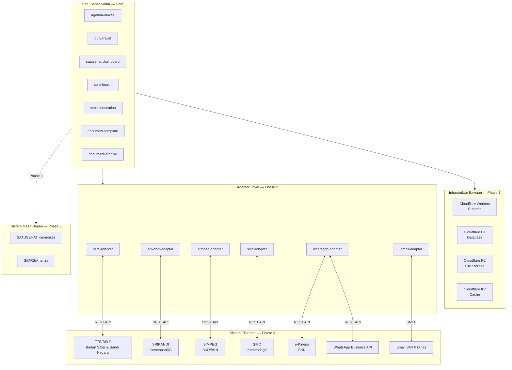
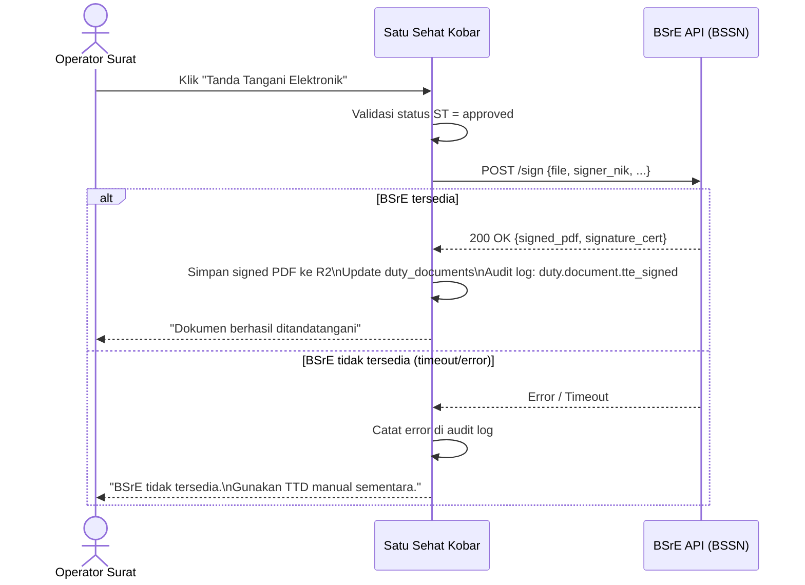
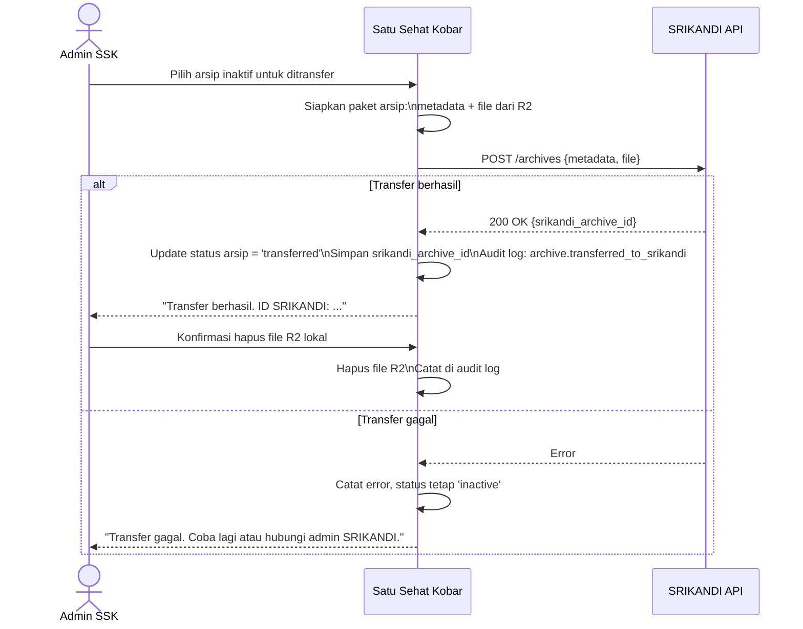

# Integration Governance and External Systems — Satu Sehat Kobar

Versi: 2.0 | Tanggal: 2026-06-13 | Status: Final MVP

Platform: AWCMS-Micro (Cloudflare Workers/D1/R2/KV)
Organisasi: Dinas Kesehatan Kabupaten Kotawaringin Barat

> **Implementasi (MVP):** fondasi integrasi §1.1–§1.4 (anti-corruption boundary, adapter interface, outbound audit + idempotency, graceful degradation) sudah menjadi issue **EPIC-14 / BE-06 (#115)**, plus abstraksi notifikasi **BE-05 (#114)**. **Hanya fondasi/extension point yang dibangun di MVP** — adapter eksternal (TTE/BSrE, SRIKANDI, SIMPEG, SIPD, WhatsApp, Email) tetap **Phase 2** (§3–§4). Lihat `docs/prd/25` dan skill `.opencode/skills/sskobar-integration-backend`.

---

## 1. Prinsip Integrasi

Setiap integrasi dengan sistem eksternal wajib mengikuti prinsip-prinsip berikut sebelum satu baris kode integrasi ditulis.

### 1.1 Loose Coupling via Service Contracts

Satu Sehat Kobar tidak boleh mengakses database sistem eksternal secara langsung. Semua integrasi menggunakan kontrak layanan (API contract) yang terdefinisi dengan jelas. Jika kontrak berubah, hanya adapter yang perlu diperbarui — tidak ada perubahan pada logika bisnis inti plugin.

### 1.2 Adapter Pattern

Setiap sistem eksternal memiliki satu adapter terisolasi:

```text
plugins/
  integrations/
    bsre-adapter/         ← TTE/BSrE
    srikandi-adapter/     ← SRIKANDI
    simpeg-adapter/       ← SIMPEG
    sipd-adapter/         ← SIPD
    whatsapp-adapter/     ← WhatsApp Business
    email-adapter/        ← SMTP Email
```

Adapter bertanggung jawab untuk:

- Transformasi format data lokal ↔ format sistem eksternal
- Error handling dan retry logic
- Logging semua outbound/inbound call
- Fallback jika sistem eksternal tidak tersedia

### 1.3 Graceful Degradation

Sistem Satu Sehat Kobar harus tetap berfungsi penuh jika integrasi manapun gagal. Contoh:

- BSrE tidak tersedia → dokumen tetap dapat di-approve, hanya TTD manual yang digunakan
- SRIKANDI down → arsip tetap tersimpan di R2 lokal, transfer dijadwalkan ulang
- SIMPEG sync gagal → data pegawai lokal tetap digunakan, admin diberitahu
- WhatsApp gateway down → notifikasi in-app tetap berjalan

### 1.4 Audit Semua Panggilan Eksternal

Setiap outbound API call ke sistem eksternal dicatat di audit log dengan:

- Timestamp call
- Sistem tujuan (BSrE, SRIKANDI, dll.)
- Endpoint yang dipanggil
- Status response (sukses/gagal/timeout)
- Duration (ms)
- Retry attempt ke-berapa
- Tidak ada payload sensitif yang dicatat di log

---

## 2. Arsitektur Integrasi



---

## 3. Status Integrasi per Sistem

| Sistem | Tipe | Phase | Status | Prioritas | Keterangan |
| :--- | :--- | :--- | :--- | :--- | :--- |
| AWCMS-Micro Core | Built-in | Phase 1 | Active | Wajib | Framework inti sistem |
| Cloudflare Workers | Built-in | Phase 1 | Active | Wajib | Runtime serverless |
| Cloudflare D1 | Built-in | Phase 1 | Active | Wajib | Database SQLite |
| Cloudflare R2 | Built-in | Phase 1 | Active | Wajib | File storage |
| Cloudflare KV | Built-in | Phase 1 | Active | Wajib | Cache layer |
| In-app Notification | Built-in | Phase 1 | Active | Wajib | Notifikasi internal sistem |
| TTE/BSrE | REST API | Phase 2 | Planned | Tinggi | Tanda tangan elektronik |
| SRIKANDI | REST API | Phase 2 | Planned | Tinggi | Transfer arsip inaktif |
| SIMPEG | REST API | Phase 2 | Planned | Tinggi | Sync data pegawai |
| SIPD | REST API | Phase 2 | Planned | Sedang | Import kode anggaran |
| e-Kinerja | REST API | Phase 2 | Planned | Sedang | Pelaporan kinerja |
| WhatsApp Business | REST API | Phase 2 | Planned | Sedang | Notifikasi approval |
| Email SMTP | SMTP | Phase 2 | Planned | Sedang | Notifikasi dan laporan |
| SATUSEHAT Kemenkes | REST API | Phase 3 | Future | Rendah | Data program nasional |
| SIMRS/Khanza | REST API | Phase 3 | Future | Rendah | Data klinis — perlu kajian khusus |

---

## 4. Spesifikasi Integrasi Phase 2 (Detail)

### 4.1 TTE/BSrE Integration

**Tujuan:** Memungkinkan penandatanganan elektronik bersertifikat pada dokumen ST/SPPD final menggunakan infrastruktur BSrE (Balai Sertifikasi Elektronik) dari BSSN.

**Data yang Dikirim ke BSrE:**

| Field | Tipe | Keterangan |
| :--- | :--- | :--- |
| `file` | PDF binary | Draft dokumen yang akan ditandatangani |
| `signer_nik` | string | NIK penandatangan (dari data ASN) |
| `signer_name` | string | Nama penandatangan |
| `signing_reason` | string | Alasan penandatanganan ("Persetujuan ST Nomor...") |
| `signing_location` | string | "Pangkalan Bun, Kotawaringin Barat" |
| `timestamp` | ISO8601 | Waktu request penandatanganan |

**Sequence Diagram:**



**Error Handling:**

- Timeout BSrE (>30 detik) → fallback TTD manual
- BSrE error 4xx → tampilkan pesan spesifik ke Operator Surat
- BSrE error 5xx → retry 2x dengan backoff 5 detik, jika masih gagal → fallback manual
- Semua error dicatat di audit log dengan kode error BSrE

---

### 4.2 SRIKANDI Integration

**Tujuan:** Transfer arsip digital inaktif dari Satu Sehat Kobar ke SRIKANDI (Sistem Informasi Kearsipan Dinamis Terintegrasi) milik Kemenpanrb.

**Trigger:** Manual oleh Admin SSK setelah arsip memasuki masa inaktif, atau scheduled job mingguan untuk arsip yang sudah lewat batas.

**Sequence Diagram:**



**Format Metadata yang Dikirim ke SRIKANDI:**

```json
{
  "document_number": "440/ST-001/DINKES-KOBAR/2026",
  "document_type": "surat_tugas",
  "document_date": "2026-01-15",
  "document_title": "Surat Tugas Perjalanan Dinas...",
  "creating_unit": "Dinas Kesehatan Kobar",
  "classification": "restricted",
  "retention_period_years": 5,
  "file_hash_sha256": "abc123...",
  "file_size_bytes": 245120
}
```

---

### 4.3 SIMPEG Integration

**Tujuan:** Sinkronisasi data pegawai (nama, NIP, jabatan, unit kerja, golongan) dari SIMPEG BKD/BKN sebagai sumber data otoritatif, sehingga data master pegawai di Satu Sehat Kobar selalu akurat.

**Trigger:** Nightly batch (setiap malam pukul 01.00 WIB) atau manual sync oleh Admin SSK.

**Prinsip:** SIMPEG adalah **sumber kebenaran (authoritative source)**. Jika ada konflik antara data SIMPEG dan data lokal, data SIMPEG yang digunakan. Admin diberitahu jika ada konflik untuk konfirmasi.

**Alur Sinkronisasi:**

1. Sistem memanggil SIMPEG API dengan token yang sudah dikonfigurasi
2. SIMPEG mengembalikan daftar pegawai yang aktif di Dinkes Kobar
3. Sistem membandingkan dengan data lokal di `satusehat_users`
4. Perubahan yang ditemukan: update data lokal (nama, jabatan, unit, status aktif)
5. Pegawai yang tidak ada di SIMPEG tetapi ada di sistem lokal → flagged untuk review
6. Pegawai baru di SIMPEG tetapi belum di sistem → notifikasi Admin SSK untuk invite
7. Semua perubahan dicatat di audit log dengan sumber "SIMPEG sync"

**Conflict Resolution:**

| Kondisi | Tindakan |
| :--- | :--- |
| Nama berubah di SIMPEG | Update otomatis, catat di audit log |
| Jabatan berubah di SIMPEG | Update otomatis, notifikasi Admin SSK |
| Unit berubah di SIMPEG | Update otomatis, review ABAC yang terpengaruh |
| Pegawai pensiun/keluar (tidak aktif di SIMPEG) | Flag akun lokal → Admin SSK nonaktifkan manual |
| Data di SIMPEG tidak lengkap | Gunakan data lokal, alert Admin SSK |

---

### 4.4 SIPD Integration

**Tujuan:** Import kode program, kegiatan, sub-kegiatan, dan kode rekening anggaran dari SIPD (Sistem Informasi Pemerintahan Daerah) Kemendagri, sehingga pengajuan SPPD berbiaya dapat menggunakan kode anggaran yang valid.

**Trigger:** Manual import oleh Admin SSK atau Keuangan, dilakukan sekali per tahun anggaran atau saat ada perubahan APBD-P.

**Alur Import:**

1. Admin SSK atau Keuangan mengunduh export SIPD dalam format yang disepakati (CSV/JSON)
2. Upload file export ke Satu Sehat Kobar melalui halaman konfigurasi anggaran
3. Sistem memvalidasi format dan kode anggaran
4. Kode anggaran yang valid diimpor ke tabel konfigurasi lokal
5. Kode anggaran lama dari tahun sebelumnya di-archive (bukan dihapus)
6. Audit log mencatat: siapa yang import, berapa kode diimpor, tanggal efektif

**Data yang Diimpor:**

| Field | Contoh | Keterangan |
| :--- | :--- | :--- |
| `program_code` | `1.02.02` | Kode program SIPD |
| `program_name` | `Program Pemenuhan Upaya Kesehatan` | Nama program |
| `activity_code` | `1.02.02.2.02` | Kode kegiatan |
| `activity_name` | `Penyediaan Layanan Kesehatan...` | Nama kegiatan |
| `account_code` | `5.1.02.01.01.0021` | Kode rekening belanja |
| `account_name` | `Belanja Perjalanan Dinas Dalam Daerah` | Nama rekening |
| `fiscal_year` | `2026` | Tahun anggaran |
| `pagu_amount` | `150000000` | Pagu anggaran (opsional) |

---

### 4.5 Notifikasi Phase 2

**Konteks:** Phase 1 menggunakan in-app notification saja. Phase 2 menambahkan WhatsApp dan email.

**WhatsApp Business API — Template Notifikasi Approval:**

```text
Halo [nama_approver],

Anda memiliki pengajuan yang menunggu persetujuan:

📋 Jenis     : [jenis_pengajuan]
👤 Pemohon   : [nama_pemohon]
📅 Tanggal   : [tanggal_tugas]
📍 Tujuan    : [lokasi_tujuan]

Silakan buka sistem untuk merespons:
[link_langsung_ke_pengajuan]

Satu Sehat Kobar — Dinkes Kobar
```

**Email — Approval Notification:**

- Subject: `[Action Needed] Pengajuan ST menunggu persetujuan Anda — [nama_pemohon]`
- Body: HTML dengan ringkasan pengajuan dan tombol "Buka di Sistem"
- Dikirim: Saat pengajuan masuk ke tahap approval role penerima

**Email — Weekly Summary (setiap Senin):**

- Subject: `Ringkasan Mingguan Satu Sehat Kobar — [Tanggal]`
- Penerima: Admin SIK, Kabid, Kadis
- Konten: Jumlah pengajuan minggu lalu, pending approval, bukti belum diverifikasi

**Komparasi Notifikasi per Phase:**

| Event | Phase 1 (In-App) | Phase 2 (+WA +Email) |
| :--- | :--- | :--- |
| Pengajuan ST disubmit | Notif ke approver in-app | + WA ke approver |
| Pengajuan di-approve | Notif ke pemohon in-app | + Email ke pemohon |
| Pengajuan dikembalikan | Notif ke pemohon in-app | + WA ke pemohon |
| Bukti perlu verifikasi | Notif ke verifikator in-app | + Email ke verifikator |
| Arsip akan jatuh tempo | Notif ke Admin SSK in-app | + Email ke Admin SSK |
| Weekly summary | Tidak ada | Email ke Kadis, Kabid, Admin SIK |

---

## 5. Service Level Agreements (SLA) per Integrasi

| Sistem | Timeout per Call | Max Retry | Retry Backoff | Fallback Jika Gagal |
| :--- | :--- | :--- | :--- | :--- |
| BSrE (TTE) | 30 detik | 2x | 5 detik | TTD manual, lanjutkan proses |
| SRIKANDI | 60 detik | 3x | 10 detik | Simpan lokal, transfer dijadwalkan ulang |
| SIMPEG | 30 detik | 3x | 5 detik | Gunakan data lokal, alert Admin SSK |
| SIPD | 60 detik | 2x | 10 detik | Gunakan kode anggaran lokal yang terakhir valid |
| WhatsApp API | 10 detik | 3x | 3 detik | In-app notification tetap dikirim |
| Email SMTP | 15 detik | 3x | 5 detik | Log kegagalan, retry di job berikutnya |

### 5.1 Circuit Breaker Pattern

Jika sebuah sistem eksternal gagal lebih dari 5 kali dalam 10 menit, circuit breaker terbuka:

- Semua panggilan ke sistem tersebut langsung fallback tanpa mencoba API
- Circuit breaker dicek ulang setiap 15 menit (half-open state)
- Jika berhasil kembali → circuit breaker closed, operasi normal
- Status circuit breaker ditampilkan di admin dashboard (monitoring section)

---

## 6. Keamanan Integrasi

### 6.1 API Key Management

- Semua API key, token, dan credential integrasi disimpan di **Cloudflare environment variables** — tidak pernah di kode atau repository
- Setiap sistem eksternal menggunakan credential yang berbeda — tidak ada credential sharing
- Credential dirotasi sesuai kebijakan masing-masing sistem (minimal satu kali per tahun)
- Audit log mencatat setiap penggunaan credential (tanpa mencatat nilai credential)

### 6.2 mTLS untuk Integrasi Sistem Pemerintah

- Integrasi dengan BSrE, SRIKANDI, SIMPEG, dan SIPD menggunakan **mTLS (mutual TLS)** jika sistem eksternal mendukung
- Sertifikat klien disimpan di Cloudflare environment (bukan di repository)
- Sertifikat diperbarui sebelum kadaluarsa dengan reminder 30 hari sebelumnya

### 6.3 Audit Outbound API Calls

Setiap panggilan ke sistem eksternal dicatat dengan struktur:

```json5
{
  "event": "integration.outbound_call",
  "integration_target": "bsre",
  "endpoint": "/api/sign",
  "method": "POST",
  "status_code": 200,
  "duration_ms": 1842,
  "retry_attempt": 0,
  "triggered_by_user_id": "uuid",
  "triggered_by_entity": "duty_document:uuid",
  "timestamp": "2026-01-15T09:30:00Z"
}
```

Field yang **tidak boleh** dicatat di audit log integrasi:

- Isi file yang dikirim (payload binary)
- Token/API key/credential
- NIK atau data PII dalam bentuk plaintext di log

### 6.4 Data Minimization untuk Integrasi

- Kirim hanya field yang diperlukan ke sistem eksternal — tidak seluruh record
- Jika SIMPEG hanya butuh NIP untuk autentikasi → jangan kirim semua profil pegawai
- Jika BSrE hanya butuh file dan NIP penandatangan → jangan kirim data lainnya

---

## 7. Testing Integrasi

### 7.1 Mock dan Stub untuk Phase 2 Development

Selama Phase 2 dalam development, sistem eksternal digantikan dengan mock:

```
plugins/integrations/
  __mocks__/
    bsre-mock.ts        ← Simulasi BSrE: sukses, timeout, error 500
    srikandi-mock.ts    ← Simulasi SRIKANDI: sukses, partial failure
    simpeg-mock.ts      ← Simulasi SIMPEG: data sync normal, konflik
    sipd-mock.ts        ← Simulasi SIPD: import sukses, format error
```

Mock responses mencakup semua skenario:

- Sukses normal
- Timeout / no response
- Error 4xx (bad request, unauthorized, not found)
- Error 5xx (internal server error)
- Partial success (beberapa record berhasil, beberapa gagal)

### 7.2 Integration Test Environment

Sebelum go-live integrasi Phase 2:

1. **Staging environment** terhubung ke sandbox/UAT masing-masing sistem eksternal
2. Test dilakukan dengan data dummy (bukan data produksi)
3. Setiap skenario dalam sequence diagram diuji end-to-end
4. Performance test: apakah timeout dan retry berjalan sesuai SLA?
5. Fallback test: matikan sistem eksternal → apakah sistem core tetap berjalan?

### 7.3 Go-Live Criteria per Integrasi

Setiap integrasi hanya diaktifkan ke production jika memenuhi kriteria:

| Kriteria | BSrE | SRIKANDI | SIMPEG | SIPD | WA/Email |
| :--- | :--- | :--- | :--- | :--- | :--- |
| Sandbox test lulus | Wajib | Wajib | Wajib | Wajib | Wajib |
| Fallback berjalan | Wajib | Wajib | Wajib | Wajib | Wajib |
| Audit log tercatat | Wajib | Wajib | Wajib | Wajib | Wajib |
| Credential production tersedia | Wajib | Wajib | Wajib | Wajib | Wajib |
| mTLS sertifikat valid | Wajib | Wajib | Wajib | Wajib | N/A |
| MOU/PKS dengan sistem eksternal | Wajib | Wajib | Wajib | Wajib | N/A |
| UAT dengan user nyata | Wajib | Wajib | Wajib | Opsional | Wajib |
| Product Owner menyetujui | Wajib | Wajib | Wajib | Wajib | Wajib |

### 7.4 Urutan Prioritas Implementasi Phase 2

Berdasarkan dampak terhadap operasional dan kesiapan teknis:

1. **SIMPEG** — dampak langsung ke akurasi data pegawai dan ABAC
2. **WhatsApp + Email** — meningkatkan responsivitas approval secara signifikan
3. **BSrE (TTE)** — memberikan kekuatan hukum penuh pada dokumen digital
4. **SRIKANDI** — kepatuhan kearsipan jangka panjang
5. **SIPD** — integrasi kode anggaran untuk validasi SPPD berbiaya
6. **e-Kinerja** — pelaporan kinerja dari data kegiatan yang sudah terdokumentasi

---

*Dokumen ini direview sebelum memulai setiap integrasi baru.*
*Tidak ada integrasi yang boleh diimplementasikan tanpa Change Control Log entry dan persetujuan Product Owner.*
*Semua credential integrasi wajib dirotasi sebelum go-live dan didokumentasikan lokasi penyimpanannya (bukan nilainya).*
