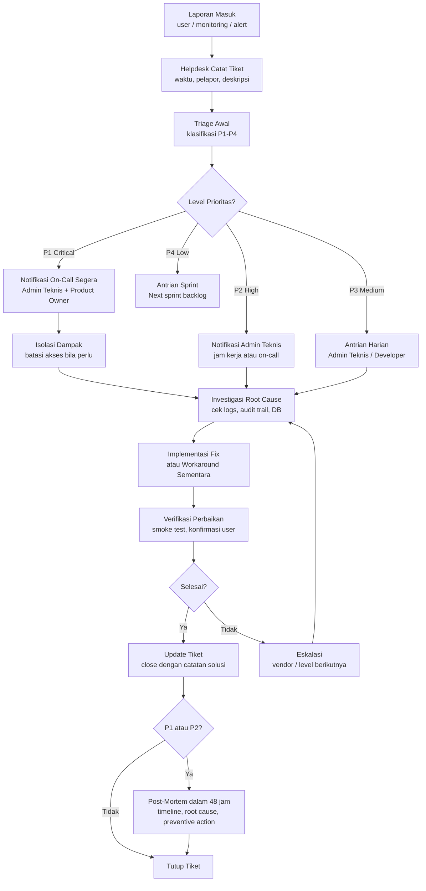

# Operations Support and Maintenance Plan — Satu Sehat Kobar

**Versi:** 1.5  
**Tanggal:** Juni 2026  
**Status:** Active  
**Berlaku untuk:** MVP Sprint 0–6 (Jul–Nov 2026) dan seterusnya

---

## 1. Model Operasional

### 1.1 Tim dan Tanggung Jawab

Operasional Satu Sehat Kobar dijalankan oleh dua lapis tim:

| Lapis | Tim | Tanggung Jawab |
|-------|-----|----------------|
| Primary | Tim SIK internal Dinkes Kobar | Operasional harian, monitoring, backup, user management, level-1 support |
| Backup | Vendor support AWCMS-Micro | Eskalasi teknis, update platform, isu Cloudflare, level-2/3 support |

### 1.2 Jam Operasional

| Mode | Waktu | Keterangan |
|------|-------|------------|
| Operasional normal | 08:00–16:00 WIB, hari kerja | Seluruh aktivitas support, admin, monitoring aktif |
| On-call P1 | 24/7 selama masa pilot | Insiden critical: sistem tidak bisa diakses, data bocor |
| On-call P2 | Di luar jam kerja, hari kerja berikutnya | Fitur utama tidak berfungsi, eskalasi via WhatsApp |

### 1.3 Prinsip Operasional

1. **Stability first** — Stabilitas sistem selama masa pilot lebih penting dari penambahan fitur.
2. **Backup before change** — Backup wajib sebelum setiap deployment atau migrasi database.
3. **Rollback ready** — Setiap release harus memiliki rencana rollback yang siap dieksekusi.
4. **Least privilege** — Admin hanya menggunakan akses yang sesuai kebutuhan tugas.
5. **Security aware** — Support tidak boleh meminta password, membuka dokumen tanpa hak, atau membagikan data sensitif.
6. **Audit important actions** — Setiap aksi penting admin dicatat dalam audit log.
7. **Documentation always updated** — Perubahan fitur, SOP, dan konfigurasi wajib memperbarui dokumentasi.

---

## 2. Level Prioritas Insiden

| Level | Definisi | Contoh | Response Time | Resolution Time |
|-------|----------|--------|---------------|-----------------|
| **P1 Critical** | Sistem tidak dapat diakses, data sensitif bocor, atau kerusakan data | Sistem down, finance data terbuka ke user tidak berwenang, migration corrupt data | ≤ 1 jam | ≤ 4 jam |
| **P2 High** | Fitur utama tidak berfungsi, menghambat pekerjaan tanpa workaround jelas | Approval flow macet, PDF tidak bisa di-generate, upload final gagal total | ≤ 4 jam | ≤ 1 hari kerja |
| **P3 Medium** | Bug yang mengganggu tetapi ada workaround | Dashboard angka tidak sinkron, validasi kurang jelas, tampilan sebagian salah | ≤ 1 hari kerja | ≤ 3 hari kerja |
| **P4 Low** | Enhancement, perbaikan kosmetik, atau pertanyaan penggunaan | Typo label, warna tombol, permintaan fitur baru | ≤ 3 hari kerja | Sprint berikutnya |

---

## 3. Prosedur Respons Insiden

### 3.1 Alur Respons Insiden



### 3.2 Post-Mortem

Setiap insiden P1 dan P2 wajib menghasilkan dokumen post-mortem dalam 48 jam setelah resolusi, memuat:

- Kronologi kejadian
- Root cause analysis
- Dampak operasional
- Tindakan perbaikan yang dilakukan
- Tindakan pencegahan ke depan
- Keputusan Product Owner bila ada perubahan scope

---

## 4. Backup dan Recovery

### 4.1 Jadwal Backup

| Item | Metode | Frekuensi | Retensi | Verifikasi |
|------|--------|-----------|---------|------------|
| D1 Database | `wrangler d1 export` | Harian (02:00 WIB) | 30 hari | Restore test bulanan |
| R2 Storage | Versioning + lifecycle rules | Real-time versioning | 90 hari versi lama | Restore test per sprint |
| KV Namespace | Export JSON via script | Mingguan (Minggu 01:00 WIB) | 14 hari | Manual spot check |
| Config & Secrets | Git (tanpa nilai secret) + Cloudflare dashboard export | Per commit / per perubahan | Unlimited (Git) | Review per sprint |
| Audit Log | Tabel `audit_events` di D1, sudah tercakup backup D1 | Harian | 2 tahun aktif, 3 tahun inaktif | Background cleanup job |

### 4.2 Prosedur Backup D1

Jalankan perintah berikut untuk backup database production:

```bash
# Export seluruh database D1 production
wrangler d1 export ssk-production \
  --output backup/ssk-production-$(date +%Y%m%d-%H%M%S).sql

# Verifikasi file backup berhasil dibuat
ls -lh backup/ssk-production-*.sql | tail -5

# Upload ke R2 sebagai long-term storage
wrangler r2 object put ssk-backups/db/ssk-production-$(date +%Y%m%d).sql \
  --file backup/ssk-production-$(date +%Y%m%d-%H%M%S).sql
```

Checklist backup D1:
- [ ] File SQL berhasil dibuat dan tidak kosong
- [ ] Ukuran file wajar (tidak jauh berbeda dari backup sebelumnya)
- [ ] File tersimpan di R2 bucket yang tidak public
- [ ] Nama file mengandung timestamp
- [ ] Dicatat di log operasional harian

### 4.3 Prosedur Backup R2 Storage

R2 Object Versioning dikonfigurasi melalui `wrangler.toml`:

```toml
[[r2_buckets]]
binding = "SSK_STORAGE"
bucket_name = "ssk-documents"
# Versioning dikonfigurasi di Cloudflare dashboard:
# Storage > R2 > ssk-documents > Settings > Object Versioning: Enabled
# Lifecycle: Delete versions older than 90 days
```

Verifikasi versioning aktif:
```bash
# List versi objek (contoh file tertentu)
wrangler r2 object list ssk-documents --prefix "final/" --include-versions
```

### 4.4 Prosedur Recovery

**RTO (Recovery Time Objective): ≤ 4 jam**  
**RPO (Recovery Point Objective): ≤ 24 jam**

**Langkah restore database D1 dari backup:**

```bash
# 1. Identifikasi file backup terbaru yang valid
wrangler r2 object list ssk-backups --prefix "db/" | sort -r | head -5

# 2. Download file backup
wrangler r2 object get ssk-backups/db/ssk-production-YYYYMMDD.sql \
  --file restore/ssk-restore.sql

# 3. Buat D1 database restore (environment staging dulu untuk verifikasi)
wrangler d1 execute ssk-staging --file restore/ssk-restore.sql

# 4. Verifikasi data di staging (cek tabel utama, jumlah record)
wrangler d1 execute ssk-staging \
  --command "SELECT COUNT(*) FROM duty_requests; SELECT COUNT(*) FROM agenda_events;"

# 5. Jika staging valid, restore ke production (koordinasi dengan Product Owner)
wrangler d1 execute ssk-production --file restore/ssk-restore.sql

# 6. Smoke test production setelah restore
# - Login sebagai admin
# - Cek dashboard
# - Cek satu agenda dan satu ST
# - Cek audit log terakhir
```

**Verifikasi setelah restore:**
- [ ] Sistem dapat diakses dan login berhasil
- [ ] Data agenda, ST, dan dokumen final terbaca
- [ ] Audit log terbaca dan konsisten
- [ ] Tidak ada data finance terbuka ke user tidak berwenang
- [ ] PDF generation berfungsi
- [ ] Upload file berfungsi
- [ ] Product Owner dikonfirmasi dan menyetujui restore complete

### 4.5 Disaster Recovery

| Skenario | Tindakan Utama | Komunikasi ke Pengguna |
|----------|---------------|------------------------|
| D1 corrupt | Restore dari backup harian terakhir, RTO ≤4 jam | Notifikasi via WhatsApp grup: "Sistem sedang dalam pemulihan, estimasi X jam" |
| R2 unavailable | Akses file melalui backup versi, dokumen final tidak dapat diunduh sementara | "Unduhan dokumen sementara tidak tersedia, sedang dipulihkan" |
| Workers outage (Cloudflare) | Pantau status.cloudflare.com, tidak ada tindakan selain menunggu | "Sistem sedang gangguan dari infrastruktur, estimasi update dari Cloudflare" |
| Secret bocor | Rotate semua secret di Cloudflare dashboard segera, audit siapa yang terekspos | Laporan insiden ke Product Owner, tidak perlu notifikasi publik kecuali ada data pengguna terdampak |

---

## 5. Pemeliharaan Rutin

| Tugas | Frekuensi | Pelaksana | Prosedur |
|-------|-----------|-----------|----------|
| Cek akses dan error log harian | Harian | Admin Teknis | Buka Cloudflare Analytics + Workers Logs, catat anomali |
| Backup verification | Mingguan | Admin Teknis | Pastikan backup D1 harian berhasil, spot-check file size |
| Security patch review | Mingguan | Admin Teknis | Cek advisory wrangler, AWCMS-Micro changelog, npm audit |
| Dependency update check | Bulanan | Developer | `npm outdated`, review changelog, test di staging |
| Audit log rotation check | Harian | Background job | Job otomatis menandai log >2 tahun sebagai inaktif |
| Performance review | Bulanan | Admin Teknis | Cloudflare Analytics: p95 latency, error rate, traffic trend |
| Full backup restore test | Per sprint (±2 minggu) | Admin Teknis | Restore ke environment staging, smoke test seluruh alur utama |
| User & role review | Bulanan | Admin Aplikasi | Cek user tidak aktif, role berlebih, super admin list |
| Storage capacity check | Mingguan | Admin Teknis | Pantau R2 usage, alert jika >80% batas paket |
| Security checklist review | Per sprint | Admin Teknis | Jalankan security checklist (doc 10) |

---

## 6. Monitoring Operasional

### 6.1 Sumber Data Monitoring

| Sumber | Informasi yang Dipantau | Frekuensi |
|--------|------------------------|-----------|
| Cloudflare Analytics | Total request, error rate, response time, geographic distribution | Real-time / harian |
| Workers Logs | Structured JSON logs per request, error traces | Real-time |
| D1 Query Analytics | Query count, slow queries | Harian |
| R2 Usage | Storage used, request count | Mingguan |
| KV Operations | Read/write count | Mingguan |

### 6.2 Alert Conditions

| Kondisi | Threshold | Tindakan |
|---------|-----------|----------|
| Error rate tinggi | > 1% dari total request dalam 1 jam | Alert P2, investigasi segera |
| Response time lambat | p95 > 1000ms selama 10 menit | Alert P3, cek query lambat dan KV cache |
| Storage R2 penuh | > 80% dari batas paket | Alert P3, review file orphan dan lifecycle rules |
| Login failure berulang | > 10 kali gagal dari IP sama dalam 5 menit | Alert P2, kemungkinan brute force |
| Backup gagal | File backup tidak muncul dalam 24 jam | Alert P2, jalankan manual backup |
| Workers 5xx spike | > 5 error 500 dalam 1 menit | Alert P1, cek deployment terbaru |

### 6.3 Health Check Endpoint

Endpoint `GET /api/health` dipanggil setiap 5 menit oleh monitoring eksternal (dapat menggunakan Cloudflare Workers Cron atau layanan uptime monitoring).

Response yang diharapkan:
```json
{
  "status": "ok",
  "version": "1.5.0",
  "db": "ok",
  "storage": "ok",
  "timestamp": "2026-07-01T08:00:00Z"
}
```

Jika `status` bukan `"ok"`, trigger alert P1.

---

## 7. Pembaruan Sistem (Update Procedure)

### 7.1 Update AWCMS-Micro Platform

AWCMS-Micro adalah upstream yang dikelola vendor. Prosedur update:

1. **Pantau changelog** — Langganan notifikasi rilis AWCMS-Micro
2. **Review breaking changes** — Identifikasi perubahan yang mempengaruhi plugin SSK
3. **Test di staging** — Deploy versi baru ke environment staging
4. **Jalankan regression test** — Smoke test seluruh alur utama di staging
5. **UAT sample** — Minta 1-2 user pilot mencoba fungsi utama di staging
6. **Backup production** — Jalankan backup D1 dan verifikasi sebelum update prod
7. **Deploy production** — `wrangler deploy --env production`
8. **Smoke test production** — Cek health, login, satu skenario lengkap
9. **Update changelog** — Catat versi AWCMS-Micro yang digunakan

### 7.2 Update Plugin SSK

1. PR dibuat oleh developer
2. CI check otomatis: lint, typecheck, unit test
3. Deploy ke staging (auto via GitHub Actions pada merge ke `develop`)
4. Smoke test staging + UAT sample minimal 2 skenario
5. Product Owner atau Admin Teknis menyetujui deploy production
6. Deploy production dengan backup terlebih dahulu
7. Post-deploy health check dan smoke test

### 7.3 Prosedur Rollback

Rollback dilakukan dalam kondisi:
- Sistem tidak dapat diakses dalam 30 menit setelah deploy
- Bug P1 ditemukan langsung setelah deploy

```bash
# Rollback ke versi sebelumnya
wrangler rollback --env production

# Jika perlu rollback database (jarang, hanya jika migration merusak data)
wrangler d1 execute ssk-production --file restore/ssk-pre-deploy-backup.sql

# Smoke test setelah rollback
# Konfirmasi ke Product Owner bahwa rollback berhasil
```

---

## 8. Pengelolaan User (Admin Tasks)

### 8.1 Tambah User Baru

1. Siapkan data: nama lengkap, email institusi, unit kerja, faskes (jika Kepala Faskes/Kepala TU), role yang akan diberikan
2. Buka panel admin: **Pengaturan > Manajemen Pengguna > Tambah User**
3. Isi form dan pilih role sesuai fungsi (tidak boleh berlebihan)
4. Simpan — sistem mengirim email aktivasi (Phase 1: admin share link manual)
5. Catat perubahan di log operasional

### 8.2 Reset Password

1. Admin Aplikasi membuka **Pengaturan > Manajemen Pengguna > [Nama User]**
2. Klik **Reset Password** — sistem generate link reset sementara
3. Sampaikan link ke user melalui kanal aman (bukan publik)
4. Link expired dalam 1 jam
5. Admin **tidak boleh** mengetahui atau mencatat password user

### 8.3 Ubah Role

1. Dapatkan persetujuan tertulis dari atasan user atau Product Owner
2. Buka **Pengaturan > Manajemen Pengguna > [Nama User] > Edit Role**
3. Ubah role sesuai keputusan
4. Audit event otomatis tercatat dengan actor admin dan waktu perubahan
5. Informasikan kepada user tentang perubahan akses

### 8.4 Non-aktifkan User (Soft Delete)

Dilakukan ketika pegawai pindah unit, cuti panjang, atau keluar dari instansi:

1. Buka **Pengaturan > Manajemen Pengguna > [Nama User]**
2. Klik **Nonaktifkan** — status `is_active = false`, data tetap ada (soft delete)
3. User tidak dapat login
4. Data historis (agenda, ST, dokumen) tetap tersimpan untuk audit
5. Catat alasan nonaktifasi di log operasional

---

## 9. SLA dan KPI Operasional

| KPI | Target | Frekuensi Laporan |
|-----|--------|-------------------|
| Uptime sistem (jam kerja) | ≥ 99.5% | Bulanan |
| Error rate | < 0.5% dari total request | Mingguan |
| Response time p95 | < 1000ms | Bulanan |
| Backup D1 sukses | 100% (tidak ada hari terlewat) | Mingguan |
| Restore test sukses | 100% per sprint | Per sprint |
| Tiket P1 response | 100% ≤ 1 jam | Per insiden |
| Tiket P2 response | 100% ≤ 4 jam | Bulanan |
| Zero critical bug open | 0 bug P1 terbuka > 24 jam | Harian |
| Audit log coverage | 100% aksi mutasi tercatat | Bulanan |
| User aktif pilot | ≥ 80% user terdaftar login minimal 1x per minggu | Bulanan |

---

## 10. Pengelolaan Audit Log

### 10.1 Retensi

- **Aktif:** 2 tahun — data audit dapat dicari dan diunduh via panel Auditor
- **Inaktif:** Tahun ke-2 hingga ke-3 — data dipindahkan ke partisi arsip (tabel `audit_events_archive`), masih dapat diakses dengan query khusus
- **Hapus:** Setelah 3 tahun — background cleanup job menghapus permanen

### 10.2 Background Cleanup Job

Job dijalankan oleh Cloudflare Workers Cron setiap hari pukul 03:00 WIB:

```typescript
// Pseudocode scheduled handler
export default {
  async scheduled(event: ScheduledEvent, env: Env, ctx: ExecutionContext) {
    const threeYearsAgo = new Date();
    threeYearsAgo.setFullYear(threeYearsAgo.getFullYear() - 3);

    // Hapus audit log > 3 tahun
    await env.DB.prepare(
      `DELETE FROM audit_events WHERE created_at < ?`
    ).bind(threeYearsAgo.toISOString()).run();

    // Pindahkan audit log 2-3 tahun ke arsip
    const twoYearsAgo = new Date();
    twoYearsAgo.setFullYear(twoYearsAgo.getFullYear() - 2);
    await env.DB.prepare(
      `INSERT OR IGNORE INTO audit_events_archive SELECT * FROM audit_events WHERE created_at < ? AND created_at >= ?`
    ).bind(twoYearsAgo.toISOString(), threeYearsAgo.toISOString()).run();
  }
}
```

---

## 11. Hal yang Tidak Boleh Dilakukan

Tim operasional, admin, helpdesk, dan AI coding agent tidak boleh:

1. Meminta password user melalui kanal apapun
2. Membagikan akun bersama antar admin
3. Mengubah role user tanpa dasar persetujuan tertulis
4. Membuka data finance tanpa kewenangan
5. Membuka atau mengunduh dokumen restricted tanpa kebutuhan yang jelas
6. Menghapus dokumen final (dokumen final bersifat immutable)
7. Menghapus atau mengubah audit log
8. Menjalankan migrasi database tanpa backup terlebih dahulu
9. Deploy ke production tanpa smoke test
10. Menutup tiket insiden tanpa catatan solusi yang jelas
11. Menyimpan secret atau credential di dokumen atau repository
12. Menyatakan masalah selesai tanpa konfirmasi dari pelapor

---

## 12. Dokumen Terkait

| Dokumen | Relevansi |
|---------|-----------|
| `07.REPOSITORY_EXECUTION_SOP.docx.md` | Prosedur teknis deployment dan migrasi |
| `10.Security and Privacy Checklist.docx.md` | Checklist keamanan yang harus dijalankan berkala |
| `06.UAT and Deployment Checklist.docx.md` | Gate deployment sebelum go-live |
| `17.Data Governance and Retention Policy.docx.md` | Kebijakan retensi dan penghapusan data |
| `16.Risk Register and Mitigation Plan.docx.md` | Daftar risiko operasional dan mitigasinya |
| `20.Master Document Index and Implementation Guide.docx.md` | Navigasi seluruh dokumen PRD |
