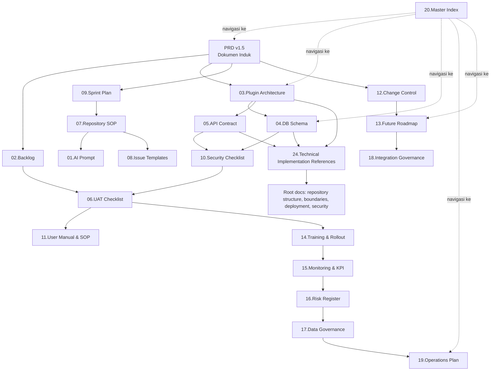

# Master Document Index and Implementation Guide — Satu Sehat Kobar

**Versi:** 1.5  
**Tanggal:** Juni 2026  
**Status:** Active  
**Fungsi:** Pintu masuk utama seluruh dokumentasi PRD Satu Sehat Kobar

---

## 1. Tentang Dokumen Ini

### 1.1 Tujuan

Dokumen ini adalah **indeks master dan panduan navigasi** seluruh paket dokumentasi PRD Satu Sehat Kobar v1.5. Sebelum membaca dokumen teknis manapun, baca dokumen ini terlebih dahulu.

Dokumen ini digunakan untuk:

1. Memberikan gambaran lengkap seluruh dokumen yang tersedia
2. Menjelaskan fungsi dan kapan setiap dokumen digunakan
3. Menentukan urutan baca yang tepat berdasarkan peran
4. Memastikan seluruh dokumen terhubung dan tidak saling bertentangan
5. Menjadi checkpoint sebelum implementasi teknis dimulai

### 1.2 Prinsip Penggunaan Dokumen

- **Semua dokumen terkoneksi** — Setiap dokumen merujuk dan dilengkapi dokumen lain. Jangan gunakan satu dokumen secara terisolasi.
- **PRD adalah dokumen induk** — Semua dokumen teknis, operasional, dan perencanaan mengacu pada PRD.
- **Change control mengatur perubahan** — Setiap perubahan substansial pada dokumen harus melalui proses change control (doc 12).
- **Versi dokumen mengikuti pola vX.Y** — Major version berubah saat ada perubahan scope atau arsitektur signifikan.

---

## 2. Index Dokumen Lengkap

| # | Nama File | Versi | Status | Tujuan Utama | Kapan Dibaca |
|---|-----------|-------|--------|--------------|--------------|
| PRD | `PRODUCT REQUIREMENT DOCUMENT v1.4.docx.md` | v1.5 | Active | Dokumen induk: visi, scope, 7 plugin, 17 role, alur approval | Sprint 0, sebelum coding apapun |
| 01 | `01.AI Implementation Prompt.docx.md` | v1.5 | Active | Konteks lengkap untuk AI coding assistant: hard rules, pola kode, anti-patterns | Setiap sesi coding dengan AI |
| 02 | `02.IMPLEMENTATION_BACKLOG.docx.md` | v1.5 | Active | Backlog atomic per sprint dan issue GitHub | Sprint planning, membuat issue |
| 03 | `03.PLUGIN_ARCHITECTURE.docx.md` | v1.5 | Active | Arsitektur 7 plugin, folder structure, service contract, inter-plugin communication | Saat membangun atau review plugin |
| 04 | `04.DATABASE_MVP_SCHEMA.docx.md` | v1.5 | Active | Skema database D1 lengkap: tabel, kolom, relasi, prefix per plugin | Saat membuat migration atau query |
| 05 | `05.API Service Contract Satu Sehat Kobar v1.4.docx.md` | v1.5 | Active | Kontrak API antar-plugin dan endpoint publik: format request/response, auth, error code | Saat membuat atau mengonsumsi API |
| 06 | `06.UAT and Deployment Checklist.docx.md` | v1.5 | Active | Checklist UAT, smoke test, dan gate sebelum go-live | Sebelum UAT dan sebelum deploy production |
| 07 | `07.REPOSITORY_EXECUTION_SOP.docx.md` | v1.5 | Active | SOP teknis: git workflow, migration, deployment, testing, code review checklist | Sebelum mulai kerja di repository |
| 08 | `08.GITHUB_ISSUE_TEMPLATES.md.docx.md` | v1.5 | Active | Template issue GitHub untuk pekerjaan atomic per sprint | Saat membuat issue baru |
| 09 | `09.SPRINT_EXECUTION_PLAN.docx.md` | v1.5 | Active | Urutan eksekusi Sprint 0–6, deliverable per sprint, gate antar sprint | Sprint planning dan review |
| 10 | `10.Security and Privacy Checklist.docx.md` | v1.5 | Active | Checklist RBAC, ABAC, audit, upload, privasi, dan keamanan | Setiap sprint, sebelum deploy |
| 11 | `11.USER_MANUAL_AND_SOP_DRAFT.docx.md` | v1.5 | Active | Draft SOP per role: pegawai, atasan, keuangan, operator surat, admin, auditor | Persiapan pelatihan dan UAT |
| 12 | `12.CHANGE_CONTROL_AND_DECISION_LOG.docx.md` | v1.5 | Active | Log keputusan, ADR arsitektur, perubahan scope, future backlog | Setiap ada keputusan penting |
| 13 | `13.Future Roadmap and Phase 2 Backlog.docx.md` | v1.5 | Active | Roadmap Phase 2–3: integrasi TTE, SRIKANDI, SIMPEG, SIPD, AI features | Perencanaan pasca-MVP |
| 14 | `14.Training and Rollout Plan.docx.md` | v1.5 | Active | Strategi pelatihan cascade, jadwal rollout bertahap, evaluasi | Persiapan pilot dan rollout |
| 15 | `15.Monitoring Evaluation and KPI MVP Satu Sehat Kobar.docx.md` | v1.5 | Active | KPI MVP, framework monitoring, laporan evaluasi berkala | Selama dan setelah pilot |
| 16 | `16.Risk Register and Mitigation Plan.docx.md` | v1.5 | Active | Daftar risiko, probabilitas, dampak, dan mitigasi | Sprint planning, sebelum go-live |
| 17 | `17.Data Governance and Retention Policy.docx.md` | v1.5 | Active | Klasifikasi data, kebijakan akses, retensi, penghapusan, koreksi | Saat desain data dan fitur akses |
| 18 | `18.Integration Governance and External Systems.docx.md` | v1.5 | Active | Tata kelola integrasi eksternal: TTE/BSrE, SRIKANDI, SIMPEG, SIPD | Phase 2 planning |
| 19 | `19.Operations Support and Maintenance Plan.docx.md` | v1.5 | Active | Operasional harian, level insiden, backup/recovery, SLA, KPI ops | Tim SIK, sebelum go-live |
| 20 | `20.Master Document Index and Implementation Guide.docx.md` | v1.5 | Active | Dokumen ini — indeks dan panduan navigasi | Selalu dibaca pertama |
| 21 | `21.Addendum Master Data Wilayah Faskes dan Lokasi.docx.md` | v1.0 | Active | Master data wilayah, faskes, dan lokasi untuk Kab. Kotawaringin Barat | Saat seed data dan setup master data |
| 22 | `22.MASTER_DATA_AND_LOCATION_FOUNDATION_ADDENDUM.docx.md` | v1.0 | Active | Fondasi master data dan lokasi untuk multi-faskes | Saat setup environment production |
| 23 | `23.Personnel Profile and Master Data Recommendation Addendum.docx.md` | v1.0 | Active | Profil pegawai dan rekomendasi master data SDM | Saat setup user dan integrasi SIMPEG |
| 24 | `24.TECHNICAL_IMPLEMENTATION_REFERENCES.md` | v1.0 | Active | Referensi teknis implementasi: mapping PRD ke workspace, boundary, plugin owner, deployment, security | Sebelum membuat issue teknis atau coding |

---

## 3. Peta Ketergantungan Antar Dokumen



---

## 4. Panduan Penggunaan per Peran

### 4.1 Tech Lead / Arsitek

**Urutan baca:**

1. `PRD v1.5` — scope, visi, 7 plugin, 17 role
2. `03.Plugin Architecture` — struktur plugin, service contract, boundaries
3. `04.DB Schema` — skema D1, prefix tabel, relasi
4. `05.API Contract` — format response, auth chain, error code
5. `09.Sprint Plan` — urutan deliverable
6. `07.Repository SOP` — standar coding dan deployment
7. `10.Security Checklist` — RBAC, ABAC, audit trail
8. `12.Change Control` — keputusan arsitektur yang sudah diambil
9. `24.Technical Implementation References` — mapping PRD ke workspace, plugin owner, dan referensi implementasi root

**Fokus:** Menjaga konsistensi arsitektur plugin-first, menghindari coupling antar plugin, memastikan ABAC dan audit diterapkan.

### 4.2 Backend Developer

**Urutan baca:**

1. `07.Repository SOP` — setup environment, git workflow, migration SOP
2. `01.AI Prompt` — hard rules, pola kode yang benar, anti-patterns
3. `04.DB Schema` — tabel yang dikerjakan
4. `05.API Contract` — endpoint yang dibangun
5. `03.Plugin Architecture` — boundary plugin
6. `10.Security Checklist` — checklist sebelum PR
7. `08.Issue Templates` — format issue yang dikerjakan
8. `24.Technical Implementation References` — lokasi implementasi, boundary, dan mapping plugin/tabel sebelum coding

**Fokus:** Tidak akses tabel plugin lain langsung, parameterized queries, audit event di setiap mutasi, ABAC check di service layer.

### 4.3 Frontend Developer

**Urutan baca:**

1. `05.API Contract` — format request/response yang dikonsumsi
2. `PRD v1.5` (bagian UI/UX flows) — alur pengguna per role
3. `11.User Manual & SOP` — bagaimana user melakukan tugas
4. `10.Security Checklist` — jangan expose data sensitif di UI
5. `07.Repository SOP` — git workflow dan CI/CD
6. `24.Technical Implementation References` — API, route, RBAC/ABAC, upload, dan rujukan testing yang harus diikuti

**Fokus:** Tampilkan hanya data sesuai role yang login, error message dalam Bahasa Indonesia, form validation konsisten dengan server-side validation.

### 4.4 Product Owner / Project Manager

**Urutan baca:**

1. `PRD v1.5` — scope dan visi
2. `02.Backlog` — prioritas fitur per sprint
3. `09.Sprint Plan` — timeline Jul–Nov 2026
4. `16.Risk Register` — risiko yang perlu dimonitor
5. `15.Monitoring & KPI` — KPI yang harus dicapai
6. `12.Change Control` — keputusan yang sudah diambil
7. `13.Future Roadmap` — Phase 2–3 untuk perencanaan anggaran

**Fokus:** Menjaga scope MVP tidak melebar, keputusan scope ada di Change Control, gate sebelum go-live.

### 4.5 QA / Tester

**Urutan baca:**

1. `06.UAT Checklist` — skenario uji lengkap
2. `05.API Contract` — expected behavior API
3. `10.Security Checklist` — skenario keamanan
4. `11.User Manual & SOP` — alur yang seharusnya diuji
5. `04.DB Schema` — memahami struktur data untuk validasi
6. `24.Technical Implementation References` — memastikan skenario uji mengikuti mapping implementasi dan boundary aktual

**Fokus:** Pastikan seluruh skenario Must Have di UAT checklist dapat dilakukan tanpa error, test ABAC dengan user berbeda role/faskes.

### 4.6 Admin Operasional / Tim SIK

**Urutan baca:**

1. `19.Operations Plan` — model operasional, level insiden, SLA
2. `07.Repository SOP` — prosedur deployment dan rollback
3. `06.UAT Checklist` — checklist sebelum go-live
4. `11.User Manual & SOP` — SOP per role untuk pelatihan
5. `17.Data Governance` — kebijakan akses dan retensi
6. `24.Technical Implementation References` — rujukan deployment, backup, security, dan lokasi implementasi teknis

**Fokus:** Backup harian, monitoring error rate, response insiden sesuai level P1-P4, user management.

---

## 5. Panduan Implementasi Bertahap

### 5.1 Sprint 0 — Dokumen yang Harus Dikuasai

Sebelum satu baris kode pun ditulis:

- `20.Master Index` (dokumen ini)
- `PRD v1.5`
- `24.Technical Implementation References`
- `03.Plugin Architecture`
- `04.DB Schema`
- `09.Sprint Plan`
- `07.Repository SOP`
- `01.AI Prompt`

**Output Sprint 0:** Repository audit selesai, GitHub milestones dan labels dibuat, pola plugin dipahami, environment lokal berjalan.

### 5.2 Sprint 1–2 — Referensi Teknis Utama

Selama Sprint 1 (Platform Foundation) dan Sprint 2 (Agenda Dinkes):

- `05.API Contract` — endpoint yang dibangun
- `10.Security Checklist` — gate sebelum merge
- `08.Issue Templates` — format issue per pekerjaan
- `12.Change Control` — catat setiap keputusan arsitektur
- `24.Technical Implementation References` — validasi plugin owner, target folder, dan dokumen root teknis sebelum membuat PR

### 5.3 Sprint 3–6 — Referensi Tambahan

Selama Sprint 3–6 (ST/SPPD, Approval, Bukti, MMC, Arsip):

- `06.UAT Checklist` — mulai menyiapkan skenario uji
- `16.Risk Register` — update risiko yang ditemukan saat development
- `11.User Manual & SOP` — mulai draft SOP bersamaan dengan development
- `14.Training & Rollout` — siapkan materi pelatihan
- `24.Technical Implementation References` — gunakan checklist implementasi untuk menghindari drift antara backlog, API, dan schema

### 5.4 Phase 2+ — Persiapan Integrasi

Setelah MVP pilot stabil:

- `18.Integration Governance` — framework untuk integrasi eksternal
- `13.Future Roadmap` — backlog Phase 2 yang sudah diprioritaskan
- `17.Data Governance` — implikasi data dari integrasi baru

---

## 6. Glosarium Silang Antar Dokumen

| Istilah | Definisi Ringkas | Didefinisikan di |
|---------|-----------------|-----------------|
| AWCMS-Micro | Platform Cloudflare Workers/D1/R2/KV yang menjadi fondasi SSK | PRD, `03.Plugin Architecture` |
| Plugin | Unit fitur modular yang dibuild di atas AWCMS-Micro | `03.Plugin Architecture` |
| Service Contract API | Mekanisme komunikasi resmi antar plugin | `05.API Contract`, `03.Plugin Architecture` |
| ABAC | Attribute-Based Access Control — aturan akses berbasis atribut unit/faskes/pemilik | `10.Security Checklist`, `01.AI Prompt` |
| RBAC | Role-Based Access Control — 17 role dengan permission matrix | PRD, `10.Security Checklist` |
| ST | Surat Tugas — dokumen perjalanan dinas yang dikelola plugin `duty-travel` | PRD, `04.DB Schema` |
| SPPD | Surat Perintah Perjalanan Dinas — lampiran biaya untuk ST berbiaya | PRD, `04.DB Schema` |
| is_budgeted | Flag pada duty request — jika false, langkah finance di approval chain di-skip | `12.Change Control`, `05.API Contract` |
| Audit Event | Record immutable setiap aksi mutasi di tabel `audit_events` | `04.DB Schema`, `10.Security Checklist` |
| Soft Delete | Penandaan `deleted_at` tanpa menghapus data fisik | `04.DB Schema`, `01.AI Prompt` |
| KV Cache | Cloudflare KV digunakan untuk cache dashboard — TTL 15 menit | PRD, `03.Plugin Architecture` |
| Signed URL | URL R2 dengan waktu expired untuk akses file — jangan expose R2 path langsung | `10.Security Checklist`, `01.AI Prompt` |
| duty_approval_step_config | Tabel konfigurasi langkah approval per faskes/unit | `04.DB Schema`, `12.Change Control` |
| RTO | Recovery Time Objective ≤ 4 jam | `19.Operations Plan` |
| RPO | Recovery Point Objective ≤ 24 jam | `19.Operations Plan` |
| Cascade Training | Strategi pelatihan: Tim SIK → Admin → User Champion → End User | `14.Training & Rollout` |
| Implementation Boundary | Batas lokasi perubahan agar AWCMS-Micro tetap sinkron dengan EmDash dan tidak menjadi fork core | `24.Technical Implementation References`, root `docs/awcms-micro-implementation-boundaries.md` |
| Plugin Owner | Plugin yang berwenang atas domain data, route, service, migration, dan audit event tertentu | `03.Plugin Architecture`, `24.Technical Implementation References` |
| Protected Path | Lokasi di `awcmsmicro-dev/` yang dipertahankan saat rebuild dari upstream EmDash | root `docs/awcmsmicro-dev-protected-paths.md`, `24.Technical Implementation References` |

---

## 7. Proses Update Dokumen

### 7.1 Siapa yang Berwenang

| Jenis Perubahan | Wewenang |
|-----------------|----------|
| Perbaikan typo atau klarifikasi kalimat | Developer atau Admin Teknis |
| Perubahan prosedur atau SOP | Admin Teknis + Product Owner |
| Perubahan scope, arsitektur, atau schema | Product Owner wajib menyetujui, dicatat di `12.Change Control` |
| Penambahan dokumen baru | Product Owner |

### 7.2 Proses Change Control

Setiap perubahan dokumen yang substansial mengikuti alur:

1. Usulkan perubahan di issue GitHub dengan label `doc-change`
2. Identifikasi dokumen lain yang ikut terpengaruh
3. Buat PR dengan perubahan di semua dokumen terkait
4. Review oleh minimal 1 orang lain (Tech Lead atau Product Owner)
5. Merge dan update versi dokumen (vX.Y)
6. Catat di `12.CHANGE_CONTROL_AND_DECISION_LOG.docx.md`

### 7.3 Versioning Dokumen

- Format: `vMAJOR.MINOR`
- `MAJOR` naik: perubahan scope, arsitektur, atau alur utama
- `MINOR` naik: penambahan prosedur, klarifikasi, koreksi

---

## 8. Status Resolusi Gap v1.5

Berikut adalah gap dan keputusan yang diselesaikan pada versi 1.5:

| Gap ID | Deskripsi Gap | Status | Dokumen yang Diperbarui | Sprint Target |
|--------|---------------|--------|------------------------|---------------|
| GAP-001 | Finance approval step — apakah wajib semua ST? | **Resolved** — Auto-skip jika `is_budgeted = false` | `12.Change Control`, `05.API Contract`, `01.AI Prompt` | Sprint 0 |
| GAP-002 | Notifikasi approval — email/WhatsApp atau in-app? | **Resolved** — In-app Phase 1; Email+WhatsApp Phase 2 | `13.Future Roadmap`, PRD | Sprint 0 |
| GAP-003 | Upload bukti perjalanan — siapa saja yang bisa upload? | **Resolved** — Semua peserta ST dapat upload bukti | `05.API Contract`, `10.Security Checklist` | Sprint 0 |
| GAP-004 | Jurnal tugas — state machine atau simple record? | **Resolved** — Bidirectional state machine (draft/submit/revisi) | `04.DB Schema`, `03.Plugin Architecture` | Sprint 0 |
| GAP-005 | Dashboard KPI — cache berapa lama? | **Resolved** — KV cache TTL 15 menit | `03.Plugin Architecture`, `01.AI Prompt` | Sprint 1 |
| GAP-006 | Audit log retensi — berapa lama simpan? | **Resolved** — 2 tahun aktif, 3 tahun inaktif, background cleanup | `17.Data Governance`, `19.Operations Plan`, `04.DB Schema` | Sprint 6 |
| GAP-007 | Multi-faskes ABAC — siapa yang dapat lihat data faskes lain? | **Resolved** — Keuangan `dinas_all` vs `faskes_own`, matrix di doc 10 | `10.Security Checklist`, `01.AI Prompt` | Sprint 1 |
| GAP-008 | TTE/BSrE di MVP — apakah masuk scope? | **Resolved** — Tidak di MVP, masuk Phase 2 Q4 2026 | `13.Future Roadmap`, `06.UAT Checklist` | Post-MVP |

---

## 9. Gate Implementasi

### Gate Sprint (berlaku setiap sprint)

Sprint dianggap selesai hanya jika:
- [ ] Semua issue Must Have di sprint selesai dan acceptance criteria terpenuhi
- [ ] Tidak ada bug P1 terbuka
- [ ] Unit test dan integration test lulus
- [ ] Dokumentasi diperbarui sesuai perubahan
- [ ] Sprint review dibuat dan disampaikan ke Product Owner

### Gate UAT

UAT hanya boleh dimulai jika:
- [ ] Seluruh alur utama MVP dapat dijalankan end-to-end
- [ ] Role dan permission seluruh 17 role sudah dikonfigurasi
- [ ] Data dummy tersedia
- [ ] Security checklist lulus awal
- [ ] Backup environment tersedia

### Gate Go-Live Pilot

Go-live hanya boleh dilakukan jika:
- [ ] Nol bug P1 terbuka
- [ ] Seluruh skenario Must Have di UAT checklist lulus
- [ ] Backup dan restore test berhasil
- [ ] Rollback plan siap
- [ ] User pilot sudah dilatih
- [ ] Product Owner menandatangani persetujuan go-live

### Gate Perluasan Rollout

Perluasan ke batch berikutnya hanya jika:
- [ ] Pilot stabil minimal 2 minggu
- [ ] ≥ 80% user aktif di batch sebelumnya
- [ ] Nol bug P1 terbuka
- [ ] KPI operasional mencapai target

---

## 10. Dokumen yang Tidak Boleh Dibaca Secara Terisolasi

Beberapa dokumen saling bergantung dan berbahaya jika dibaca terisolasi:

| Jangan hanya baca... | Tanpa juga baca... | Risiko |
|---------------------|-------------------|--------|
| `04.DB Schema` | `03.Plugin Architecture` | Salah membuat tabel tanpa prefix, coupling antar plugin |
| `05.API Contract` | `10.Security Checklist` | API tanpa auth/ABAC check yang benar |
| `13.Future Roadmap` | `12.Change Control` + PRD | Salah masukkan fitur Phase 2 ke MVP |
| `11.User Manual` | `05.API Contract` | SOP tidak sesuai behavior sistem aktual |
| `19.Operations Plan` | `07.Repository SOP` | Tidak tahu cara rollback saat insiden |
| `02.Backlog` | `24.Technical Implementation References` + `03.Plugin Architecture` + `04.DB Schema` | Salah membuat issue teknis karena nama plugin/tabel backlog belum dipetakan ke owner final |
| Addendum `21`/`22`/`23` | `24.Technical Implementation References` | Master data dibuat di lokasi yang tidak rebuild-safe atau tidak jelas plugin owner-nya |

---

## 11. Ringkasan Alur MVP

Alur utama yang harus selalu dijaga dari seluruh dokumen:

```
Agenda Dinkes
  → ST/SPPD (duty-travel plugin)
  → Approval 6 langkah (finance auto-skip jika is_budgeted=false)
  → Generate PDF ST/SPPD (document-template plugin)
  → Tanda Tangan Manual
  → Upload Dokumen Final (document-archive plugin)
  → Pelaksanaan Tugas
  → Upload Laporan dan Bukti (semua peserta ST dapat upload)
  → Verifikasi Bukti
  → Jurnal Pegawai (bidirectional state machine)
  → Dashboard SPM (KV cache 15 menit)
  → Arsip Digital
```

Setiap fitur yang berada di luar alur ini harus diuji terhadap scope MoSCoW sebelum masuk implementasi.

---

## 12. Referensi Cepat

| Kebutuhan | Lihat Dokumen |
|-----------|---------------|
| Apa yang boleh dan tidak boleh dikerjakan AI | `01.AI Implementation Prompt` |
| Struktur folder plugin | `03.Plugin Architecture` |
| Skema tabel database | `04.DB Schema` |
| Format response API | `05.API Contract` |
| Cara deploy ke production | `07.Repository SOP` |
| Skenario uji UAT | `06.UAT Checklist` |
| Bagaimana user menggunakan sistem | `11.User Manual & SOP` |
| Keputusan yang sudah diambil | `12.Change Control` |
| Roadmap setelah MVP | `13.Future Roadmap` |
| Cara pelatihan user | `14.Training & Rollout` |
| Risiko dan mitigasi | `16.Risk Register` |
| Kebijakan simpan data | `17.Data Governance` |
| Prosedur operasional harian | `19.Operations Plan` |
| Mapping PRD ke implementasi teknis | `24.Technical Implementation References` |
