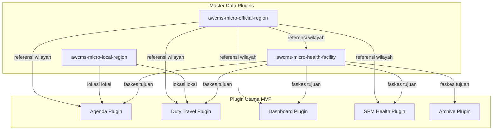

# Addendum: Master Data Wilayah, Faskes, dan Lokasi — Satu Sehat Kobar v1.5

## Addendum Plugin Wilayah Resmi, Wilayah Lokal, Faskes Tujuan ST, dan Koordinat Lokasi

**Status**: Addendum Resmi — Terintegrasi dalam PRD v1.5  
**Versi Dokumen**: v1.5 (diselaraskan dari v1.4)  
**Hubungan dengan Dokumen Utama**: Addendum ini merinci komponen master data wilayah dan faskes yang menjadi fondasi referensi untuk plugin Agenda, ST/SPPD, Dashboard, SPM, dan Arsip.

---

## 1. Latar Belakang dan Status

Dokumen utama PRD v1.5 mencakup alur Agenda, ST/SPPD, Approval, PDF, Bukti, Jurnal, Dashboard, MMC, Arsip, Security, UAT, Monitoring, Risiko, Data Governance, Integrasi, dan Operasional. Addendum ini secara khusus merinci **master data wilayah, faskes, dan koordinat lokasi** yang menjadi fondasi referensi seluruh modul tersebut.

**Mengapa diperlukan**:
- Agenda memerlukan referensi lokasi kegiatan (kecamatan, desa, faskes)
- ST/SPPD memerlukan referensi tujuan perjalanan dinas (wilayah/faskes)
- Dashboard memerlukan agregasi data per wilayah/faskes
- SPM memerlukan data faskes untuk tracking capaian indikator

---

## 2. Plugin Tambahan untuk Master Data Wilayah

Selain 7 plugin utama MVP, sistem memerlukan **3 plugin pendukung master data**:

| # | Plugin ID | Fungsi | Status MVP |
|---|-----------|--------|-----------|
| 8 | `awcms-micro-official-region` | Master wilayah Kemendagri (Provinsi → Desa) | Must Have |
| 9 | `awcms-micro-local-region` | Wilayah lokal non-Kemendagri (kampung, blok RT/RW) | Should Have |
| 10 | `awcms-micro-health-facility` | Master faskes lengkap dengan koordinat | Must Have |

---

## 3. Plugin Wilayah Resmi Kemendagri (`awcms-micro-official-region`)

### 3.1 Tujuan

Menyediakan master wilayah administrasi resmi berdasarkan kode wilayah Kemendagri sebagai referensi valid untuk:
- Lokasi kegiatan agenda
- Tujuan perjalanan dinas ST/SPPD
- Alamat faskes
- Filter dan agregasi dashboard per wilayah
- Validasi input alamat dari pengguna

### 3.2 Schema Tabel

**Prefix tabel**: `region_`

```sql
-- Tabel wilayah hierarkis (Provinsi → Kabupaten → Kecamatan → Desa/Kelurahan)
CREATE TABLE region_official (
  id TEXT PRIMARY KEY,
  code TEXT UNIQUE NOT NULL,          -- Kode Kemendagri (misal: 62.01.01.2001)
  name TEXT NOT NULL,                 -- Nama wilayah resmi
  level TEXT NOT NULL,                -- province|regency|district|village
  parent_code TEXT,                   -- FK ke code level di atasnya
  province_code TEXT,                 -- shortcut ke kode provinsi
  regency_code TEXT,                  -- shortcut ke kode kabupaten
  district_code TEXT,                 -- shortcut ke kode kecamatan
  postal_code TEXT,
  is_active INTEGER DEFAULT 1,
  created_at TEXT NOT NULL,
  updated_at TEXT NOT NULL
);

-- Index untuk performa
CREATE INDEX idx_region_official_parent ON region_official(parent_code);
CREATE INDEX idx_region_official_level ON region_official(level);
CREATE INDEX idx_region_official_regency ON region_official(regency_code);
```

### 3.3 Hierarki Wilayah

```
Provinsi (level: province)
└── Kabupaten/Kota (level: regency)
    └── Kecamatan (level: district)
        └── Desa/Kelurahan (level: village)
```

**Cakupan MVP**: Semua wilayah dalam Kab. Kotawaringin Barat + level provinsi Kalimantan Tengah.

### 3.4 API

| Method | Endpoint | Deskripsi |
|--------|----------|-----------|
| GET | `/api/regions/provinces` | Daftar provinsi |
| GET | `/api/regions/regencies?province_code=` | Daftar kabupaten dalam provinsi |
| GET | `/api/regions/districts?regency_code=` | Daftar kecamatan dalam kabupaten |
| GET | `/api/regions/villages?district_code=` | Daftar desa dalam kecamatan |
| GET | `/api/regions/search?q=&level=` | Pencarian wilayah |
| GET | `/api/regions/:code` | Detail wilayah tertentu |

### 3.5 Seed Data

- Sumber: Data Kemendagri terbaru (format JSON atau CSV)
- Cakupan seed MVP: Kalimantan Tengah → Kab. Kotawaringin Barat → semua kecamatan dan desa
- Update: Manual (Kemendagri tidak sering berubah); update jika ada pemekaran wilayah
- Format import: CSV dengan kolom: code, name, level, parent_code, postal_code

---

## 4. Plugin Wilayah Lokal (`awcms-micro-local-region`)

### 4.1 Tujuan

Mengelola lokasi yang tidak memiliki kode Kemendagri resmi, seperti:
- Nama kawasan industri / perumahan
- Nama kampung / blok / RT/RW
- Lokasi spesifik (gedung, jalan tertentu)
- Area yang menginduk ke wilayah resmi tingkat desa

### 4.2 Schema Tabel

**Prefix tabel**: `local_region_`

```sql
CREATE TABLE local_region_areas (
  id TEXT PRIMARY KEY,
  name TEXT NOT NULL,                  -- Nama lokasi lokal
  description TEXT,
  parent_village_code TEXT NOT NULL,   -- FK ke region_official (level: village)
  area_type TEXT DEFAULT 'other',      -- kampung|blok|rtrw|kawasan|gedung|other
  latitude REAL,
  longitude REAL,
  is_active INTEGER DEFAULT 1,
  created_by TEXT NOT NULL,
  created_at TEXT NOT NULL,
  updated_at TEXT NOT NULL
);
```

### 4.3 Penggunaan

- **Agenda**: `location_name` dan `location_address` dapat merujuk ke wilayah lokal
- **ST/SPPD tujuan**: `destination_name` dapat merujuk ke wilayah lokal
- **Input UI**: Dropdown cascading: Pilih wilayah resmi → opsional masukkan lokasi lokal

---

## 5. Plugin Faskes (`awcms-micro-health-facility`)

### 5.1 Tujuan

Master data fasilitas kesehatan yang menjadi:
- Subjek pembinaan Dinas Kesehatan
- Tujuan kunjungan ST/SPPD
- Unit penyelenggara kegiatan faskes
- Referensi untuk SPM per faskes
- Filter dan agregasi dashboard per faskes

### 5.2 Schema Tabel

**Prefix tabel**: `hf_`

```sql
CREATE TABLE hf_health_facilities (
  id TEXT PRIMARY KEY,
  code TEXT UNIQUE NOT NULL,           -- Kode faskes (kode Kemenkes/Puskesmas)
  name TEXT NOT NULL,
  short_name TEXT,
  facility_type TEXT NOT NULL,         -- puskesmas|klinik|rs|laboratorium|apotek|lainnya
  ownership TEXT DEFAULT 'public',     -- public|private|military|police
  organization_unit_id TEXT,           -- FK ke unit organisasi Dinkes (nullable)
  address TEXT NOT NULL,
  village_code TEXT,                   -- FK region_official (level: village)
  district_code TEXT,                  -- shortcut
  regency_code TEXT,                   -- shortcut
  latitude REAL,
  longitude REAL,
  phone TEXT,
  email TEXT,
  head_name TEXT,                      -- Nama kepala faskes saat ini
  head_nip TEXT,
  has_rawat_inap INTEGER DEFAULT 0,
  has_igd INTEGER DEFAULT 0,
  bed_count INTEGER,
  registration_number TEXT,            -- Nomor ijin operasional
  is_active INTEGER DEFAULT 1,
  created_at TEXT NOT NULL,
  updated_at TEXT NOT NULL,
  updated_by TEXT NOT NULL
);

-- Kontak dan jam operasional
CREATE TABLE hf_facility_contacts (
  id TEXT PRIMARY KEY,
  health_facility_id TEXT NOT NULL,    -- FK hf_health_facilities
  contact_type TEXT NOT NULL,          -- phone|email|fax|website|whatsapp
  contact_value TEXT NOT NULL,
  is_primary INTEGER DEFAULT 0,
  created_at TEXT NOT NULL
);

-- Layanan yang tersedia di faskes
CREATE TABLE hf_facility_services (
  id TEXT PRIMARY KEY,
  health_facility_id TEXT NOT NULL,
  service_code TEXT NOT NULL,          -- kode layanan SPM/non-SPM
  service_name TEXT NOT NULL,
  is_active INTEGER DEFAULT 1,
  created_at TEXT NOT NULL
);

-- Index untuk performa
CREATE INDEX idx_hf_district ON hf_health_facilities(district_code);
CREATE INDEX idx_hf_type ON hf_health_facilities(facility_type);
CREATE INDEX idx_hf_active ON hf_health_facilities(is_active);
```

### 5.3 API

| Method | Endpoint | Permission | Deskripsi |
|--------|----------|-----------|-----------|
| GET | `/api/health-facilities` | duty.read | Daftar faskes aktif |
| GET | `/api/health-facilities/:id` | duty.read | Detail faskes |
| GET | `/api/health-facilities?district_code=&type=` | duty.read | Filter faskes |
| POST | `/api/health-facilities` | admin.manage | Tambah faskes |
| PATCH | `/api/health-facilities/:id` | admin.manage | Update faskes |
| GET | `/api/health-facilities/:id/spm-summary` | dashboard.read | Summary SPM faskes |

### 5.4 Seed Data

- Sumber: Daftar faskes resmi Dinas Kesehatan Kab. Kotawaringin Barat
- Cakupan MVP pilot: ≥5 puskesmas pilot + Dinas Kesehatan pusat
- Format import: CSV/Excel dengan mapping ke schema tabel

---

## 6. Koordinat Lokasi pada Agenda dan ST/SPPD

### 6.1 Field Koordinat di Agenda

```sql
-- Tambahan field koordinat pada agenda_events
ALTER TABLE agenda_events ADD COLUMN latitude REAL;
ALTER TABLE agenda_events ADD COLUMN longitude REAL;
ALTER TABLE agenda_events ADD COLUMN location_village_code TEXT; -- FK region_official
ALTER TABLE agenda_events ADD COLUMN location_faskes_id TEXT;    -- FK hf_health_facilities
```

### 6.2 Field Koordinat di ST/SPPD

```sql
-- Tambahan field koordinat pada duty_request_destinations
ALTER TABLE duty_request_destinations ADD COLUMN latitude REAL;
ALTER TABLE duty_request_destinations ADD COLUMN longitude REAL;
ALTER TABLE duty_request_destinations ADD COLUMN village_code TEXT;   -- FK region_official
ALTER TABLE duty_request_destinations ADD COLUMN health_facility_id TEXT; -- FK hf_health_facilities (nullable)
```

### 6.3 Penggunaan Koordinat

| Fitur | Penggunaan |
|-------|-----------|
| Peta tujuan ST | Visualisasi lokasi kunjungan (Phase 3: GIS) |
| Dashboard distribusi | Heatmap kegiatan per wilayah (Phase 3) |
| Filter berbasis lokasi | Filter agenda/ST per kecamatan (Phase 1: teks, Phase 3: peta) |
| Export laporan | Laporan per wilayah/faskes |

---

## 7. Relasi dengan Plugin Utama



---

## 8. Aturan Validasi Referensi

1. `health_facility_id` pada agenda/ST harus merujuk ke faskes yang `is_active = 1`
2. `village_code` harus merujuk ke kode Kemendagri yang valid
3. Penghapusan faskes: **soft delete only** (`is_active = 0`); data historis tetap valid
4. Update nama/kepala faskes: hanya memengaruhi data baru; data lama tetap sebagai snapshot

---

## 9. Kepemilikan Master Data

| Data | Pemilik | Cara Update | Frekuensi |
|------|---------|------------|-----------|
| Wilayah Kemendagri | Admin SIK | Import CSV | Jika ada pemekaran wilayah |
| Wilayah Lokal | Admin OPD | CRUD UI | Sesuai kebutuhan |
| Data Faskes | Admin Faskes / Admin OPD | CRUD UI | Saat ada perubahan |
| Koordinat | Admin Faskes | Form update | Saat setup awal |

---

*Addendum ini merupakan bagian tidak terpisahkan dari PRD v1.5. Lihat juga Addendum 22 dan 23 untuk master data organisasi, pegawai, dan penomoran.*
