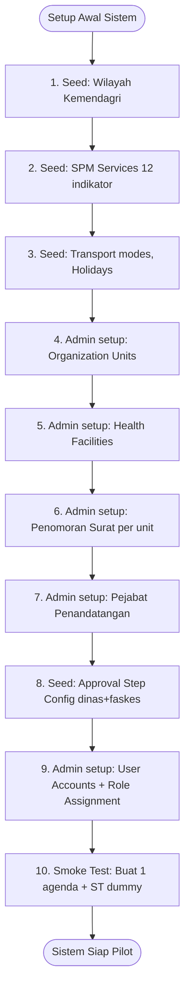

# Addendum: Fondasi Master Data Sistem — Satu Sehat Kobar v1.5

## Addendum Organisasi, Penomoran Surat, SPM, Kalender, Transport, dan Konfigurasi Approval

**Status**: Addendum Resmi — Terintegrasi dalam PRD v1.5  
**Versi Dokumen**: v1.5 (diselaraskan dari v1.4)  
**Referensi Utama**: PRD v1.5 §7 (Database Design), §5 (Kebutuhan Bisnis Inti)  
**Addendum Terkait**: Addendum 21 (Wilayah/Faskes), Addendum 23 (Pegawai/Profil)

---

## 1. Latar Belakang

Dokumen ini merinci master data fondasi yang belum dijabarkan secara eksplisit dalam dokumen utama PRD v1.5, namun esensial untuk operasional sistem:

1. **Unit Organisasi** — Struktur organisasi Dinkes dan Faskes
2. **Penomoran Naskah Dinas** — Pola dan urutan nomor ST/SPPD otomatis
3. **Pejabat Penandatangan** — Daftar pejabat yang berwenang menandatangani dokumen
4. **Master SPM dan Indikator** — 12 indikator SPM Kesehatan
5. **Kalender Hari Libur** — Kalender resmi pemerintah
6. **Master Transport** — Jenis alat angkut perjalanan dinas
7. **Template Approval Chain** — Konfigurasi rantai persetujuan per level organisasi
8. **Master Dasar ST** — Jenis dan dasar hukum penugasan

---

## 2. Unit Organisasi

### 2.1 Tabel `organization_units`

Unit organisasi mencakup semua unit kerja dalam Dinas Kesehatan Kab. Kotawaringin Barat.

```sql
CREATE TABLE organization_units (
  id TEXT PRIMARY KEY,
  code TEXT UNIQUE NOT NULL,          -- Kode unit (misal: DINKES-SEKRET, DINKES-BIDKIA)
  name TEXT NOT NULL,                 -- Nama resmi unit
  short_name TEXT,                    -- Singkatan (misal: Bidang KIA)
  unit_type TEXT NOT NULL,            -- dinas|bidang|subbag|seksi|uptd|faskes
  parent_unit_id TEXT,                -- FK ke unit induk (nullable untuk Dinkes pusat)
  level INTEGER DEFAULT 1,            -- Hierarki level (1=Dinas, 2=Bidang, 3=Subbag/Seksi)
  organization_level TEXT DEFAULT 'dinas', -- dinas|faskes
  health_facility_id TEXT,            -- FK hf_health_facilities (untuk unit faskes)
  head_title TEXT,                    -- Jabatan kepala unit (misal: Kepala Bidang)
  address TEXT,
  phone TEXT,
  is_active INTEGER DEFAULT 1,
  created_at TEXT NOT NULL,
  updated_at TEXT NOT NULL
);

CREATE INDEX idx_org_units_parent ON organization_units(parent_unit_id);
CREATE INDEX idx_org_units_type ON organization_units(unit_type);
CREATE INDEX idx_org_units_level_org ON organization_units(organization_level);
```

### 2.2 Contoh Struktur Organisasi Dinkes

```
Dinas Kesehatan Kab. Kotawaringin Barat (level: 1)
├── Sekretariat (level: 2)
│   ├── Sub Bagian Umum dan Kepegawaian (level: 3)
│   ├── Sub Bagian Keuangan (level: 3)
│   └── Sub Bagian Perencanaan (level: 3)
├── Bidang Kesehatan Masyarakat (level: 2)
│   ├── Seksi Promkes (level: 3)
│   └── Seksi Gizi dan KIA (level: 3)
├── Bidang P2P (level: 2)
├── Bidang SDK (level: 2)
└── UPTD Puskesmas [nama] (level: 2, type: uptd/faskes)
```

### 2.3 Relasi dengan Plugin Lain

- `agenda_events.organizer_unit_id` → `organization_units.id`
- `duty_requests.proposer_unit_id` → `organization_units.id`
- `duty_request_approvals.approver_unit_id` → `organization_units.id` (untuk konteks unit)
- `duty_numbering_sequences.unit_id` → `organization_units.id`

---

## 3. Penomoran Naskah Dinas (Nomor ST/SPPD)

### 3.1 Tabel `duty_numbering_sequences`

```sql
CREATE TABLE duty_numbering_sequences (
  id TEXT PRIMARY KEY,
  unit_id TEXT NOT NULL,              -- FK organization_units
  document_type TEXT NOT NULL,        -- st|sppd|cost_attachment
  year INTEGER NOT NULL,              -- Tahun berjalan
  prefix TEXT NOT NULL,               -- Contoh: "800"
  unit_code TEXT NOT NULL,            -- Contoh: "DINKES" atau "PKM-PTNG"
  current_sequence INTEGER DEFAULT 0, -- Counter urutan saat ini
  pattern TEXT NOT NULL,              -- Format pola: "{PREFIX}/{SEQ:3}/{UNIT}/{YEAR}"
  reset_annually INTEGER DEFAULT 1,   -- Reset ke 0 setiap tahun baru
  created_at TEXT NOT NULL,
  updated_at TEXT NOT NULL,
  UNIQUE(unit_id, document_type, year)
);
```

### 3.2 Pola Penomoran

**Format pattern**: `{PREFIX}/{SEQ:PAD}/{UNIT}/{YEAR}`

| Placeholder | Keterangan | Contoh |
|-------------|-----------|--------|
| `{PREFIX}` | Kode klasifikasi surat | 800 |
| `{SEQ:3}` | Nomor urut (3 digit padded) | 001, 025 |
| `{SEQ:4}` | Nomor urut (4 digit padded) | 0001, 0025 |
| `{UNIT}` | Kode unit penerbit | DINKES, PKM-PTNG |
| `{YEAR}` | Tahun 4 digit | 2026 |
| `{MONTH}` | Bulan 2 digit | 06, 12 |

**Contoh hasil**: `800/001/DINKES/2026` atau `800/0025/PKM-PTNG/2026`

### 3.3 Mekanisme Auto-Increment

```
POST /api/duty-requests/:id/generate-st
  → Cek duty_numbering_sequences (unit_id, document_type, year)
  → current_sequence += 1 (atomic update)
  → Render pattern dengan current_sequence
  → Simpan ke duty_documents.document_number
  → Jika tahun berubah: buat record baru dengan current_sequence = 1
```

**Atomicity**: Increment sequence menggunakan D1 transaction untuk menghindari duplikasi.

### 3.4 Konfigurasi per Unit

- Setiap unit organisasi memiliki konfigurasi penomoran sendiri
- Admin OPD/Faskes dapat mengatur `prefix`, `unit_code`, dan `pattern`
- Sequence tidak bisa diubah manual setelah ada dokumen terbit (audit integrity)

---

## 4. Pejabat Penandatangan

### 4.1 Tabel `duty_signatories`

```sql
CREATE TABLE duty_signatories (
  id TEXT PRIMARY KEY,
  unit_id TEXT NOT NULL,              -- FK organization_units
  employee_id TEXT,                   -- FK employees (nullable jika belum terintegrasi)
  name TEXT NOT NULL,                 -- Nama lengkap pejabat
  nip TEXT,                           -- NIP pejabat
  position TEXT NOT NULL,             -- Jabatan resmi (misal: Kepala Dinas Kesehatan)
  rank_grade TEXT,                    -- Pangkat/golongan
  document_types TEXT NOT NULL,       -- JSON array: ["st","sppd"] — dokumen yang bisa ditandatangani
  is_primary INTEGER DEFAULT 0,       -- Penandatangan utama unit
  is_active INTEGER DEFAULT 1,
  effective_from TEXT NOT NULL,       -- Tanggal mulai berlaku
  effective_until TEXT,               -- Tanggal akhir (nullable = masih aktif)
  created_at TEXT NOT NULL,
  updated_at TEXT NOT NULL
);

CREATE INDEX idx_signatories_unit ON duty_signatories(unit_id, is_active);
```

### 4.2 Penggunaan dalam Dokumen

Saat generate PDF:
1. Sistem mengambil penandatangan aktif untuk unit terkait
2. Data penandatangan **di-snapshot** ke `duty_documents` (signer_name, signer_nip, signer_position)
3. Snapshot memastikan dokumen mencerminkan pejabat yang menandatangani **pada saat itu**, bukan saat ini

---

## 5. Master SPM dan Indikator

### 5.1 Tabel `spm_services` (Seed Data)

```sql
CREATE TABLE spm_services (
  id TEXT PRIMARY KEY,
  code TEXT UNIQUE NOT NULL,           -- Kode indikator (misal: SPM-01)
  name TEXT NOT NULL,                  -- Nama indikator resmi
  short_name TEXT,
  target_group TEXT,                   -- Kelompok sasaran
  measurement_unit TEXT,               -- Satuan ukur (misal: %)
  national_target REAL,                -- Target nasional (%)
  local_target REAL,                   -- Target lokal Kab. Kobar (%) — dapat berbeda
  description TEXT,
  basis_regulation TEXT,               -- Permenkes/regulasi dasar
  is_active INTEGER DEFAULT 1,
  sort_order INTEGER,
  created_at TEXT NOT NULL,
  updated_at TEXT NOT NULL
);
```

### 5.2 12 Indikator SPM Kesehatan (Seed Data Wajib)

| # | Kode | Nama Indikator | Sasaran | Target Nasional |
|---|------|---------------|---------|----------------|
| 1 | SPM-01 | Pelayanan kesehatan ibu hamil | Ibu hamil | 100% |
| 2 | SPM-02 | Pelayanan kesehatan ibu bersalin | Ibu bersalin | 100% |
| 3 | SPM-03 | Pelayanan kesehatan bayi baru lahir | Bayi baru lahir | 100% |
| 4 | SPM-04 | Pelayanan kesehatan balita | Balita | 100% |
| 5 | SPM-05 | Pelayanan kesehatan usia pendidikan dasar | Usia 7-15 tahun | 100% |
| 6 | SPM-06 | Pelayanan kesehatan usia produktif | Usia 15-59 tahun | 100% |
| 7 | SPM-07 | Pelayanan kesehatan usia lanjut | Usia ≥60 tahun | 100% |
| 8 | SPM-08 | Pelayanan kesehatan penderita hipertensi | Penderita hipertensi | 100% |
| 9 | SPM-09 | Pelayanan kesehatan penderita diabetes melitus | Penderita DM | 100% |
| 10 | SPM-10 | Pelayanan kesehatan ODGJ berat | ODGJ berat | 100% |
| 11 | SPM-11 | Pelayanan kesehatan terduga tuberkulosis | Terduga TB | 100% |
| 12 | SPM-12 | Pelayanan pencegahan risiko HIV | Risiko HIV | 100% |

### 5.3 Manajemen Data SPM

- **MVP**: Seed data saja; tidak ada CRUD UI untuk SPM
- **Phase 2**: Admin OPD dapat memperbarui target lokal via UI
- Perubahan target: dicatat di audit log dengan nilai before/after
- Relasi: `agenda_spm_links`, `duty_spm_links` merujuk ke `spm_services.id`

---

## 6. Kalender Hari Libur

### 6.1 Tabel `satusehat_holidays`

```sql
CREATE TABLE satusehat_holidays (
  id TEXT PRIMARY KEY,
  date TEXT NOT NULL UNIQUE,          -- ISO 8601 date (YYYY-MM-DD)
  name TEXT NOT NULL,                 -- Nama hari libur
  holiday_type TEXT DEFAULT 'national', -- national|regional|cuti_bersama
  year INTEGER NOT NULL,
  is_active INTEGER DEFAULT 1,
  created_at TEXT NOT NULL,
  updated_at TEXT NOT NULL
);

CREATE INDEX idx_holidays_date ON satusehat_holidays(date, is_active);
CREATE INDEX idx_holidays_year ON satusehat_holidays(year);
```

### 6.2 Penggunaan

- **Kalender Agenda**: Menandai hari libur di tampilan kalender
- **Perhitungan Deadline Approval**: Hitung hari kerja (exclude hari libur) untuk eskalasi
- **SPPD**: Validasi tanggal perjalanan dinas tidak bertabrakan dengan hari libur (opsional warning)

### 6.3 Update Kalender

- Sumber: SKB Menteri tentang hari libur nasional dan cuti bersama
- Update: Manual oleh Admin SIK, awal setiap tahun
- API: `GET /api/holidays?year=2026` — daftar hari libur tahun tertentu

---

## 7. Master Transport / Alat Angkut

### 7.1 Tabel `duty_transport_modes`

```sql
CREATE TABLE duty_transport_modes (
  id TEXT PRIMARY KEY,
  code TEXT UNIQUE NOT NULL,          -- Kode (misal: DARAT-MOTOR, UDARA-PESAWAT)
  name TEXT NOT NULL,                 -- Nama alat angkut
  category TEXT NOT NULL,             -- darat|udara|laut|kereta
  requires_ticket INTEGER DEFAULT 0,  -- Apakah perlu lampiran tiket
  is_active INTEGER DEFAULT 1,
  sort_order INTEGER,
  created_at TEXT NOT NULL
);
```

### 7.2 Data Seed Transport

| Kode | Nama | Kategori | Perlu Tiket |
|------|------|---------|------------|
| DARAT-MOTOR | Sepeda Motor | darat | Tidak |
| DARAT-MOBIL | Kendaraan Roda 4 | darat | Tidak |
| DARAT-BUS | Bus / Travel | darat | Ya |
| UDARA-PESAWAT | Pesawat Terbang | udara | Ya |
| LAUT-KAPAL | Kapal Laut | laut | Ya |
| KERETA | Kereta Api | kereta | Ya |
| SPEEDBOAT | Speedboat / Klotok | laut | Tidak |
| OJEK | Ojek / Ojek Online | darat | Tidak |

### 7.3 Penggunaan

- `duty_request_destinations.transportation_mode` → merujuk ke kode transport
- Jika `requires_ticket = 1`: sistem menampilkan peringatan wajib lampirkan tiket saat upload bukti

---

## 8. Template Approval Chain

### 8.1 Tabel `duty_approval_step_config`

Sesuai keputusan DEC-005 (lihat Change Control doc 12), approval chain dikonfigurasi di database — tidak hardcoded.

```sql
CREATE TABLE duty_approval_step_config (
  id TEXT PRIMARY KEY,
  org_level TEXT NOT NULL,            -- dinas|faskes
  step_order INTEGER NOT NULL,        -- Urutan langkah (1, 2, 3, ...)
  approval_step TEXT NOT NULL,        -- supervisor|technical|secretary|finance|final_approver|operator_document
  approver_role TEXT NOT NULL,        -- Role yang ditunjuk (harus ada di tabel roles)
  step_label TEXT NOT NULL,           -- Label tampilan (misal: "Verifikasi Atasan Langsung")
  is_optional INTEGER DEFAULT 0,      -- Apakah langkah bisa di-skip secara manual
  skip_condition TEXT,                -- JSON kondisi auto-skip (misal: {"is_budgeted": false})
  is_active INTEGER DEFAULT 1,
  created_at TEXT NOT NULL,
  updated_at TEXT NOT NULL,
  UNIQUE(org_level, step_order)
);
```

### 8.2 Konfigurasi Default: Level Dinas

| step_order | approval_step | approver_role | skip_condition |
|------------|--------------|---------------|---------------|
| 1 | supervisor | Atasan Langsung | null |
| 2 | technical | Kabid | null |
| 3 | secretary | Sekretaris | null |
| 4 | finance | Keuangan | `{"is_budgeted": false}` |
| 5 | final_approver | Kadis | null |
| 6 | operator_document | Operator Surat | null |

### 8.3 Konfigurasi Default: Level Faskes

| step_order | approval_step | approver_role | skip_condition |
|------------|--------------|---------------|---------------|
| 1 | supervisor | Kepala TU Faskes | null |
| 2 | finance | Keuangan | `{"is_budgeted": false}` |
| 3 | final_approver | Kepala Faskes | null |
| 4 | operator_document | Operator Surat | null |

### 8.4 Logika Skip Finance Step

```
Saat duty_request.submitted:
  FOR EACH step IN duty_approval_step_config(org_level):
    IF step.skip_condition IS NOT NULL:
      condition = JSON.parse(step.skip_condition)
      IF duty_request satisfies condition:
        INSERT duty_request_approvals WITH status='skipped'
      ELSE:
        INSERT duty_request_approvals WITH status='pending'
    ELSE:
      INSERT duty_request_approvals WITH status='pending'
```

---

## 9. Master Dasar ST dan Jenis Penugasan

### 9.1 Tabel `duty_basis_types`

```sql
CREATE TABLE duty_basis_types (
  id TEXT PRIMARY KEY,
  code TEXT UNIQUE NOT NULL,
  name TEXT NOT NULL,                 -- Nama dasar hukum
  template TEXT,                      -- Template teks dasar hukum
  is_active INTEGER DEFAULT 1,
  sort_order INTEGER,
  created_at TEXT NOT NULL
);
```

### 9.2 Seed Data Dasar ST

| Kode | Nama Dasar Hukum |
|------|-----------------|
| DPA | DPA Dinas Kesehatan |
| SK-KADIS | SK Kepala Dinas |
| SK-BUPATI | SK Bupati |
| RAPAT-KOORDINASI | Undangan Rapat Koordinasi |
| PELATIHAN | Surat Undangan Pelatihan |
| KUNJUNGAN-FASKES | Rencana Kunjungan Faskes |
| PROGRAM-SPM | Program SPM Kesehatan |
| MANUAL | Lainnya (diisi manual) |

---

## 10. Ringkasan Seed Data Wajib (MVP)

| Tabel | Jumlah Row | Keterangan |
|-------|-----------|------------|
| `organization_units` | ≥10 | Dinkes + bidang + subbag (sesuai struktur resmi) |
| `duty_numbering_sequences` | ≥5 | Per unit + tipe dokumen untuk tahun 2026 |
| `duty_signatories` | ≥3 | Kadis, Sekretaris, Kepala Faskes pilot |
| `spm_services` | 12 | 12 indikator SPM wajib |
| `satusehat_holidays` | ≥15 | Hari libur nasional 2026 |
| `duty_transport_modes` | 8 | Sesuai tabel §7.2 |
| `duty_approval_step_config` | 10 | 6 langkah dinas + 4 langkah faskes |
| `duty_basis_types` | 8 | Sesuai tabel §9.2 |

---

## 11. Alur Pengisian Data Master Saat Setup Awal



---

*Addendum ini merupakan bagian tidak terpisahkan dari PRD v1.5. Lihat Addendum 21 untuk master data wilayah/faskes dan Addendum 23 untuk profil pegawai dan integrasi user.*
