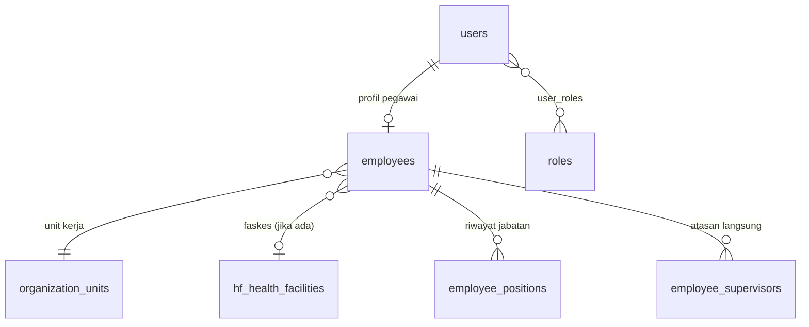
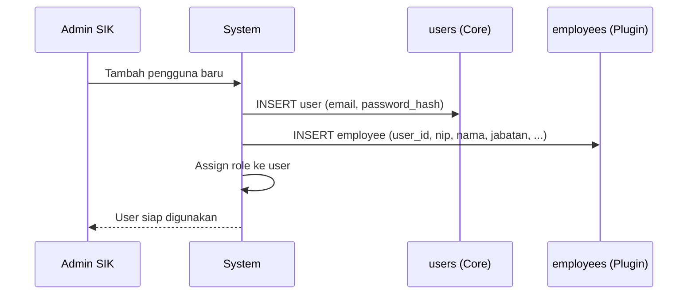
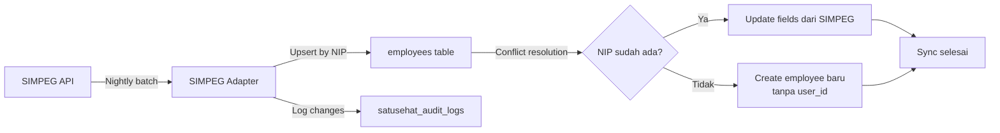

# Addendum: Profil Pegawai dan Master Data Kepegawaian — Satu Sehat Kobar v1.5

## Addendum Rekomendasi Master Data Pegawai, Profil, Snapshot, dan Integrasi User

**Status**: Addendum Resmi — Terintegrasi dalam PRD v1.5  
**Versi Dokumen**: v1.5 (diselaraskan dari v1.4)  
**Referensi Utama**: PRD v1.5 §7 (Database Design), §11 (RBAC/ABAC)  
**Addendum Terkait**: Addendum 21 (Wilayah/Faskes), Addendum 22 (Master Data Sistem)

---

## 1. Latar Belakang

Sistem Satu Sehat Kobar memerlukan data pegawai yang akurat untuk:

1. **Autentikasi dan Otorisasi**: Setiap pengguna adalah pegawai dengan role tertentu
2. **Snapshot Dokumen**: ST/SPPD menyimpan snapshot data peserta saat dokumen dibuat
3. **Jurnal Kepegawaian**: Jurnal tugas per pegawai membutuhkan identitas lengkap
4. **Approval Chain**: Atasan langsung ditentukan dari data kepegawaian
5. **Penandatanganan**: Pejabat penandatangan dipilih dari daftar pegawai berwenang
6. **Audit Trail**: Setiap aksi dikaitkan dengan identity pegawai yang bertindak

**Sumber data**: MVP = input manual; Phase 2 = sync dari SIMPEG daerah.

---

## 2. Model Data Pegawai

### 2.1 Relasi User → Employee



**Prinsip**:
- `users`: akun sistem (email, password, session) — dikelola AWCMS-Micro core
- `employees`: data kepegawaian (NIP, jabatan, golongan) — dikelola plugin kepegawaian
- Satu user dapat memiliki satu record employee (one-to-one, nullable)
- User tanpa employee record: hanya role sistem (Admin SIK, Auditor eksternal)

### 2.2 Tabel `employees`

```sql
CREATE TABLE employees (
  id TEXT PRIMARY KEY,
  user_id TEXT UNIQUE,                  -- FK users.id (nullable jika belum punya akun)
  nip TEXT UNIQUE,                      -- Nomor Induk Pegawai (nullable untuk non-ASN)
  name TEXT NOT NULL,                   -- Nama lengkap
  title TEXT,                           -- Gelar depan (Dr., drg., dll)
  suffix TEXT,                          -- Gelar belakang (S.Kes., M.Kes., dll)
  full_name_with_title TEXT,            -- Computed: title + name + suffix
  employee_type TEXT DEFAULT 'asn',     -- asn|pppk|kontrak|magang|lainnya
  organization_unit_id TEXT NOT NULL,   -- FK organization_units (unit kerja aktif)
  health_facility_id TEXT,              -- FK hf_health_facilities (jika faskes)
  position_title TEXT NOT NULL,         -- Jabatan aktif (misal: Kepala Seksi Promkes)
  position_type TEXT DEFAULT 'structural', -- structural|fungsional|pelaksana
  rank_grade TEXT,                      -- Pangkat/golongan (misal: III/c, IV/a)
  echelon TEXT,                         -- Eselon (misal: III.b, IV.a — nullable)
  gender TEXT,                          -- L|P
  birth_date TEXT,                      -- YYYY-MM-DD
  birth_place TEXT,
  education_level TEXT,                 -- sd|smp|sma|d3|s1|s2|s3
  education_field TEXT,                 -- Bidang studi terakhir
  employee_status TEXT DEFAULT 'active', -- active|cuti|tugas_belajar|pensiun|meninggal|inactive
  join_date TEXT,                       -- Tanggal mulai kerja di instansi
  phone TEXT,
  email_gov TEXT,                       -- Email pemerintah (domain go.id)
  photo_path TEXT,                      -- Path foto di R2
  simpeg_id TEXT,                       -- ID di SIMPEG (Phase 2 sync key)
  created_at TEXT NOT NULL,
  updated_at TEXT NOT NULL,
  updated_by TEXT NOT NULL
);

CREATE INDEX idx_employees_user ON employees(user_id);
CREATE INDEX idx_employees_unit ON employees(organization_unit_id);
CREATE INDEX idx_employees_nip ON employees(nip);
CREATE INDEX idx_employees_status ON employees(employee_status);
```

### 2.3 Tabel `employee_positions` (Riwayat Jabatan)

```sql
CREATE TABLE employee_positions (
  id TEXT PRIMARY KEY,
  employee_id TEXT NOT NULL,            -- FK employees
  organization_unit_id TEXT NOT NULL,   -- Unit pada periode ini
  health_facility_id TEXT,              -- Faskes pada periode ini (nullable)
  position_title TEXT NOT NULL,
  position_type TEXT NOT NULL,
  rank_grade TEXT,
  effective_from TEXT NOT NULL,         -- Tanggal mulai jabatan ini
  effective_until TEXT,                 -- Tanggal selesai (nullable = masih aktif)
  sk_number TEXT,                       -- Nomor SK pengangkatan
  sk_date TEXT,
  note TEXT,
  created_at TEXT NOT NULL
);
```

### 2.4 Tabel `employee_supervisors` (Atasan Langsung)

```sql
CREATE TABLE employee_supervisors (
  id TEXT PRIMARY KEY,
  employee_id TEXT NOT NULL,            -- FK employees (bawahan)
  supervisor_employee_id TEXT NOT NULL, -- FK employees (atasan langsung)
  effective_from TEXT NOT NULL,
  effective_until TEXT,                 -- Nullable = masih berlaku
  created_at TEXT NOT NULL,
  updated_at TEXT NOT NULL
);

CREATE INDEX idx_emp_supervisors_emp ON employee_supervisors(employee_id, effective_until);
CREATE INDEX idx_emp_supervisors_sup ON employee_supervisors(supervisor_employee_id);
```

**Penggunaan ABAC**:
```
-- Atasan dapat lihat ST bawahan
SELECT * FROM duty_requests
WHERE created_by IN (
  SELECT e.user_id FROM employees e
  JOIN employee_supervisors es ON es.employee_id = e.id
  WHERE es.supervisor_employee_id = (
    SELECT id FROM employees WHERE user_id = :current_user_id
  )
  AND es.effective_until IS NULL
)
```

---

## 3. Snapshot Pegawai dalam Dokumen

### 3.1 Mengapa Diperlukan Snapshot

Data pegawai berubah (rotasi jabatan, promosi, mutasi). Dokumen ST/SPPD harus mencerminkan data **pada saat dokumen dibuat**, bukan data pegawai saat ini.

**Solusi**: Snapshot JSON disimpan dalam tabel transaksi, bukan foreign key ke data master yang bisa berubah.

### 3.2 Format Snapshot Peserta ST

```typescript
// Format JSON untuk duty_request_participants.employee_snapshot
interface ParticipantSnapshot {
  employee_id: string;
  user_id: string;
  name: string;
  full_name_with_title: string;
  nip: string;
  position_title: string;
  position_type: string;
  rank_grade: string;
  echelon?: string;
  organization_unit_name: string;
  health_facility_name?: string;
  captured_at: string; // ISO 8601 timestamp saat snapshot diambil
}
```

### 3.3 Tabel `duty_request_participants` (Lengkap)

```sql
CREATE TABLE duty_request_participants (
  id TEXT PRIMARY KEY,
  duty_request_id TEXT NOT NULL,         -- FK duty_requests
  user_id TEXT NOT NULL,                 -- FK users (untuk ABAC)
  employee_id TEXT,                      -- FK employees (nullable jika tidak punya employee record)
  -- Snapshot fields (tidak berubah meski data master berubah)
  participant_name TEXT NOT NULL,
  participant_full_name TEXT NOT NULL,   -- Dengan gelar
  participant_nip TEXT,
  participant_position TEXT NOT NULL,
  participant_rank_grade TEXT,
  participant_unit_name TEXT NOT NULL,
  participant_faskes_name TEXT,
  employee_snapshot TEXT NOT NULL,       -- JSON snapshot lengkap saat ST dibuat
  is_lead INTEGER DEFAULT 0,            -- Apakah peserta utama/penanggung jawab
  sort_order INTEGER DEFAULT 0,
  created_at TEXT NOT NULL
);

CREATE INDEX idx_duty_participants_request ON duty_request_participants(duty_request_id);
CREATE INDEX idx_duty_participants_user ON duty_request_participants(user_id);
```

---

## 4. Profil Pegawai di UI

### 4.1 Halaman Profil Pegawai

Setiap pegawai dapat melihat profilnya sendiri melalui UI:

```
Profil Saya
├── Data Pribadi: nama, NIP, jabatan, unit, faskes
├── Riwayat Jabatan
├── Jurnal Tugas (daftar ST yang pernah diikuti)
└── Pengaturan Akun: password, foto profil
```

### 4.2 Data yang Dapat Diedit oleh Pegawai

| Field | Dapat Diedit | Catatan |
|-------|-------------|---------|
| Nama | Tidak | Hanya Admin SIK |
| NIP | Tidak | Hanya Admin SIK |
| Jabatan | Tidak | Hanya Admin SIK/OPD |
| Email gov | Tidak | Hanya Admin SIK |
| Foto profil | Ya | Upload ke R2 |
| Password | Ya | Via auth flow |
| Nomor telepon | Ya | Opsional |

### 4.3 Tampilan Peserta ST

Saat membuat ST, sistem menampilkan picker peserta yang:
1. Mencari pegawai aktif (`employee_status = 'active'`)
2. Filter per unit/faskes sesuai ABAC pengguna
3. Saat dipilih: sistem auto-fill data dari `employees` dan buat snapshot
4. Data snapshot tersimpan dan **tidak berubah** meski data pegawai diubah kemudian

---

## 5. Integrasi dengan User AWCMS-Micro (EmDash)

### 5.1 Relasi `users` ↔ `employees`



### 5.2 Pembuatan Akun Pengguna Baru

**Alur**:
1. Admin SIK membuat akun di panel Admin → user record di `users`
2. Admin SIK melengkapi data kepegawaian → employee record di `employees`
3. Admin SIK assign role sesuai jabatan

**Validasi**:
- NIP harus unik (jika diisi)
- Satu NIP = satu user account
- Email harus unik di seluruh sistem

### 5.3 Sinkronisasi SIMPEG (Phase 2)



**Conflict Resolution Rules**:
- SIMPEG adalah sumber otoritatif untuk: nama, NIP, jabatan, golongan, unit
- Sistem lokal berwenang untuk: user_id, foto_profil, phone, email_gov override
- Jika ada perbedaan: SIMPEG menang untuk data struktural; lokal menang untuk data kontak

---

## 6. Snapshot vs. Live Data — Panduan Keputusan

| Konteks | Gunakan Snapshot | Gunakan Live Data |
|---------|-----------------|------------------|
| ST/SPPD peserta | ✓ Snapshot | — |
| PDF dokumen | ✓ Snapshot | — |
| Jurnal kepegawaian | ✓ Snapshot | — |
| Approval chain | — | ✓ Live (role saat ini) |
| Dashboard peserta aktif | — | ✓ Live |
| Picker peserta baru | — | ✓ Live |
| Audit log actor | ✓ Snapshot nama | — |

**Prinsip**: Dokumen historis selalu menggunakan snapshot. Query/UI real-time menggunakan live data.

---

## 7. API Kepegawaian

| Method | Endpoint | Permission | Deskripsi |
|--------|----------|-----------|-----------|
| GET | `/api/employees` | duty.read | Daftar pegawai aktif (untuk picker ST) |
| GET | `/api/employees/:id` | duty.read | Detail pegawai |
| GET | `/api/employees/me` | (auth) | Profil pegawai sendiri |
| GET | `/api/employees/:id/journals` | duty.read (ABAC) | Jurnal tugas pegawai |
| POST | `/api/employees` | admin.manage | Tambah pegawai |
| PATCH | `/api/employees/:id` | admin.manage | Update pegawai |
| PATCH | `/api/employees/me/photo` | (auth) | Update foto profil |
| GET | `/api/employees/:id/supervisors` | admin.read | Riwayat atasan |
| POST | `/api/employees/:id/supervisors` | admin.manage | Set atasan langsung |

---

## 8. ABAC: Akses Data Pegawai

| Rule | Kondisi | Query Filter |
|------|---------|-------------|
| Pegawai lihat profil sendiri | `user_id = current_user_id` | `WHERE user_id = ?` |
| Atasan lihat daftar bawahan | `role = Atasan Langsung` | Via `employee_supervisors` |
| Admin OPD kelola pegawai unitnya | `role = Admin OPD` | `WHERE organization_unit_id IN (admin_units)` |
| Admin Faskes kelola pegawai faskesnya | `role = Admin Faskes` | `WHERE health_facility_id = admin_faskes_id` |
| Admin SIK kelola semua pegawai | `role = Admin SIK` | No filter |

---

## 9. Seed Data Pegawai (Setup Awal)

Untuk pilot, minimal diperlukan:

| Peran | Jumlah Akun | Catatan |
|-------|------------|---------|
| Admin SIK | 1-2 | Tim teknis |
| Admin OPD | 1 per bidang | ~5 akun |
| Operator Surat | 1 | Sekretariat |
| Kadis | 1 | Kepala Dinas |
| Sekretaris | 1 | Sekretariat |
| Kabid | 3-4 | Per bidang |
| Keuangan | 1-2 | Sub bagian keuangan |
| Atasan Langsung | 5-10 | Kepala seksi dan sejenisnya |
| Pegawai | 20-50 | Staf dinas dan faskes pilot |
| Kepala Faskes | 5 | Kepala faskes pilot |
| Admin/TU Faskes | 5 | Satu per faskes pilot |

**Total minimum**: ~60-80 akun untuk pilot sukses.

---

## 10. Kebijakan Data Pegawai

| Kebijakan | Aturan |
|-----------|--------|
| Penghapusan akun | Soft delete: `employee_status = 'inactive'`, `users.is_active = 0` |
| Pegawai pensiun | `employee_status = 'pensiun'`; history tetap ada untuk audit |
| Perubahan jabatan | Insert ke `employee_positions`; update field aktif di `employees` |
| Rotasi atasan | Insert ke `employee_supervisors` dengan `effective_from`; set `effective_until` pada record lama |
| Data PII pegawai | Klasifikasi: internal; hanya dapat diakses oleh pemilik, atasan, dan admin |
| Foto profil | Disimpan di R2 dengan signed URL; tidak di-expose path langsung |
| NIP dalam dokumen | Dianggap `internal` (bukan `confidential`); boleh tampil dalam dokumen resmi |

---

*Addendum ini merupakan bagian tidak terpisahkan dari PRD v1.5. Lihat Addendum 21 untuk master data wilayah/faskes dan Addendum 22 untuk master data sistem (penomoran, SPM, approval chain).*
