# PRODUCT REQUIREMENT DOCUMENT v1.5

## Satu Sehat Kobar — Platform Manajemen Operasional Kesehatan Daerah

**Instansi**: Dinas Kesehatan Kabupaten Kotawaringin Barat  
**Status Dokumen**: PRD/SRS v1.5 — Revisi Terpadu, Siap Eksekusi Pengembangan  
**Tanggal Revisi**: Juni 2026  
**Pemilik Proses Bisnis**: Dinas Kesehatan Kabupaten Kotawaringin Barat  
**Pemilik Teknis**: Tim Sistem Informasi Kesehatan — Dinas Kesehatan Kab. Kotawaringin Barat  
**Platform Teknis**: AWCMS-Micro (Cloudflare Workers / D1 / R2 / KV)  
**Pola Pengembangan**: Modular Plugin Ecosystem  
**Disusun oleh**: Unggul Cahya Saputra  
**Klasifikasi**: Internal Pemerintahan / Perencanaan Produk / SPBE Kesehatan Daerah  

---

> **Catatan Revisi v1.5**: Dokumen ini merupakan konsolidasi dan penyelarasan menyeluruh dari PRD v1.4 dan seluruh dokumen pendukungnya. Seluruh inkonsistensi, celah spesifikasi, dan tumpang tindih antar dokumen telah diselesaikan. Dokumen ini menjadi sumber kebenaran tunggal (*single source of truth*) untuk pengembangan Satu Sehat Kobar.

---

## DAFTAR ISI

1. Ringkasan Eksekutif
2. Latar Belakang dan Tujuan Sistem
3. Ruang Lingkup Sistem
4. Pemangku Kepentingan dan Pengguna
5. Kebutuhan Bisnis Inti
6. Arsitektur Sistem
7. Desain Basis Data dan Hubungan Data
8. Alur Kerja Setiap Modul
9. Kebutuhan UI/UX
10. Kebutuhan API dan Integrasi
11. Kebutuhan Keamanan — Auth, RBAC, ABAC, Audit
12. Kebutuhan Operasional — Deployment, Backup, Monitoring
13. Standar Dokumentasi Teknis
14. Fase Implementasi
15. Prioritas Pengembangan (MoSCoW)
16. Kriteria Penerimaan
17. Risiko, Mitigasi, dan Ketergantungan Teknis
18. Glosarium

---

## 1. RINGKASAN EKSEKUTIF

**Satu Sehat Kobar** adalah platform digital terpadu Dinas Kesehatan Kabupaten Kotawaringin Barat yang dibangun di atas ekosistem plugin **AWCMS-Micro**. Platform ini bukan pengganti platform SATUSEHAT Kemenkes, melainkan sistem operasional regional untuk:

- Manajemen tugas, agenda, dan perjalanan dinas (ST/SPPD)
- Alur persetujuan multitingkat dan penerbitan dokumen resmi
- Pengumpulan dan verifikasi bukti pelaksanaan tugas
- Pemantauan kinerja program SPM Kesehatan
- Pengelolaan arsip digital dan jurnal kepegawaian
- Fondasi integrasi ke sistem pemerintah (TTE, SRIKANDI, SIMPEG, SIPD, SATUSEHAT)

**Inti alur MVP**: Agenda → ST/SPPD → Persetujuan → PDF → Unggah Dokumen → Bukti → Verifikasi → Jurnal Pegawai → Dashboard → Arsip

**Infrastruktur**: Cloudflare Workers (D1 / R2 / KV) — tanpa server fisik, skalabel, siap SPBE  
**Jumlah Plugin MVP**: 7 plugin utama  
**Timeline MVP**: Sprint 0–6 (±6 bulan)  
**Target Pilot**: 5–7 puskesmas/faskes di Kab. Kotawaringin Barat

---

## 2. LATAR BELAKANG DAN TUJUAN SISTEM

### 2.1 Latar Belakang

Dinas Kesehatan Kabupaten Kotawaringin Barat mengelola jaringan faskes yang mencakup puskesmas, klinik, rumah sakit, dan unit laboratorium. Operasional harian melibatkan:

- Perencanaan dan pelaksanaan kegiatan/agenda dinas
- Penerbitan Surat Tugas (ST) dan SPPD untuk pegawai
- Proses persetujuan hierarkis (Atasan → Kabid → Sekretaris → Keuangan → Kadis)
- Pengumpulan laporan dan bukti pelaksanaan tugas lapangan
- Pemantauan capaian 12 indikator SPM Kesehatan
- Pengarsipan dokumen sesuai kebijakan retensi pemerintah

**Masalah yang diselesaikan**:
- Proses manual berbasis kertas rentan kesalahan dan lambat
- Tidak ada visibilitas real-time status ST/SPPD
- Arsip dokumen tidak terstruktur, sulit ditelusuri
- Tidak ada catatan jurnal tugas otomatis per pegawai
- Tidak ada dashboard terpadu untuk pemantauan SPM

### 2.2 Tujuan Sistem

| # | Tujuan | Indikator Keberhasilan |
|---|--------|----------------------|
| T1 | Digitalisasi alur ST/SPPD end-to-end | 0 berkas fisik dalam alur normal |
| T2 | Persetujuan multitingkat terstruktur | Approval dalam ≤3 hari kerja |
| T3 | Pemantauan SPM real-time | Dashboard SPM diperbarui dalam 24 jam |
| T4 | Arsip digital terstandar | 100% dokumen final terarsip dengan hash |
| T5 | Jurnal tugas otomatis per pegawai | Jurnal terisi setelah bukti diverifikasi |
| T6 | Fondasi integrasi SPBE daerah | Siap integrasi TTE/SRIKANDI/SIMPEG Q3 2026 |

### 2.3 Kerangka Regulasi

- PP No. 95 Tahun 2018 tentang SPBE
- Permenkes No. 4 Tahun 2019 tentang SPM Bidang Kesehatan
- Perka ANRI No. 2 Tahun 2014 tentang Pedoman Tata Naskah Dinas
- PP No. 28 Tahun 2012 tentang Kearsipan
- UU No. 36 Tahun 2009 tentang Kesehatan

---

## 3. RUANG LINGKUP SISTEM

### 3.1 Dalam Cakupan (In Scope)

```
✓ Manajemen agenda/kegiatan Dinas Kesehatan
✓ Pembuatan dan pengelolaan ST/SPPD (wizard-based)
✓ Alur persetujuan multitingkat dengan notifikasi in-app
✓ Penerbitan dokumen PDF (ST, SPPD, lampiran biaya)
✓ Unggah dokumen final bertanda tangan (R2 storage)
✓ Pengumpulan laporan dan bukti tugas
✓ Verifikasi bukti oleh verifikator
✓ Jurnal tugas otomatis per pegawai
✓ Dashboard KPI dan SPM terpadu
✓ Manajemen arsip digital (metadata, hash, retensi)
✓ Draft publikasi MMC dari laporan tugas terverifikasi
✓ RBAC + ABAC per peran dan unit/faskes
✓ Audit trail lengkap semua aksi
✓ Manajemen master data (wilayah, faskes, SPM, template)
✓ Export data (CSV/XLSX/PDF)
```

### 3.2 Di Luar Cakupan (Out of Scope) — MVP

```
✗ Rekam Medis Elektronik (RME) / SIMRS / SIMKES Khanza
✗ Integrasi langsung SATUSEHAT Kemenkes (Phase 2+)
✗ Tanda Tangan Elektronik (TTE/BSrE) — Phase 2
✗ Integrasi SRIKANDI, SIMPEG, SIPD, e-Kinerja — Phase 2
✗ Notifikasi WhatsApp/Email — Phase 2
✗ Analitik AI/ML prediktif — Phase 3
✗ Geospasial/GIS — Phase 3
✗ Manajemen data klinis pasien
✗ Billing/keuangan rumah sakit
```

### 3.3 Batas Sistem

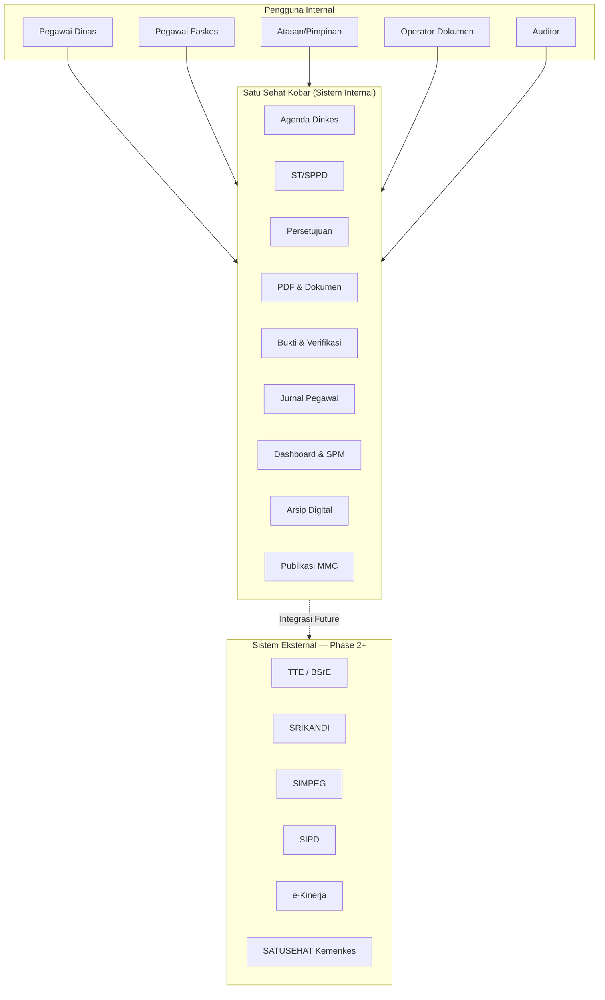

---

## 4. PEMANGKU KEPENTINGAN DAN PENGGUNA

### 4.1 Pemangku Kepentingan

| Pemangku Kepentingan | Peran | Kepentingan Utama |
|---------------------|-------|-------------------|
| Kepala Dinas Kesehatan | Sponsor / Pengguna Strategis | Visibilitas kinerja, dashboard pimpinan |
| Sekretaris Dinas | Admin Senior | Alur dokumen, penomoran surat |
| Kabid Program | Verifikator Teknis | Kualitas laporan, capaian SPM |
| Tim SIK (Sistem Informasi Kesehatan) | Pemilik Teknis | Keandalan sistem, integrasi |
| Kepala Puskesmas/Faskes | Approver Faskes | Approval ST faskes, monitoring faskes |
| Pegawai Dinas/Faskes | Pengguna Utama | Kemudahan input, tracking status |
| Keuangan | Verifikator Anggaran | Validasi SPPD, kontrol anggaran |
| Diskominfo | Infrastruktur | SPBE compliance, keamanan jaringan |
| ANRI/Arsip Daerah | Regulator Arsip | Standar retensi, transfer arsip |

### 4.2 Persona Pengguna dan User Stories

#### Pegawai / Pemohon (P01)
**Konteks**: Staf dinas yang mengajukan ST untuk kegiatan lapangan

| ID | User Story | Acceptance Criteria |
|----|-----------|---------------------|
| US-P01-01 | Sebagai Pegawai, saya ingin membuat agenda kegiatan agar atasan dapat menyetujui rencana tugas saya | Agenda tersimpan dengan status `draft`, dapat diedit sebelum diajukan |
| US-P01-02 | Sebagai Pegawai, saya ingin membuat ST dari agenda yang sudah disetujui agar tidak mengulang input data | Data agenda terisi otomatis ke form ST, dapat diedit |
| US-P01-03 | Sebagai Pegawai, saya ingin melacak status ST/SPPD saya secara real-time | Status tampil di dashboard dengan history langkah approval |
| US-P01-04 | Sebagai Pegawai, saya ingin mengunggah laporan dan bukti pelaksanaan tugas | File berhasil diunggah, status berubah ke `evidence_submitted` |
| US-P01-05 | Sebagai Pegawai, saya ingin melihat jurnal tugas saya | Jurnal terisi otomatis setelah bukti diverifikasi |

#### Atasan Langsung (P02)
| ID | User Story | Acceptance Criteria |
|----|-----------|---------------------|
| US-P02-01 | Sebagai Atasan, saya ingin menyetujui atau mengembalikan pengajuan ST tim saya | Tombol Setujui/Kembalikan tersedia jika saya adalah approver di langkah saat ini |
| US-P02-02 | Sebagai Atasan, saya ingin melihat semua pengajuan yang menunggu persetujuan saya | Daftar pending approval tampil di dashboard dengan urutan prioritas |

#### Operator Dokumen (P03)
| ID | User Story | Acceptance Criteria |
|----|-----------|---------------------|
| US-P03-01 | Sebagai Operator, saya ingin men-generate PDF ST/SPPD dari template | PDF berhasil digenerate dengan nomor surat otomatis |
| US-P03-02 | Sebagai Operator, saya ingin mengunggah dokumen final yang sudah ditandatangani | File tersimpan di R2, hash tersimpan di database |

#### Keuangan (P04)
| ID | User Story | Acceptance Criteria |
|----|-----------|---------------------|
| US-P04-01 | Sebagai Keuangan, saya ingin memvalidasi rincian biaya SPPD yang diajukan | Rincian anggaran tampil lengkap, dapat disetujui atau dikembalikan |
| US-P04-02 | Sebagai Keuangan, saya ingin melihat summary anggaran terpakai per periode | Laporan agregat anggaran tersedia di dashboard keuangan |

#### Kepala Dinas (P05)
| ID | User Story | Acceptance Criteria |
|----|-----------|---------------------|
| US-P05-01 | Sebagai Kadis, saya ingin melihat dashboard kinerja unit dan capaian SPM | Dashboard tampil dalam <3 detik dengan data terkini |
| US-P05-02 | Sebagai Kadis, saya ingin memberikan persetujuan final ST/SPPD dari perangkat mobile | Tampilan responsive, tombol approval berfungsi di mobile |

---

## 5. KEBUTUHAN BISNIS INTI

### 5.1 Proses Bisnis Utama

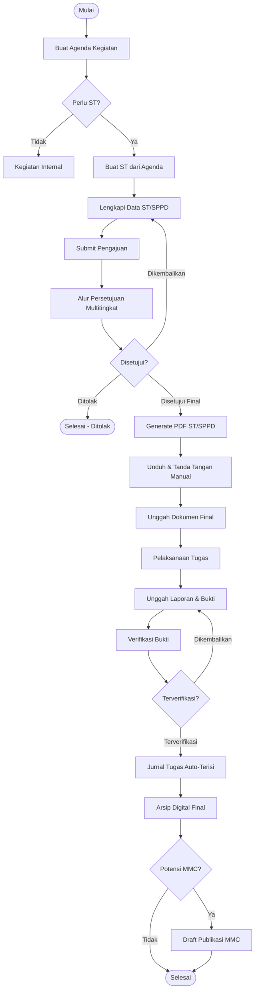

### 5.2 Alur Persetujuan ST/SPPD

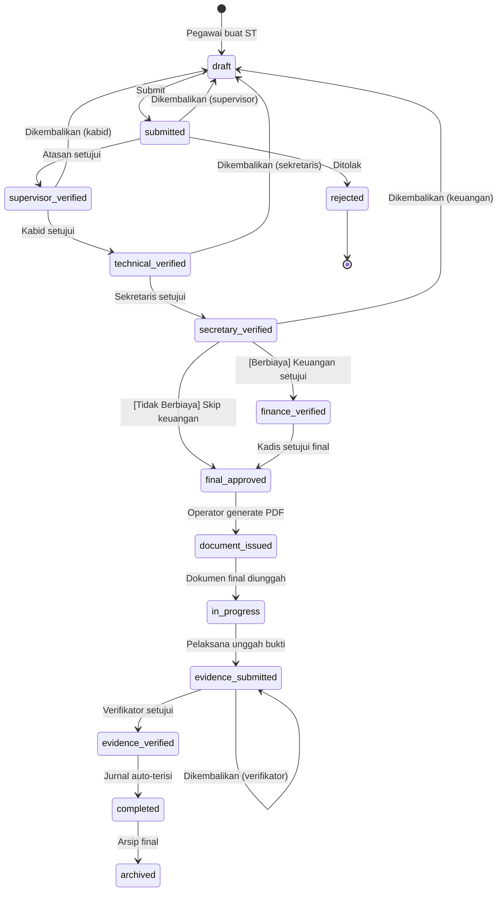

### 5.3 Kebutuhan Fungsional per Modul

#### F01 — Manajemen Agenda
- F01.1: CRUD agenda kegiatan dengan field: judul, deskripsi, tanggal, lokasi, unit penyelenggara, faskes terkait
- F01.2: Tagging SPM: agenda dapat ditautkan ke ≥1 dari 12 indikator SPM
- F01.3: Flag `need_st`: operator dapat menandai agenda memerlukan ST
- F01.4: Lampiran agenda: unggah file pendukung (PDF, DOCX, max 10 MB)
- F01.5: Kalender tampilan agenda (minggu/bulan)
- F01.6: Visibilitas: internal / terbatas / publik
- F01.7: Status lifecycle: draft → proposed → confirmed → need_st → st_created → in_progress → completed/cancelled/archived

#### F02 — ST/SPPD
- F02.1: Wizard pembuatan ST dengan auto-fill dari agenda (agenda snapshot disimpan)
- F02.2: Pembuatan ST manual tanpa agenda
- F02.3: SPPD: rincian anggaran per baris (sumber dana: APBD/BLUD/BOK/JKN, komponen biaya)
- F02.4: Multi-peserta: daftar peserta dengan data snapshot (nama, NIP, jabatan, golongan)
- F02.5: Multi-tujuan: daftar tempat tujuan
- F02.6: Flag ST urgent dengan justifikasi
- F02.7: Penomoran otomatis sesuai pola unit/faskes
- F02.8: Tracking status lifecycle lengkap (lihat §5.2)

#### F03 — Persetujuan
- F03.1: Rantai persetujuan dikonfigurasi per level organisasi (dinas/faskes)
- F03.2: Langkah keuangan hanya aktif jika `is_budgeted = true`
- F03.3: Setiap langkah: Setujui / Kembalikan / Tolak / Tunda (hold)
- F03.4: Catatan wajib saat Kembalikan/Tolak
- F03.5: Hanya approver yang ditunjuk di langkah aktif yang dapat bertindak
- F03.6: Notifikasi in-app saat giliran approver
- F03.7: Eskalasi otomatis jika pending >N hari (konfigurasi)

#### F04 — Dokumen & PDF
- F04.1: Template ST/SPPD dengan versioning
- F04.2: Generate PDF dari template (render server-side)
- F04.3: Nomor surat otomatis dari sequence terkonfigurasi
- F04.4: Unggah dokumen final (sudah TTD) → R2 storage, hash SHA-256 tersimpan
- F04.5: Versi dokumen dipertahankan (unlimited history)
- F04.6: Template dapat dikelola oleh Admin OPD (CRUD)

#### F05 — Bukti & Verifikasi
- F05.1: Upload laporan tugas (teks + lampiran)
- F05.2: Upload bukti multi-tipe: foto, daftar hadir, tiket, SPPD bertanda tangan, notulen, lainnya
- F05.3: Klasifikasi bukti: publik / internal / terbatas / keuangan
- F05.4: Semua peserta dapat mengunggah bukti untuk ST yang sama
- F05.5: Verifikator dapat Setujui atau Kembalikan setiap bukti
- F05.6: Saat semua bukti terverifikasi → status ST → `evidence_verified`

#### F06 — Jurnal Pegawai
- F06.1: Jurnal dibuat/diperbarui otomatis saat bukti diverifikasi
- F06.2: Satu baris jurnal per peserta per ST
- F06.3: Field jurnal: nomor dokumen, judul tugas, tanggal, tujuan, output, rekan kerja (snapshot), SPM terkait
- F06.4: Export jurnal: CSV/XLSX/PDF per periode
- F06.5: Jurnal hanya bisa dilihat oleh pemilik, atasan, dan admin

#### F07 — Dashboard & SPM
- F07.1: KPI cards: ST pending, ST in-progress, ST completed, arsip terbaru
- F07.2: SPM tracker: 12 indikator dengan progress bar capaian
- F07.3: Filter dashboard: per periode, per unit, per faskes, per SPM
- F07.4: Dashboard pimpinan: agregat lintas unit
- F07.5: Load time ≤3 detik (dengan caching KV 15 menit)

#### F08 — Arsip Digital
- F08.1: Metadata arsip lengkap: nomor dokumen, tanggal, penanda tangan, hash, klasifikasi akses
- F08.2: Retensi dikonfigurasi per tipe dokumen (5 tahun aktif / 5 tahun inaktif untuk ST)
- F08.3: Download arsip dicatat (audit access log)
- F08.4: Status arsip: final_archive → active_archive → inactive_archive → transferred/destroyed/permanent
- F08.5: Akses berdasarkan klasifikasi: confidential/finance hanya untuk role tertentu

#### F09 — MMC Draft
- F09.1: Draft publikasi dibuat hanya dari laporan yang `evidence_verified`
- F09.2: Flag `potential_mmc` diatur manual oleh Reviewer MMC atau auto-diwarisi dari agenda
- F09.3: Reviewer dapat mengedit draft: hapus data sensitif (NIP, rincian biaya)
- F09.4: Alur review: draft → approved/rejected → link_published
- F09.5: Tidak ada auto-publish; semua penerbitan manual

### 5.4 Kebutuhan Non-Fungsional

| Kategori | Spesifikasi |
|---------|-------------|
| **Ketersediaan** | 99,5% uptime (SLA Cloudflare Workers) |
| **Performa** | API response ≤500ms untuk 95% request; Dashboard ≤3 detik |
| **Kapasitas Awal** | 200 pengguna aktif, 10.000 dokumen/tahun |
| **Skalabilitas** | Horizontal via Cloudflare Workers (auto-scale) |
| **Keamanan** | HTTPS only; CSP; rate limiting; OWASP Top 10 compliant |
| **Privasi** | Data pegawai dienkripsi at rest; akses berbasis ABAC |
| **Aksesibilitas** | Responsive mobile-first; WCAG 2.1 AA minimum |
| **Lokalisasi** | Bahasa Indonesia; zona waktu WIB (UTC+7) |
| **Browser Support** | Chrome/Firefox/Edge versi 2 terbaru; Safari iOS 15+ |
| **File Upload** | Max 10 MB per dokumen; max 50 MB per batch bukti |
| **Audit** | Semua aksi tercatat dengan timestamp, actor, IP |

---

## 6. ARSITEKTUR SISTEM

### 6.1 Arsitektur Tingkat Tinggi

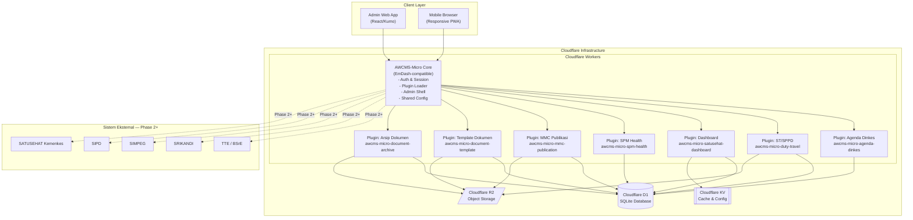

### 6.2 Arsitektur Plugin

```mermaid
graph LR
    subgraph core["AWCMS-Micro Core (Immutable)"]
        cl["Plugin Loader"]
        auth["Auth & Session"]
        shell["Admin UI Shell"]
        db["DB Bindings (D1/R2/KV)"]
        audit_core["Audit Event Emitter"]
    end

    subgraph plugin["Plugin Boundary (Mutable)"]
        direction TB
        routes["Route Handlers\n/api/[plugin]/..."]
        svc["Service Layer\nBusiness Logic"]
        repo["Repository Layer\nDB Queries"]
        ui["UI Pages/Components"]
        mig["DB Migrations\n[plugin]_*.sql"]
        perms["Permission Declarations"]
        templ["Document Templates"]
    end

    subgraph contract["Service Contracts (Inter-Plugin)"]
        sc1["Agenda → Duty\nGET /api/agenda/events/:id\nPOST /api/agenda/events/:id/st-links"]
        sc2["Duty → Template\nPOST /api/document-templates/render"]
        sc3["Duty → Archive\nPOST /api/document-archives"]
        sc4["Duty → MMC\nPOST /api/mmc/drafts/from-duty/:id"]
        sc5["All → Dashboard\nGET /api/*/metrics"]
    end

    core --> plugin
    plugin --> contract
```

**Prinsip Plugin Architecture (Tidak Boleh Dilanggar)**:
1. Plugin TIDAK boleh mengakses tabel plugin lain secara langsung — hanya via Service Contract API
2. Plugin TIDAK boleh memodifikasi core AWCMS-Micro/EmDash
3. Setiap plugin memiliki prefix tabel sendiri (lihat §7)
4. Semua migrasi berada di folder plugin masing-masing
5. Setiap plugin memiliki changelog dan dokumentasi sendiri

### 6.3 Alur Pemrosesan Request

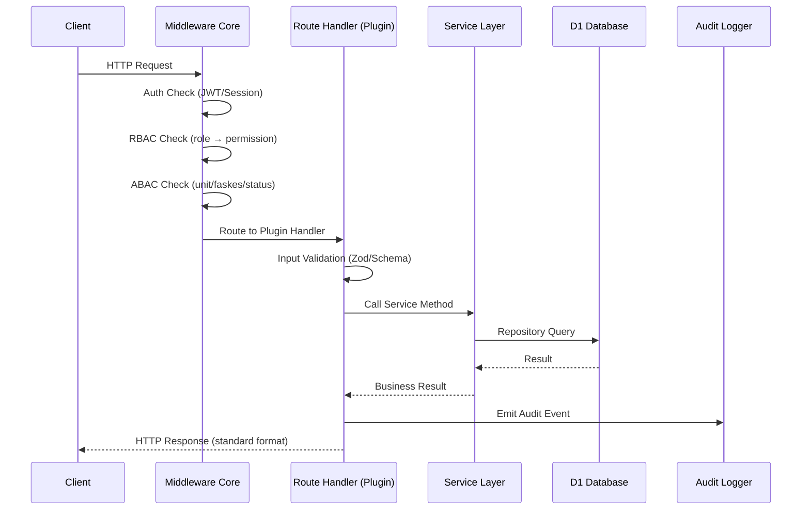

---

## 7. DESAIN BASIS DATA DAN HUBUNGAN DATA

### 7.1 Organisasi Tabel per Domain

| Prefix | Domain | Plugin | Jumlah Tabel (MVP) |
|--------|--------|--------|-------------------|
| `satusehat_` | Platform Core | Core/Dashboard | 5 |
| `agenda_` | Agenda | agenda-dinkes | 6 |
| `duty_` | ST/SPPD/Bukti/Jurnal | duty-travel | 20 |
| `document_` | Arsip | document-archive | 3 |

**Total**: ±34 tabel MVP

### 7.2 Entity Relationship Diagram (Konseptual)

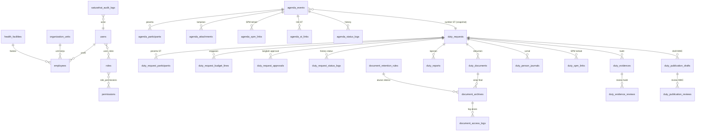

### 7.3 Tabel Kunci dan Field Penting

#### `agenda_events`
```sql
id TEXT PRIMARY KEY,
title TEXT NOT NULL,
description TEXT,
organizer_unit_id TEXT,         -- FK organization_units
health_facility_id TEXT,        -- FK health_facilities (nullable)
start_at TEXT NOT NULL,         -- ISO 8601 UTC
end_at TEXT NOT NULL,
location_name TEXT,
visibility TEXT DEFAULT 'internal', -- internal|restricted|public
status TEXT DEFAULT 'draft',    -- lifecycle status (lihat §5.2)
spm_category TEXT,              -- kode indikator SPM (nullable)
need_st INTEGER DEFAULT 0,      -- flag: perlu ST
potential_mmc INTEGER DEFAULT 0, -- flag: potensi publikasi
created_by TEXT NOT NULL,
created_at TEXT NOT NULL,
updated_at TEXT NOT NULL,
cancelled_at TEXT, cancelled_by TEXT,
archived_at TEXT, archived_by TEXT
```

#### `duty_requests` (Tabel Inti)
```sql
id TEXT PRIMARY KEY,
tracking_number TEXT UNIQUE NOT NULL,   -- auto-generated
request_type TEXT NOT NULL,             -- st_only|st_sppd|urgent
organization_level TEXT NOT NULL,       -- dinas|faskes
proposer_unit_id TEXT,
proposer_health_facility_id TEXT,
proposer_user_id TEXT NOT NULL,
agenda_id TEXT,                         -- FK agenda_events (nullable)
agenda_snapshot TEXT,                   -- JSON snapshot saat ST dibuat
duty_basis_type TEXT,                   -- dasar hukum ST
duty_basis_number TEXT,
spm_category TEXT,
purpose TEXT NOT NULL,
task_description TEXT NOT NULL,
expected_output TEXT,
is_budgeted INTEGER DEFAULT 0,
is_urgent INTEGER DEFAULT 0,
urgent_reason TEXT,
potential_mmc INTEGER DEFAULT 0,        -- inherit dari agenda atau set manual
status TEXT DEFAULT 'draft',            -- lifecycle status lengkap
created_by TEXT NOT NULL,
created_at TEXT NOT NULL,
updated_at TEXT NOT NULL,
submitted_at TEXT,
cancelled_at TEXT, cancelled_by TEXT
```

#### `duty_request_approvals`
```sql
id TEXT PRIMARY KEY,
duty_request_id TEXT NOT NULL,
approval_step TEXT NOT NULL,   -- supervisor|technical|secretary|finance|final_approver|operator_document
approver_role TEXT NOT NULL,   -- role yang ditunjuk
approver_user_id TEXT,         -- user aktual yang bertindak (nullable jika pending)
decision TEXT,                 -- approve|return|reject|hold|approve_with_note
decision_note TEXT,
decided_at TEXT,
sort_order INTEGER NOT NULL,   -- urutan langkah
status TEXT DEFAULT 'pending'  -- pending|completed|skipped
```

**Aturan Langkah Approval**:
- `finance` langkah: `status = 'skipped'` jika `is_budgeted = false`
- Langkah tidak boleh di-skip kecuali oleh sistem (bukan user)
- Hanya user dengan role yang sesuai di `approver_role` dapat bertindak

#### `duty_request_budget_lines`
```sql
duty_request_id TEXT NOT NULL,
funding_source TEXT NOT NULL,  -- APBD|BLUD|BOK|JKN
budget_category TEXT NOT NULL, -- perjalanan_dinas|honorarium|atk|kegiatan|lainnya
program_code TEXT,
activity_code TEXT,
sub_activity_code TEXT,
account_code TEXT,
cost_component TEXT NOT NULL,
estimated_amount INTEGER NOT NULL,
approved_amount INTEGER,       -- diisi oleh keuangan saat approval
finance_note TEXT
```

#### `duty_documents`
```sql
id TEXT PRIMARY KEY,
duty_request_id TEXT NOT NULL,
document_type TEXT NOT NULL,   -- st|sppd|cost_attachment|report
document_number TEXT UNIQUE,
document_date TEXT,
template_id TEXT,
template_version_snapshot TEXT, -- JSON snapshot template saat generate
status TEXT DEFAULT 'draft_document', -- lifecycle dokumen
draft_file_path TEXT,           -- path R2 draft PDF
final_file_path TEXT,           -- path R2 final signed PDF
hash TEXT,                      -- SHA-256 final file
signing_method TEXT DEFAULT 'manual', -- manual|external_tte (Phase 2)
signer_name TEXT,
signer_nip TEXT,
signer_position TEXT,
created_by TEXT NOT NULL,
created_at TEXT NOT NULL,
updated_at TEXT NOT NULL,
final_uploaded_at TEXT,
final_uploaded_by TEXT
```

#### `duty_person_journals`
```sql
id TEXT PRIMARY KEY,
duty_request_id TEXT NOT NULL,
participant_user_id TEXT NOT NULL,
participant_name TEXT NOT NULL,     -- snapshot saat ST dibuat
participant_nip TEXT,
participant_position TEXT,
document_number TEXT,
duty_title TEXT NOT NULL,
start_at TEXT NOT NULL,
end_at TEXT NOT NULL,
destination_name TEXT,
coworkers_snapshot TEXT,            -- JSON array peserta lain
spm_category TEXT,
expected_output TEXT,
result_summary TEXT,
follow_up_summary TEXT,
evidence_status TEXT DEFAULT 'pending', -- pending|submitted|returned|verified
completion_status TEXT DEFAULT 'pending', -- pending|completed
document_link_id TEXT,              -- FK duty_documents
created_at TEXT NOT NULL,
updated_at TEXT NOT NULL
```

**Aturan Jurnal**:
- Dibuat otomatis saat ST dibuat (`completion_status = 'pending'`)
- Diperbarui saat `evidence_verified`: `evidence_status = 'verified'`, `completion_status = 'completed'`
- Jika bukti dikembalikan: `evidence_status = 'returned'`, `completion_status = 'pending'`

#### `document_archives`
```sql
id TEXT PRIMARY KEY,
source_plugin TEXT NOT NULL,
source_entity_type TEXT NOT NULL,
source_entity_id TEXT NOT NULL,
document_id TEXT NOT NULL,          -- FK duty_documents
document_number TEXT NOT NULL,
document_type TEXT NOT NULL,
document_date TEXT NOT NULL,
creator_unit_id TEXT,
signer_name TEXT,
signer_position TEXT,
file_path TEXT NOT NULL,            -- R2 path (immutable)
hash TEXT NOT NULL,                 -- SHA-256 (immutable)
archive_status TEXT DEFAULT 'final_archive',
access_classification TEXT DEFAULT 'internal', -- public|internal|restricted|confidential|finance
retention_rule_id TEXT,
active_until TEXT,                  -- tanggal akhir masa aktif
inactive_until TEXT,                -- tanggal akhir masa inaktif
final_action TEXT,                  -- musnah|permanen|dinilai_kembali
created_by TEXT NOT NULL,
created_at TEXT NOT NULL,
updated_at TEXT NOT NULL
```

**Aturan Klasifikasi Dokumen → Arsip**:
| Tipe Dokumen | access_classification Default |
|-------------|------------------------------|
| ST | internal |
| SPPD | finance |
| Lampiran Biaya | finance |
| Laporan Tugas | internal |
| Bukti Foto | internal |
| Bukti Keuangan | finance |

### 7.4 Aturan Retensi Data

| Tipe Dokumen | Aktif | Inaktif | Aksi Final |
|-------------|-------|---------|------------|
| ST (Surat Tugas) | 5 tahun | 5 tahun | Dinilai kembali |
| SPPD & Biaya | Sesuai JRA Keuangan | Sesuai JRA | Permanen |
| Agenda | 2 tahun | 3 tahun | Musnah |
| Laporan/Bukti | 3 tahun | 3 tahun | Dinilai kembali |
| Audit Log | 2 tahun | 3 tahun | Musnah |
| Publikasi MMC | Permanen (bernilai sejarah) | — | Permanen |

---

## 8. ALUR KERJA SETIAP MODUL

### 8.1 Alur Agenda

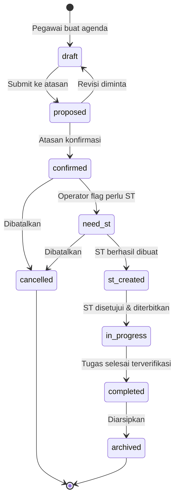

### 8.2 Alur Dokumen PDF

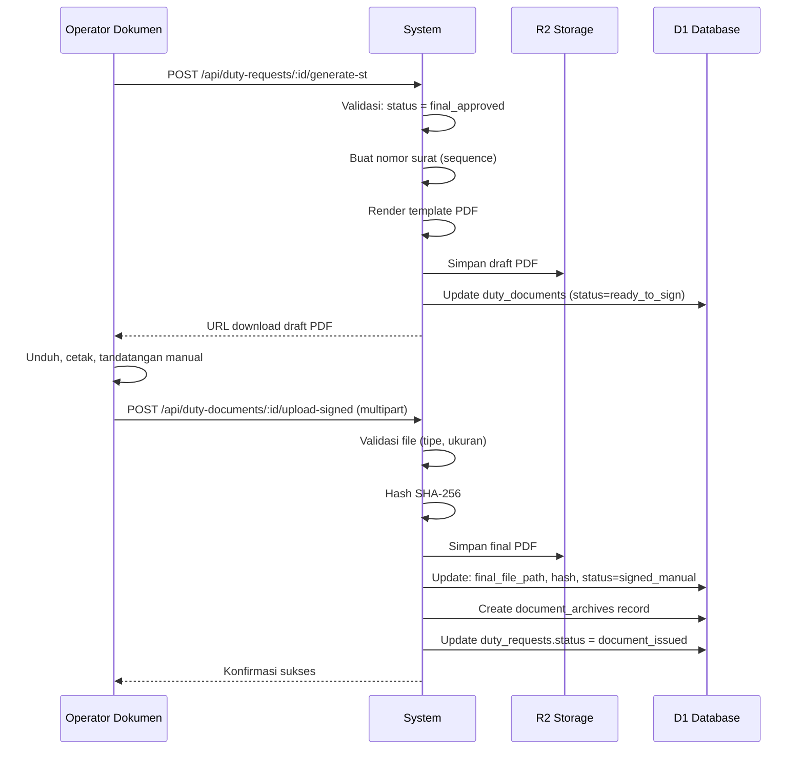

### 8.3 Alur Bukti dan Verifikasi

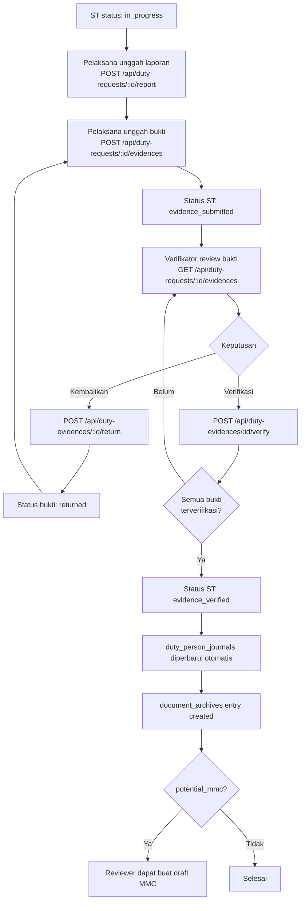

### 8.4 Alur Arsip Digital

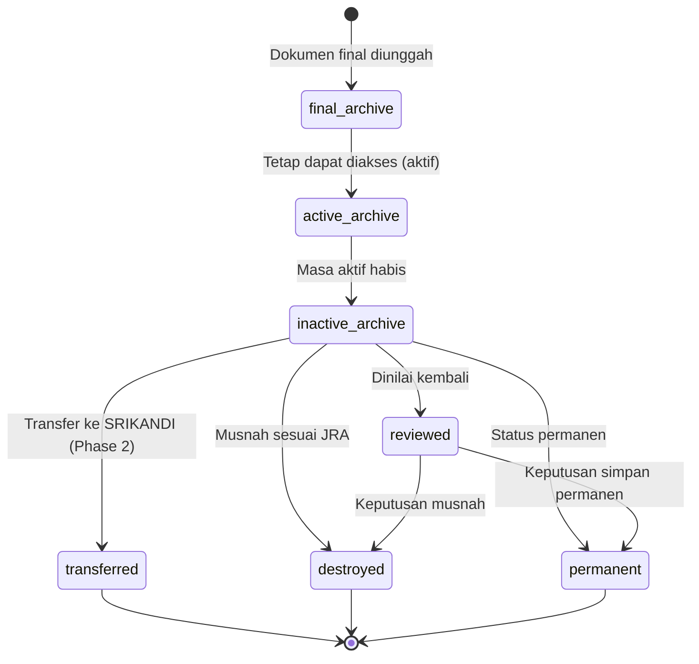

---

## 9. KEBUTUHAN UI/UX

### 9.1 Prinsip Desain

- **Mobile-first**: Semua fitur utama dapat digunakan di layar 375px
- **Minimalis**: Tidak lebih dari 3 klik untuk aksi utama
- **Feedback visual**: Loading state, success toast, error inline pada form
- **Aksesibilitas**: Contrast ratio ≥4.5:1, keyboard navigable, screen reader compatible

### 9.2 Struktur Navigasi Utama

```
Dashboard
├── Agenda
│   ├── Daftar Agenda
│   ├── Kalender
│   └── Buat Agenda
├── ST/SPPD
│   ├── Pengajuan Saya
│   ├── Persetujuan (badge: pending count)
│   └── Buat ST Baru
├── Bukti & Laporan
│   ├── Upload Laporan
│   └── Verifikasi Bukti
├── Dokumen
│   ├── Generate PDF
│   └── Daftar Dokumen
├── Arsip
│   └── Cari & Unduh
├── SPM
│   └── Capaian Indikator
├── Publikasi MMC
│   └── Kelola Draft
└── Admin
    ├── Pengguna & Peran
    ├── Master Data
    ├── Template Dokumen
    └── Audit Trail
```

### 9.3 Kebutuhan UI per Modul

| Modul | Komponen UI Kritis | Catatan |
|-------|-------------------|---------|
| Agenda | Form buat/edit, kalender bulanan, filter SPM | Kalender via library (fullcalendar atau react-calendar) |
| ST/SPPD | Wizard 4 langkah, tabel peserta, tabel anggaran | Validasi real-time per langkah |
| Persetujuan | Timeline approval visual, tombol aksi kontekstual | Badge count di nav |
| Dokumen | Preview PDF inline, tombol generate/download/upload | Progress upload bar |
| Bukti | Multi-upload drag-drop, preview foto, checklist | Klasifikasi per file |
| Jurnal | Tabel dengan filter, export button | Read-only untuk pemilik |
| Dashboard | Card KPI, chart SPM, daftar pending | Refresh otomatis 5 menit |
| Arsip | Pencarian full-text, filter tanggal/tipe, download | Audit akses otomatis |

---

## 10. KEBUTUHAN API DAN INTEGRASI

### 10.1 Prinsip API

- **Base URL**: `https://[domain]/api/`
- **Format**: JSON REST
- **Versi**: Implisit dalam path (upgrade: `/api/v2/` jika breaking change)
- **Auth**: Session/JWT via core AWCMS-Micro
- **Timeout**: 30 detik untuk semua endpoint; 120 detik untuk generate PDF
- **Rate Limiting**: 100 req/menit per user; 1000 req/menit per IP (konfigurasi)

### 10.2 Format Response Standar

```json
// Sukses (single object)
{
  "data": { "id": "...", "field": "value" },
  "meta": { "request_id": "uuid", "timestamp": "2026-06-13T08:00:00+07:00" }
}

// Sukses (list)
{
  "data": [...],
  "pagination": { "page": 1, "per_page": 20, "total": 100, "total_pages": 5 },
  "meta": { "request_id": "uuid", "timestamp": "..." }
}

// Error
{
  "error": {
    "code": "VALIDATION_ERROR|FORBIDDEN|CONFLICT|NOT_FOUND|WORKFLOW_ERROR",
    "message": "Pesan kesalahan dalam Bahasa Indonesia",
    "details": { "field_name": ["Pesan error"] }
  },
  "meta": { "request_id": "uuid", "timestamp": "..." }
}
```

### 10.3 HTTP Status Codes

| Code | Kondisi |
|------|---------|
| 200 | Baca/Update berhasil |
| 201 | Create berhasil |
| 400 | Input tidak valid |
| 401 | Belum login |
| 403 | Tidak diizinkan (RBAC/ABAC gagal) |
| 404 | Resource tidak ditemukan |
| 409 | Konflik workflow (misalnya sudah disubmit) |
| 422 | Validasi bisnis gagal |
| 429 | Rate limit terlampaui |
| 500 | Kesalahan server |

### 10.4 Ringkasan Endpoint MVP

| Plugin | Endpoint Utama | Jumlah |
|--------|---------------|--------|
| Platform | `/api/satusehat/*` | 5 |
| Agenda | `/api/agenda/*` | 8 |
| Duty | `/api/duty-requests/*` | 12 |
| Document | `/api/duty-documents/*` | 4 |
| Evidence | `/api/duty-evidences/*` | 4 |
| Journal | `/api/duty-journals/*` | 2 |
| Archive | `/api/document-archives/*` | 3 |
| MMC | `/api/mmc/*` | 4 |
| **Total** | | **≈42** |

### 10.5 Service Contracts Antar Plugin

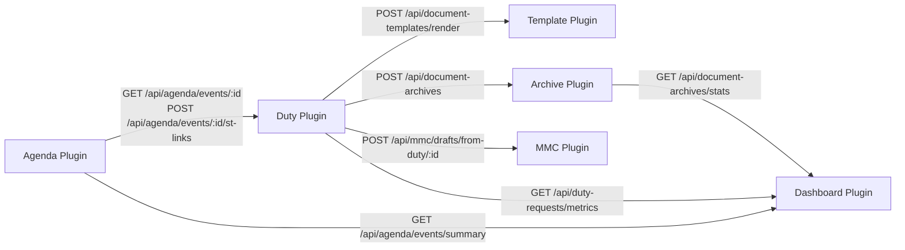

### 10.6 Integrasi Eksternal (Phase 2+)

| Sistem | Tipe | Data | Status |
|--------|------|------|--------|
| TTE/BSrE | REST API | Upload PDF → signed PDF return | Phase 2 |
| SRIKANDI | REST API | Transfer arsip final | Phase 2 |
| SIMPEG | REST API | Sync data pegawai | Phase 2 |
| SIPD | REST API | Sync kode anggaran | Phase 2 |
| e-Kinerja | REST API | Push data kinerja | Phase 2 |
| SATUSEHAT Kemenkes | REST API | Baca data faskes/SPM | Phase 3 |
| WhatsApp Gateway | REST API | Notifikasi approval | Phase 2 |
| Email SMTP | SMTP | Notifikasi approval | Phase 2 |

---

## 11. KEBUTUHAN KEAMANAN — AUTH, RBAC, ABAC, AUDIT

### 11.1 Autentikasi

- **Mekanisme**: Session-based via AWCMS-Micro core (JWT + HttpOnly cookie)
- **Password**: bcrypt/argon2, minimum 12 karakter
- **Session**: Expire 8 jam, refresh on activity
- **MFA**: Opsional di Phase 2 (TOTP via authenticator app)
- **HTTPS Only**: Redirect HTTP → HTTPS; HSTS header
- **CSRF Protection**: Token per-session

### 11.2 Otorisasi — RBAC

**17 Role Sistem**:

| # | Role | Level | Deskripsi Singkat |
|---|------|-------|-------------------|
| 1 | Super Admin | Platform | Semua akses, config core |
| 2 | Admin Satu Sehat Kobar | Platform | Manajemen plugin, role, dashboard config |
| 3 | Admin Tim SIK | Sistem | User management, audit, backup |
| 4 | Admin OPD | Org Unit | Master data unit, template, penomoran |
| 5 | Admin Faskes | Faskes | Master data faskes, staff, arsip faskes |
| 6 | Pegawai/Pemohon | Diri Sendiri | Buat agenda/ST, revisi draft sendiri |
| 7 | Pelaksana | Diri Sendiri | Lihat ST sendiri, unggah laporan/bukti |
| 8 | Atasan Langsung | Tim | Verifikasi pengajuan tim, kembalikan/revisi |
| 9 | Kabid | Bidang | Verifikasi teknis, oversight bidang |
| 10 | Sekretaris | Organisasi | Verifikasi administratif, approval sekretariat |
| 11 | Kadis | Organisasi | Approval final, dashboard strategis |
| 12 | Kepala Faskes | Faskes | Approval final faskes |
| 13 | Kepala TU Faskes | Faskes | Admin faskes, penomoran, arsip |
| 14 | Keuangan | Keuangan | Validasi SPPD/anggaran, approval berbiaya |
| 15 | Operator Surat | Dokumen | Template, generate PDF, unggah final |
| 16 | Reviewer MMC | Publikasi | Review/edit draft publikasi |
| 17 | Auditor | Audit | Read-only audit log, sampling dokumen |

### 11.3 Matrix Permission

| Permission | SA | ASS | SIK | OPD | FK | PGW | PLK | ATL | KBD | SKR | KDS | KFS | TU | KEU | OPS | MMC | AUD |
|------------|----|----|-----|-----|----|----|-----|-----|-----|-----|-----|-----|----|----|-----|-----|-----|
| agenda.read | ✓ | ✓ | ✓ | ✓ | ✓ | ✓ | ✓ | ✓ | ✓ | ✓ | ✓ | ✓ | ✓ | | ✓ | | ✓ |
| agenda.create | ✓ | ✓ | ✓ | ✓ | ✓ | ✓ | ✓ | | | | | | | | | | |
| agenda.update | ✓ | ✓ | ✓ | ✓ | | ✓* | | | | | | | | | | | |
| duty.read | ✓ | ✓ | ✓ | ✓ | ✓ | ✓ | ✓ | ✓ | ✓ | ✓ | ✓ | ✓ | ✓ | ✓ | ✓ | | ✓ |
| duty.create | ✓ | ✓ | ✓ | ✓ | ✓ | ✓ | | | | | | | | | | | |
| duty.submit | ✓ | ✓ | ✓ | ✓ | ✓ | ✓ | | | | | | | | | | | |
| duty.approve | ✓ | ✓ | ✓ | | | | | ✓ | ✓ | ✓ | ✓ | ✓ | ✓ | ✓ | | | |
| duty.verify_evidence | ✓ | ✓ | ✓ | | | | | ✓ | ✓ | ✓ | | ✓ | ✓ | | | | |
| duty.generate_document | ✓ | ✓ | ✓ | | | | | | | | | | | | ✓ | | |
| duty.upload_final | ✓ | ✓ | ✓ | | | | | | | | | | | | ✓ | | |
| archive.read | ✓ | ✓ | ✓ | ✓ | ✓ | | | | | ✓ | ✓ | ✓ | ✓ | | ✓ | | ✓ |
| archive.manage | ✓ | ✓ | ✓ | ✓ | ✓ | | | | | | | | | | ✓ | | |
| audit.read | ✓ | ✓ | ✓ | | | | | | | | | | | | | | ✓ |
| mmc.create_draft | ✓ | ✓ | | | | | | | | | | | | | | ✓ | |
| mmc.review | ✓ | ✓ | | | | | | | | | | | | | | ✓ | |
| dashboard.read | ✓ | ✓ | ✓ | ✓ | ✓ | ✓ | ✓ | ✓ | ✓ | ✓ | ✓ | ✓ | ✓ | ✓ | ✓ | | ✓ |
| dashboard.leadership | ✓ | ✓ | ✓ | | | | | | | | ✓ | ✓ | | | | | |

*`agenda.update` untuk Pegawai: hanya milik sendiri, hanya jika status = draft

### 11.4 ABAC — Aturan Berbasis Atribut

ABAC diterapkan sebagai lapisan tambahan di atas RBAC. Aturan yang wajib diterapkan:

```typescript
// Aturan ABAC (pseudocode)

// Pegawai hanya lihat ST sendiri
if (role === 'Pegawai') {
  query.where('created_by = ?', userId)
}

// Faskes hanya lihat data faskes sendiri
if (user.organization_level === 'faskes') {
  query.where('proposer_health_facility_id = ?', user.faskes_id)
}

// Approval: hanya approver langkah aktif yang bisa bertindak
const currentStep = await getCurrentApprovalStep(duty_request_id)
if (currentStep.approver_role !== user.role) throw FORBIDDEN

// Finance scope: Keuangan hanya validasi ST berbiaya
if (role === 'Keuangan') {
  query.where('is_budgeted = 1')
  // Scope unit: keuangan dinas = lihat semua dinas
  // Scope faskes: keuangan faskes = lihat faskes sendiri
}

// Arsip classified: restricted/finance/confidential hanya untuk role tertentu
if (['restricted','finance','confidential'].includes(archive.access_classification)) {
  if (!hasPermission(user, 'archive.read_restricted')) throw FORBIDDEN
}

// Jurnal: hanya milik sendiri, atasan, atau admin
if (resource === 'duty_person_journals') {
  if (userId !== journal.participant_user_id && !isAtasanOf(userId, journal.participant_user_id)) {
    throw FORBIDDEN
  }
}
```

### 11.5 Keamanan Data

- **Enkripsi at-rest**: D1 native encryption; R2 server-side encryption
- **Enkripsi in-transit**: TLS 1.3 minimum
- **File Upload**: Validasi MIME type + ekstensi; scan virus (ClamAV) di Phase 2
- **Input Sanitization**: Semua input di-sanitize sebelum disimpan (XSS prevention)
- **SQL Injection**: Parameterized queries only; ORM/query builder
- **Secrets**: Cloudflare environment variables / KV encrypted; tidak ada secrets di repo
- **PII Handling**: NIP, nama, jabatan dalam snapshot dokumen diklasifikasikan `internal`
- **Data Isolation**: Multi-tenancy per unit/faskes via ABAC

### 11.6 Audit Trail

**Tabel**: `satusehat_audit_logs`

```sql
id TEXT PRIMARY KEY,
actor_id TEXT NOT NULL,           -- user yang melakukan aksi
actor_name TEXT NOT NULL,         -- snapshot nama user
plugin_key TEXT NOT NULL,         -- nama plugin
action TEXT NOT NULL,             -- event type (lihat list di bawah)
entity_type TEXT NOT NULL,        -- jenis entitas (agenda_event, duty_request, dll)
entity_id TEXT NOT NULL,          -- ID entitas
before_data TEXT,                 -- JSON state sebelum (nullable untuk CREATE)
after_data TEXT,                  -- JSON state sesudah (nullable untuk DELETE)
note TEXT,                        -- catatan tambahan
ip_address TEXT NOT NULL,
user_agent TEXT,
created_at TEXT NOT NULL
```

**23+ Event Types yang Wajib Dicatat**:

| Event | Entitas | Trigger |
|-------|---------|---------|
| `agenda.created` | agenda_events | POST create |
| `agenda.updated` | agenda_events | PATCH |
| `agenda.cancelled` | agenda_events | POST cancel |
| `agenda.archived` | agenda_events | POST archive |
| `duty.created` | duty_requests | POST create |
| `duty.submitted` | duty_requests | POST submit |
| `duty.approved` | duty_request_approvals | POST approve |
| `duty.returned` | duty_request_approvals | POST return |
| `duty.rejected` | duty_request_approvals | POST reject |
| `document.generated` | duty_documents | POST generate-st/sppd |
| `document.final_uploaded` | duty_documents | POST upload-signed |
| `document.downloaded` | duty_documents | GET download |
| `evidence.uploaded` | duty_evidences | POST evidences |
| `evidence.verified` | duty_evidences | POST verify |
| `evidence.returned` | duty_evidences | POST return |
| `journal.updated` | duty_person_journals | Auto-trigger |
| `archive.created` | document_archives | Auto-trigger |
| `archive.accessed` | document_archives | GET download (classified) |
| `mmc.draft_created` | duty_publication_drafts | POST create |
| `mmc.draft_reviewed` | duty_publication_reviews | POST review |
| `user.login` | users | Session create |
| `user.logout` | users | Session destroy |
| `user.permission_denied` | — | RBAC/ABAC 403 |

---

## 12. KEBUTUHAN OPERASIONAL — DEPLOYMENT, BACKUP, MONITORING

### 12.1 Topologi Deployment

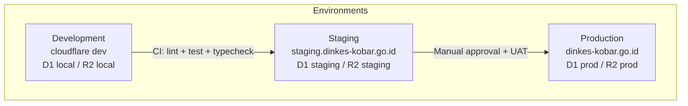

### 12.2 CI/CD Pipeline

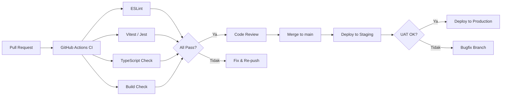

### 12.3 Backup & Recovery

| Item | Strategi | Frekuensi | Retensi |
|------|---------|-----------|---------|
| D1 Database | D1 Export (wrangler d1 export) | Harian otomatis | 30 hari |
| R2 Object Storage | R2 versioning + cross-region copy | Real-time versioning | 90 hari versi |
| KV Namespace | Export JSON | Mingguan | 14 hari |
| Konfigurasi | Git repository | Per commit | Unlimited (Git) |
| Audit Logs | Export ke R2 | Harian | 5 tahun |

**Recovery Time Objective (RTO)**: ≤4 jam  
**Recovery Point Objective (RPO)**: ≤24 jam

**Prosedur Backup Test**: Dilakukan setiap Sprint Review (setiap 2 minggu) untuk memverifikasi backup dapat di-restore.

### 12.4 Monitoring & Alerting

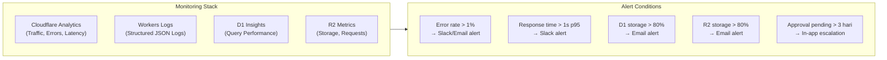

**KPI Operasional yang Dimonitor**:
- Uptime: Target ≥99.5%
- Error rate: Target <0.5%
- API response p95: Target <500ms
- Dashboard load: Target <3 detik
- Approval pending >3 hari: Alert ke atasan terkait

### 12.5 Health Check Endpoint

```
GET /api/health
Response: { "status": "ok", "plugins": {...}, "db": "ok", "storage": "ok" }
```

Endpoint ini dipanggil setiap 5 menit oleh Cloudflare Health Checks.

---

## 13. STANDAR DOKUMENTASI TEKNIS

### 13.1 Dokumentasi Plugin

Setiap plugin wajib memiliki:

```
[plugin-name]/
├── README.md              # Deskripsi, setup, cara kerja
├── CHANGELOG.md           # Perubahan per versi (Keep a Changelog format)
├── docs/
│   ├── API.md             # Dokumentasi endpoint API
│   ├── SCHEMA.md          # Deskripsi tabel DB
│   ├── PERMISSIONS.md     # Daftar permission dan aturan ABAC
│   └── WORKFLOWS.md       # Diagram alur kerja (Mermaid)
└── migrations/
    └── [timestamp]_*.sql  # Migrasi DB berurutan
```

### 13.2 Kode

- **Komentar**: Hanya untuk WHY yang tidak jelas — bukan WHAT
- **Nama fungsi/variabel**: Bahasa Inggris, deskriptif, camelCase untuk JS, snake_case untuk SQL
- **Tipe TypeScript**: Wajib untuk semua parameter fungsi dan return value
- **Tidak ada `any`** kecuali dengan `// eslint-disable-next-line @typescript-eslint/no-explicit-any` beserta justifikasi
- **Error handling**: Gunakan custom error classes dengan kode HTTP dan message Bahasa Indonesia
- **API Contract**: Perubahan breaking change wajib didokumentasikan 1 sprint sebelumnya

### 13.3 Database Migration

- Satu file migration per perubahan schema
- Nama file: `[YYYYMMDDHHMMSS]_[deskripsi_singkat].sql`
- Selalu sertakan rollback SQL jika memungkinkan
- Tidak boleh memodifikasi tabel plugin lain dalam migration sendiri

### 13.4 Git & Branch Strategy

```
main              ← Production-ready, protected
├── develop       ← Integration branch
│   ├── feat/[plugin-name]-[feature]   ← Feature branches
│   ├── fix/[issue-id]-[description]   ← Bugfix branches
│   └── chore/[description]            ← Non-code changes
└── release/[version]   ← Release candidates
```

**Commit Message Format** (Conventional Commits):
```
feat(agenda): tambah kalender mingguan
fix(duty): perbaiki validasi tanggal SPPD
chore(docs): perbarui schema ERD
test(archive): tambah test download arsip
```

---

## 14. FASE IMPLEMENTASI

### 14.1 Roadmap Fase

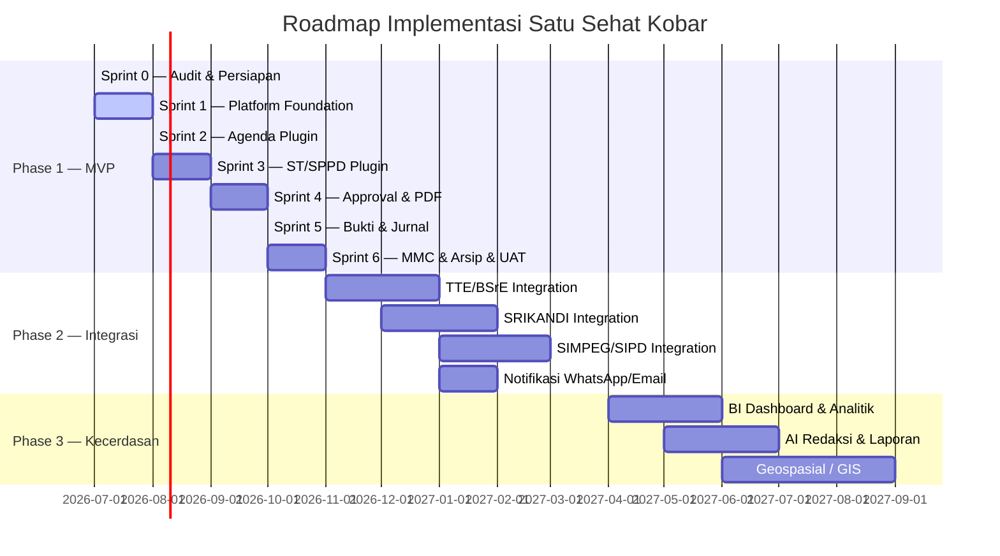

### 14.2 Detail Sprint MVP

| Sprint | Deliverables | Kriteria Selesai |
|--------|-------------|-----------------|
| **Sprint 0** | Audit repo, identifikasi pola AWCMS-Micro, gap analysis, dokumen PRD final | Semua dokumen PRD tervalidasi, rencana Sprint 1 siap |
| **Sprint 1** | Plugin registry, RBAC baseline, audit log infrastructure, dashboard placeholder | Admin login berfungsi, 5 role terdaftar, audit log menulis |
| **Sprint 2** | Plugin Agenda: CRUD, SPM tagging, lampiran, kalender, API | Create/edit/cancel agenda, kalender tampil, filter SPM berfungsi |
| **Sprint 3** | Plugin ST/SPPD: wizard, SPPD anggaran, multi-peserta, relasi agenda | ST dari agenda, ST manual, SPPD berhasil dibuat |
| **Sprint 4** | Approval workflow, template ST/SPPD, generate PDF, unggah dokumen final | PDF berhasil digenerate, unggah final + hash tersimpan |
| **Sprint 5** | Upload bukti, verifikasi, jurnal auto-terisi, dashboard live | Bukti terverifikasi, jurnal auto-update, dashboard menampilkan data nyata |
| **Sprint 6** | MMC draft, arsip final, backup/restore test, security hardening, UAT | UAT skenario semua passed, 0 critical bug, backup verified |

---

## 15. PRIORITAS PENGEMBANGAN (MoSCoW)

### Must Have (MVP — Sprint 1-6)
- Platform foundation: plugin registry, RBAC, audit trail
- Agenda CRUD + SPM tagging + attachment
- ST wizard + SPPD budget + multi-participant
- Approval workflow multitingkat (konfigurasi skip keuangan)
- Generate PDF + upload signed + hash storage
- Evidence upload + verification workflow
- Journal auto-population
- Dashboard KPI (aggregate, SPM summary)
- Archive metadata + access control
- Export data (CSV/XLSX)

### Should Have (Sprint 5-6, jika memungkinkan)
- MMC publication draft workflow
- Notifikasi in-app approval
- Kalender agenda interaktif
- Eskalasi approval otomatis
- Template manager UI untuk Admin OPD

### Could Have (Phase 1.5 atau Phase 2)
- Export laporan PDF kustom
- Full-text search arsip
- Dashboard mobile optimized
- Preview PDF inline di browser

### Won't Have (Phase 2+)
- TTE/BSrE integration
- SRIKANDI, SIMPEG, SIPD, e-Kinerja sync
- Notifikasi WhatsApp/Email
- AI/ML redaksi otomatis
- Geospasial/GIS

---

## 16. KRITERIA PENERIMAAN

### 16.1 Kriteria Teknis (Per Sprint)

| Sprint | Kriteria |
|--------|---------|
| S1 | Admin dapat login; plugin registry menampilkan 7 plugin; audit log menulis ke DB |
| S2 | Agenda dapat dibuat, diedit, disubmit, dikonfirmasi, dibatalkan; kalender tampil |
| S3 | ST dapat dibuat dari agenda; SPPD dengan rincian anggaran tersimpan |
| S4 | PDF berhasil digenerate; hash tersimpan; dokumen final terunggah ke R2 |
| S5 | Bukti terverifikasi; jurnal auto-diisi; dashboard menampilkan data nyata |
| S6 | UAT skenario semua passed; backup berhasil direstore; 0 critical security issue |

### 16.2 Kriteria UAT Go-Live

**Semua kondisi berikut harus terpenuhi sebelum go-live pilot**:

1. ✅ Semua user story Must Have passed
2. ✅ 0 bug severity Critical/High yang belum diselesaikan
3. ✅ Load test: 50 concurrent users, response <1 detik
4. ✅ Security checklist 100% passed
5. ✅ Backup & restore verified oleh tim SIK
6. ✅ Data master (faskes, SPM, role, template) ter-seed lengkap
7. ✅ User training minimal 3 sesi selesai
8. ✅ SOP penggunaan tersedia untuk setiap role
9. ✅ Audit log berfungsi dan dapat dibaca oleh Auditor
10. ✅ Semua environment variable production tersetting di Cloudflare

---

## 17. RISIKO, MITIGASI, DAN KETERGANTUNGAN TEKNIS

### 17.1 Risiko dan Mitigasi

| # | Risiko | Dampak | Kemungkinan | Mitigasi |
|---|--------|--------|-------------|----------|
| R01 | Ketergantungan AWCMS-Micro: update breaking change | Tinggi | Sedang | Versi lock; test per minor update; review changelog |
| R02 | Kapasitas D1 SQLite terbatas (100K row/tabel) | Sedang | Rendah | Arsip data lama ke R2; partisi tabel per tahun jika perlu |
| R03 | Perubahan regulasi pemerintah (format ST, JRA) | Sedang | Sedang | Template versioning; update tanpa deploy ulang |
| R04 | Resistensi adopsi pengguna | Tinggi | Sedang | Training terstruktur; SOP simpel; rollout bertahap |
| R05 | Data sensitif bocor via bukti foto (PII) | Tinggi | Sedang | Klasifikasi bukti; peringatan saat upload; Phase 2: AI scan |
| R06 | Approval bottleneck (approver tidak responsif) | Sedang | Tinggi | Notifikasi eskalasi; notifikasi in-app; SLA approval |
| R07 | Cloudflare D1 downtime | Tinggi | Rendah | SLA Cloudflare 99.99%; backup harian; komunikasi ke user |
| R08 | Template dokumen tidak sesuai format resmi | Sedang | Sedang | Validasi template oleh Sekretaris sebelum go-live |
| R09 | ABAC leak — user akses data unit lain | Tinggi | Rendah | Unit test ABAC; penetration test sebelum go-live |
| R10 | File R2 kehilangan hash match (korupsi) | Tinggi | Sangat Rendah | Hash verify saat download; R2 versioning |

### 17.2 Ketergantungan Teknis

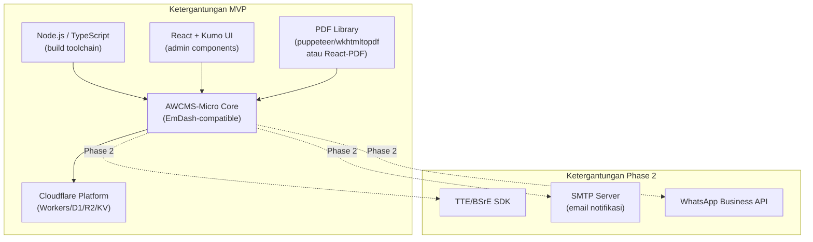

**Versi yang Dikunci (MVP)**:
- AWCMS-Micro: sesuai `awcms-latest` release di repo
- Node.js: ≥20.x LTS
- TypeScript: ≥5.x
- Cloudflare Wrangler: ≥3.x

---

## 18. GLOSARIUM

| Istilah | Definisi |
|---------|---------|
| **ABAC** | Attribute-Based Access Control — kontrol akses berdasarkan atribut kontekstual |
| **AWCMS-Micro** | Platform CMS berbasis Cloudflare sebagai fondasi Satu Sehat Kobar |
| **BOK** | Bantuan Operasional Kesehatan — sumber dana dari pusat |
| **BLUD** | Badan Layanan Umum Daerah — sumber dana BLUD faskes |
| **D1** | Cloudflare D1 — database SQLite serverless |
| **EmDash** | Ekosistem admin UI AWCMS-Micro |
| **Evidence** | Bukti pelaksanaan tugas (foto, daftar hadir, tiket, dll) |
| **Faskes** | Fasilitas Kesehatan (Puskesmas, Klinik, RS, dll) |
| **JRA** | Jadwal Retensi Arsip — jadwal resmi retensi dokumen pemerintah |
| **Kadis** | Kepala Dinas Kesehatan |
| **Kabid** | Kepala Bidang |
| **KV** | Cloudflare Workers KV — distributed key-value store |
| **MMC** | Media/Materi Komunikasi Publik |
| **MVP** | Minimum Viable Product |
| **NIP** | Nomor Induk Pegawai |
| **PRD** | Product Requirement Document |
| **R2** | Cloudflare R2 — object storage S3-compatible |
| **RBAC** | Role-Based Access Control — kontrol akses berdasarkan peran |
| **RME** | Rekam Medis Elektronik |
| **SIMPEG** | Sistem Informasi Manajemen Kepegawaian |
| **SIPD** | Sistem Informasi Pemerintahan Daerah |
| **SPBE** | Sistem Pemerintahan Berbasis Elektronik |
| **SPM** | Standar Pelayanan Minimal Kesehatan (12 indikator) |
| **SPPD** | Surat Perintah Perjalanan Dinas |
| **SRS** | System Requirement Specification |
| **ST** | Surat Tugas |
| **TTE** | Tanda Tangan Elektronik |

---

*Dokumen ini merupakan PRD v1.5 hasil konsolidasi dan revisi menyeluruh dari v1.4. Semua inkonsistensi antar dokumen telah diselesaikan. Lihat dokumen 12.CHANGE_CONTROL untuk catatan keputusan perubahan.*

*Satu Sehat Kobar — Platform Digital Dinas Kesehatan Kab. Kotawaringin Barat*
