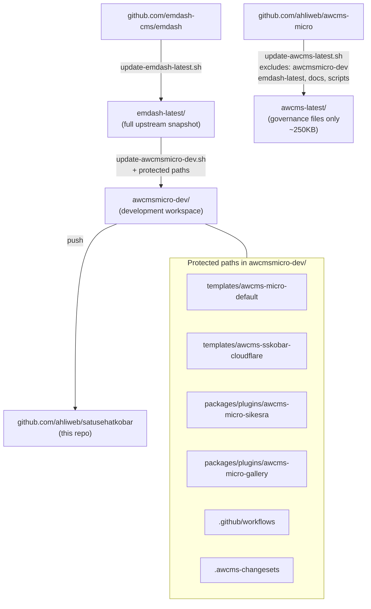

# Repository Structure

## Overview

The root repository is a parent maintenance layer with five primary folders:

- `emdash-latest/` — upstream EmDash reference snapshot
- `awcms-latest/` — upstream AWCMS-Micro reference snapshot
- `awcmsmicro-dev/` — AWCMS-Micro development workspace
- `docs/` — root documentation
- `scripts/` — synchronization and maintenance scripts

## Folder Responsibilities

### `emdash-latest/`

Contains the latest updated EmDash source tree. This folder is the local upstream reference copied from `https://github.com/emdash-cms/emdash`.

Rules:

- Keep it as close to upstream EmDash as possible.
- Use it as the comparison baseline for synchronization work.
- Do not place AWCMS-Micro-specific customization here unless the task is explicitly about analyzing upstream differences.

### `awcms-latest/`

Contains a **lightweight reference snapshot** of the root-level governance files and unique upstream configs from `https://github.com/ahliweb/awcms-micro`. This provides a reference point for comparing upstream governance (AGENTS.md, README.md, CHANGELOG.md, .github workflows, .opencode skills) against the working repository.

Large subdirectories that already exist in the repo root (`awcmsmicro-dev/`, `emdash-latest/`, `docs/`, `scripts/`) and binary archives are intentionally excluded from this snapshot to avoid redundant duplication and excessive repository size growth.

Rules:

- Treat it as a read-only reference. Do not edit it directly.
- Use it to check alignment between upstream governance files and the working repository's root.
- Updated by `bash scripts/update-awcms-latest.sh`.
- Does not contain `awcmsmicro-dev/`, `emdash-latest/`, `docs/`, `scripts/` — those are at the repo root and are authoritative.

### `awcmsmicro-dev/`

Contains a clone of `emdash-latest/` and serves as the AWCMS-Micro development workspace.

Rules:

- Rebuild it from `emdash-latest/` when upstream synchronization is needed.
- Apply AWCMS-Micro-specific example implementation work here.
- Keep new product behavior in plugin and template boundaries rather than introducing a new shared core fork layer.
- Keep AWCMS-Micro-owned additions inside the approved protected paths documented in `docs/awcms-micro-implementation-boundaries.md`.
- Preserve the goal that AWCMS-Micro remains a full EmDash adoption, not a divergent fork of EmDash core.

### `docs/`

Contains root-level technical documentation for this parent repository.

Documents in this folder define:

- the repository structure
- the synchronization workflow
- the implementation instructions and execution model
- the root maintenance versioning and workspace snapshot model
- upstream sync status and divergence tracking
- deployment and security baselines

`docs/prd/` is a distinct sub-package: the Satu Sehat Kobar product specification (26 Markdown documents: 1 PRD induk + 25 supporting docs). It describes the product built on top of `awcmsmicro-dev/` as Native EmDash plugins and the `awcms-sskobar-cloudflare` template. Start from `docs/prd/20.Master Document Index and Implementation Guide.docx.md`; `docs/prd/24.TECHNICAL_IMPLEMENTATION_REFERENCES.md` bridges that spec to this workspace.

### `scripts/`

Contains update and synchronization scripts.

| Script | Purpose |
| --- | --- |
| `update-emdash-latest.sh` | Clone latest EmDash into `emdash-latest/` |
| `update-awcms-latest.sh` | Clone latest `ahliweb/awcms-micro` into `awcms-latest/` |
| `update-awcmsmicro-dev.sh` | Rebuild `awcmsmicro-dev/` from `emdash-latest/` preserving protected paths |
| `sync-and-validate-awcmsmicro-dev.sh` | Combined: update both refs, rebuild, sync env, validate |
| `validate-awcmsmicro-dev.sh` | Run install, typecheck, lint, test, build in `awcmsmicro-dev/` |
| `validate-awcmsmicro-boundaries.sh` | Verify protected paths list consistency |
| `validate-sskobar-config.sh` | Validate canonical config for this workspace |
| `sync-sskobar-env.sh` | Propagate root `.env` to derived config locations |
| `backup/backup-db.sh` | Backup D1/R2/Postgres/SQLite databases |

## AWCMS-Micro Example Locations

- Example template: `awcmsmicro-dev/templates/awcms-micro-default/`
- Example Cloudflare template: `awcmsmicro-dev/templates/awcms-sskobar-cloudflare/`
- Example plugin: `awcmsmicro-dev/packages/plugins/awcms-micro-sikesra/`
- Example gallery plugin: `awcmsmicro-dev/packages/plugins/awcms-micro-gallery/`
- Reserved Cloudflare demo boundary: `awcmsmicro-dev/demos/awcms-micro-cloudflare/`
- Reserved docs boundary: `awcmsmicro-dev/docs/awcms-micro/`
- Reserved gallery docs boundary: `awcmsmicro-dev/docs/gallery/`
- Reserved E2E boundary: `awcmsmicro-dev/e2e/awcms-micro/`
- Reserved AWCMS changesets boundary: `awcmsmicro-dev/.awcms-changesets/`
- Preserved workspace package-release boundary: `awcmsmicro-dev/.changeset/`
- Preserved workflow boundary: `awcmsmicro-dev/.github/workflows/`
- Preserved workflow scripts boundary: `awcmsmicro-dev/.github/scripts/`
- Preserved Dependabot config: `awcmsmicro-dev/.github/dependabot.yml`

These examples are intentionally isolated in new folders and do not replace EmDash built-in templates or built-in plugins.

New AWCMS-Micro product development should be implemented as:

- plugins under `awcmsmicro-dev/packages/plugins/`
- templates under `awcmsmicro-dev/templates/`
- optional supporting docs, demos, and E2E coverage inside the corresponding approved boundaries
- workspace package-release metadata under `awcmsmicro-dev/.changeset/`
- release-note inputs under `awcmsmicro-dev/.awcms-changesets/`
- workflow automation under preserved `.github/` boundaries when needed for AWCMS-Micro-specific release operations

The approved preserved path list for rebuilds lives in `scripts/awcmsmicro-dev-protected-paths.txt` and is governed by `docs/awcms-micro-implementation-boundaries.md`.

## Root-Level Supporting Files

The root repository also contains:

- `README.md`: repository purpose and operator entry point
- `AGENTS.md`: agent-facing execution rules for this parent repository
- `CHANGELOG.md`: root maintenance changelog and workspace snapshot
- `VERSION`: root maintenance release version
- `.awcms-changesets/`: root maintenance release-note inputs
- `.gitignore`: local artifact and secret-protection rules
- local-only `.env`: optional operator secrets, excluded from git

## Language Policy

English (US) is the official language for root-level repository documentation, instructions, scripts, and governance text.

Exceptions:

- `emdash-latest/` preserves upstream EmDash wording as-is
- `awcms-latest/` preserves upstream AWCMS-Micro wording as-is
- `awcmsmicro-dev/` may inherit upstream wording when synchronized from `emdash-latest/`

## Design Principle

The root repository is not a runtime host. It is a maintenance, synchronization, and documentation layer. Product behavior belongs in `awcmsmicro-dev/`, while `emdash-latest/` and `awcms-latest/` remain clean upstream references used for refresh, comparison, and validation.
