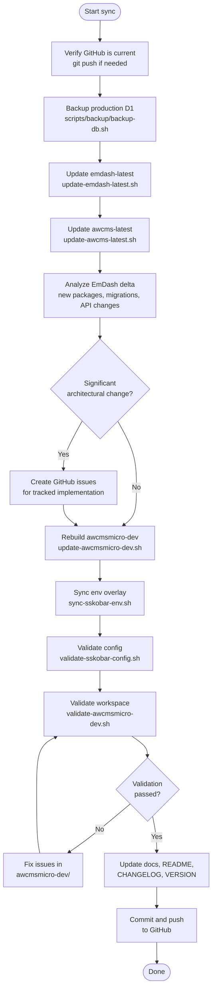
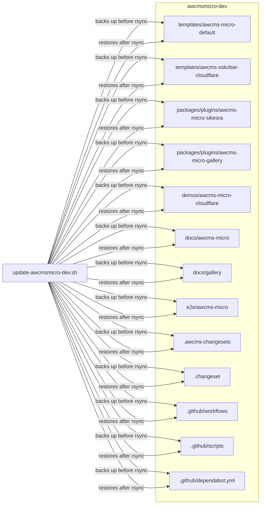

# Synchronization Workflow

## Goal

Keep AWCMS-Micro aligned with the latest EmDash source while preserving a strict separation between:

- the upstream reference tree in `emdash-latest/`
- the upstream AWCMS-Micro reference snapshot in `awcms-latest/`
- the AWCMS-Micro development workspace in `awcmsmicro-dev/`

## Workflow Overview



## Standard Sequence

1. Analyze upstream EmDash changes.
2. Refresh `emdash-latest/` from upstream.
3. Refresh `awcms-latest/` from `ahliweb/awcms-micro`.
4. Rebuild `awcmsmicro-dev/` from `emdash-latest/`.
5. Validate `awcmsmicro-dev/` with `bash scripts/validate-awcmsmicro-dev.sh`.
6. Continue AWCMS-Micro-specific implementation work only inside the approved protected paths in `awcmsmicro-dev/`.
7. Keep new product development in plugin and template boundaries; use docs, demos, and E2E paths only as supporting surfaces.
8. Update root documentation if process, structure, or rules changed.
9. Update the root workspace snapshot in `CHANGELOG.md` when the EmDash upstream SHA or the plugin/template inventory changes.

## Refresh `emdash-latest/`

Run:

```bash
bash scripts/update-emdash-latest.sh
```

Result:

- clones the latest `https://github.com/emdash-cms/emdash`
- replaces the contents of `emdash-latest/`
- excludes upstream `.git` metadata from the copied tree
- writes the EmDash SHA and fetch timestamp to `docs/upstream-sync/LAST_UPSTREAM_FETCH.md`

## Refresh `awcms-latest/`

Run:

```bash
bash scripts/update-awcms-latest.sh
```

Result:

- clones the latest `https://github.com/ahliweb/awcms-micro`
- replaces the contents of `awcms-latest/` with **root-level governance files and unique configs only**
- excludes large subdirectories that already exist in the repo root: `awcmsmicro-dev/`, `emdash-latest/`, `docs/`, `scripts/`
- excludes `.git`, `node_modules`, `dist`, `.astro`, `.wrangler`, and binary archives
- writes the AWCMS-Micro SHA and fetch timestamp to `docs/upstream-sync/LAST_AWCMS_MICRO_FETCH.md`
- keeps `awcms-latest/` at ~250KB (down from the original ~100MB full clone)

## Rebuild `awcmsmicro-dev/`

Run:

```bash
bash scripts/update-awcmsmicro-dev.sh
```

Result:

- copies the current `emdash-latest/` tree into `awcmsmicro-dev/`
- removes stale files in `awcmsmicro-dev/` that no longer exist in `emdash-latest/`
- preserves only the approved AWCMS-Micro paths listed in `scripts/awcmsmicro-dev-protected-paths.txt`, including the workflow and Dependabot config under `awcmsmicro-dev/.github/`
- preserves workspace package-release metadata in `awcmsmicro-dev/.changeset/` alongside the approved AWCMS-Micro paths listed in `scripts/awcmsmicro-dev-protected-paths.txt`
- excludes transient local build artifacts such as `node_modules/`, `dist/`, `.astro/`, `.wrangler/`, `.vite/`, and `.mf/`
- prunes stale directories that remain only because they contain excluded transient artifacts after upstream paths are removed

## Protected AWCMS-Micro Paths

The approved rebuild-safe boundary list is governed by `docs/awcms-micro-implementation-boundaries.md` and stored in `scripts/awcmsmicro-dev-protected-paths.txt`.

Only those listed paths are backed up and restored during `bash scripts/update-awcmsmicro-dev.sh`.

Run `bash scripts/validate-awcmsmicro-boundaries.sh` after boundary or allowlist changes.



## Validate `awcmsmicro-dev/`

Run:

```bash
bash scripts/validate-awcmsmicro-dev.sh
```

Result:

- runs install, typecheck, lint, test, and build commands when `pnpm` is available
- writes the latest validation record to `docs/upstream-sync/LAST_VALIDATION.md`
- fails clearly when dependency install, tests, or validation steps fail

## Combined Sync Workflow

Run:

```bash
bash scripts/sync-and-validate-awcmsmicro-dev.sh
```

This wrapper:

1. Refreshes `emdash-latest/` from upstream EmDash
2. Refreshes `awcms-latest/` from `ahliweb/awcms-micro`
3. Rebuilds `awcmsmicro-dev/` from `emdash-latest/`
4. Runs `sync-sskobar-env.sh`
5. Validates with `validate-sskobar-config.sh`
6. Validates with `validate-awcmsmicro-dev.sh`
7. Updates `docs/upstream-sync/UPSTREAM_SYNC_STATUS.md`

## Operating Rules

- Treat `emdash-latest/` as disposable and reproducible from upstream.
- Treat `awcms-latest/` as disposable and reproducible from upstream.
- Treat `awcmsmicro-dev/` as the only place for AWCMS-Micro implementation work inside this parent repository.
- Keep AWCMS-Micro-owned divergence limited to the approved protected paths rather than editing upstream core locations.
- Keep new product behavior in plugins and templates instead of introducing a parallel shared core implementation layer.
- Keep changes atomic so upstream sync and downstream adaptation can be reviewed separately.
- When a sync or adaptation effort is too large, split it into smaller GitHub issues.
- Keep AWCMS-Micro-specific release automation inputs inside preserved boundaries such as `.awcms-changesets/` and `.github/scripts/`.
- Keep workspace package-release metadata in `awcmsmicro-dev/.changeset/` and downstream AWCMS release-note inputs in `awcmsmicro-dev/.awcms-changesets/`.
- Keep the root maintenance changelog snapshot aligned with the current `emdash-latest/` revision and the latest plugin/template versions in `awcmsmicro-dev/`.

## Language Rule During Synchronization

- Keep root-level workflow and governance documentation in English (US).
- Do not rewrite `emdash-latest/` content to normalize spelling, because it must remain faithful to upstream EmDash.
- Allow `awcmsmicro-dev/` to inherit upstream wording when it is rebuilt from `emdash-latest/`.
