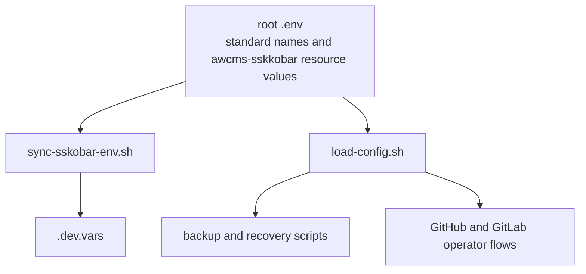

# Backup & Recovery Scripts

Automated backup and disaster recovery tools for AWCMS-Micro development environment.

## Quick Start

### 1. Install Prerequisites

```bash
# age (encryption)
brew install age        # macOS
sudo apt install age    # Ubuntu
sudo pacman -S age      # Arch

# wrangler (Cloudflare CLI)
npm install -g wrangler
```

### 2. Setup Unified Configuration

All backup settings live in one encrypted file: `scripts/backup/.backup-config.age`

The root `.env` file is now the canonical local operator config for the workspace. Keep standard variable names there, use the `awcms-sskkobar` naming family for workspace-owned remote resource values, then sync local runtime outputs with:

```bash
bash scripts/sync-sskobar-env.sh
```

```bash
# Create config from template
cp scripts/backup/.backup-config.example scripts/backup/.backup-config

# Edit with your settings (GitLab, R2, D1, passphrase, etc.)
nano scripts/backup/.backup-config

# Encrypt the config
bash scripts/backup/encrypt-config.sh

# Securely delete unencrypted version
shred -u scripts/backup/.backup-config
```

The encrypted `.backup-config.age` is safe to commit to **private** repositories.
The loader also normalizes legacy GitLab SSH URLs to the current PAT-based HTTPS mirror when `GITLAB_PAT`, `GITLAB_USERNAME`, and `GITLAB_REPO_NAME` are available.
It also reads the canonical root `.env` directly so backup scripts stay aligned with the current operator configuration.

### 3. Using the Config

All scripts automatically read from the encrypted config. You only need to enter the passphrase once per session.
The loader also safely overlays local `.env` files when present, so mirror-only values like `GITLAB_PAT` can be supplied without shell-sourcing arbitrary content.

```bash
# Decrypt config for editing
bash scripts/backup/decrypt-config.sh

# Edit, then re-encrypt
nano scripts/backup/.backup-config
bash scripts/backup/encrypt-config.sh
shred -u scripts/backup/.backup-config
```

## Configuration Reference

| Setting                 | Description                  | Example                  |
| ----------------------- | ---------------------------- | ------------------------ |
| `GITLAB_USERNAME`       | GitLab account username      | `myusername`             |
| `GITLAB_REPO_NAME`      | GitLab repo for mirror       | `awcms-micro`            |
| `GITLAB_PAT`            | GitLab personal access token | `glpat-...`              |
| `R2_BUCKET_NAME`        | Cloudflare R2 bucket         | `awcms-sskkobar-r2backup` |
| `CLOUDFLARE_API_TOKEN`  | Cloudflare API token         | `abc123...`              |
| `CLOUDFLARE_ACCOUNT_ID` | Cloudflare account ID        | `def456...`              |
| `D1_DATABASE_NAME`      | D1 database to backup        | `awcms-sskkobar-d1`      |
| `BACKUP_PASSPHRASE`     | Master encryption key        | `your-secure-passphrase` |
| `BACKUP_CRON_SCHEDULE`  | Backup schedule (cron)       | `0 2 * * *`              |
| `BACKUP_SSH_KEYS`       | Include SSH keys in backup   | `true`                   |
| `NOTIFICATION_METHOD`   | Backup notifications         | `none`, `discord`        |

### Cloudflare Deployment Fields

These mirror the `awcms-sskkobar-worker` deployment settings from `wrangler.jsonc`.

| Setting                                     | Description                 |
| ------------------------------------------- | --------------------------- |
| `CLOUDFLARE_WORKER_NAME`                    | Worker script name          |
| `CLOUDFLARE_WORKER_MAIN`                    | Worker entry file           |
| `CLOUDFLARE_WORKER_COMPATIBILITY_DATE`      | Wrangler compatibility date |
| `CLOUDFLARE_WORKER_COMPATIBILITY_FLAGS`     | Compatibility flags         |
| `CLOUDFLARE_WORKER_ROUTE_PATTERN`           | Route/custom domain pattern |
| `CLOUDFLARE_WORKER_ZONE_NAME`               | Cloudflare zone name        |
| `CLOUDFLARE_WORKER_D1_DATABASE_NAME`        | D1 database name            |
| `CLOUDFLARE_WORKER_D1_DATABASE_ID`          | D1 database ID              |
| `CLOUDFLARE_WORKER_R2_BUCKET_NAME`          | R2 bucket name              |
| `CLOUDFLARE_WORKER_KV_NAMESPACE_ID`         | KV namespace ID             |
| `CLOUDFLARE_WORKER_SITE_URL`                | Public site URL             |
| `CLOUDFLARE_WORKER_STORAGE_PUBLIC_BASE_URL` | Public storage URL          |

## Scripts

### Configuration Management

| Script              | Description                                      |
| ------------------- | ------------------------------------------------ |
| `encrypt-config.sh` | Encrypt `.backup-config` to `.backup-config.age` |
| `decrypt-config.sh` | Decrypt config for editing                       |
| `load-config.sh`    | Source config (used internally by other scripts) |

### Environment Variables

| Script               | Description                  |
| -------------------- | ---------------------------- |
| `encrypt-env.sh`     | Encrypt a single .env file   |
| `decrypt-env.sh`     | Decrypt a .env.age file      |
| `encrypt-all-env.sh` | Batch encrypt all .env files |

```bash
bash scripts/backup/encrypt-env.sh .env
bash scripts/backup/decrypt-env.sh .env.age
bash scripts/backup/encrypt-all-env.sh
```

### Database Backup

| Script         | Description                           |
| -------------- | ------------------------------------- |
| `backup-db.sh` | Backup database to R2 with encryption |

```bash
# Uses config defaults (D1 + R2)
bash scripts/backup/backup-db.sh --type d1

# Override config values
bash scripts/backup/backup-db.sh --type postgres --name mydb --bucket my-bucket

# Dry run
bash scripts/backup/backup-db.sh --type d1 --dry-run
```

### Dotfiles Backup

| Script                | Description                          |
| --------------------- | ------------------------------------ |
| `backup-dotfiles.sh`  | Backup dotfiles to encrypted archive |
| `restore-dotfiles.sh` | Restore dotfiles from backup         |

```bash
bash scripts/backup/backup-dotfiles.sh
bash scripts/backup/backup-dotfiles.sh --include-secrets
bash scripts/backup/restore-dotfiles.sh ~/dotfiles-backup-20260525.tar.gz.age
```

### Recovery

| Script                  | Description                         |
| ----------------------- | ----------------------------------- |
| `recovery-checklist.sh` | Interactive disaster recovery guide |

```bash
bash scripts/backup/recovery-checklist.sh
```

## Automated Backups

| Workflow               | Schedule       | Description           |
| ---------------------- | -------------- | --------------------- |
| `backup-automated.yml` | Daily 2 AM UTC | Database backup to R2 |
| `mirror-to-gitlab.yml` | On every push  | Mirror repo to GitLab |

### GitHub Secrets Required

These must match your `.backup-config` values:

| Secret                  | Source from Config      |
| ----------------------- | ----------------------- |
| `CLOUDFLARE_API_TOKEN`  | `CLOUDFLARE_API_TOKEN`  |
| `CLOUDFLARE_ACCOUNT_ID` | `CLOUDFLARE_ACCOUNT_ID` |
| `D1_DATABASE_NAME`      | `D1_DATABASE_NAME`      |
| `R2_BUCKET_NAME`        | `R2_BUCKET_NAME`        |
| `BACKUP_PASSPHRASE`     | `BACKUP_PASSPHRASE`     |
| `GITHUB_PAT`            | `GITHUB_PAT`            |
| `GITLAB_PAT`            | `GITLAB_PAT`            |
| `GITLAB_USERNAME`       | `GITLAB_USERNAME`       |
| `GITLAB_REPO_NAME`      | `GITLAB_REPO_NAME`      |

### GitHub Actions Fields

| Setting                                 | Description                    |
| --------------------------------------- | ------------------------------ |
| `GITHUB_ACTION_DEPLOY_WORKFLOW`         | Deploy workflow filename       |
| `GITHUB_ACTION_BACKUP_WORKFLOW`         | Backup workflow filename       |
| `GITHUB_ACTION_MIRROR_WORKFLOW`         | Mirror workflow filename       |
| `GITHUB_ACTION_DEPLOY_BRANCH`           | Deploy trigger branch          |
| `GITHUB_ACTION_BACKUP_CRON`             | Backup cron schedule           |
| `GITHUB_ACTION_TEMPLATE_NAME`           | Canonical deployment identifier |
| `GITHUB_ACTION_WORKER_TEMPLATE_PACKAGE` | Build target package           |
| `GITHUB_ACTION_NODE_VERSION`            | Node version used by workflows |
| `GITHUB_ACTION_PNPM_VERSION`            | pnpm version used by workflows |

### GitHub Repository Variables

Set these as repository variables (not secrets) so workflows can stay aligned with the unified config names:

| Variable                                | Recommended Value                          |
| --------------------------------------- | ------------------------------------------ |
| `GITLAB_USERNAME`                       | `ahliweb`                                  |
| `GITLAB_REPO_NAME`                      | `awcms-micro`                              |
| `GITHUB_ACTION_NODE_VERSION`            | `22`                                       |
| `GITHUB_ACTION_PNPM_VERSION`            | `11.1.3`                                   |
| `GITHUB_ACTION_TEMPLATE_NAME`           | `awcms-sskkobar`                           |
| `GITHUB_ACTION_WORKER_TEMPLATE_PACKAGE` | `@awcms-sskobar/template-sskobar-cloudflare` |

## Security Model



```
Unencrypted (NEVER commit)          Encrypted (SAFE to commit in private repo)
─────────────────────────           ─────────────────────────────────────────
.backup-config                  →   .backup-config.age
.env                            →   .env.age
awcmsmicro-dev/.env             →   awcmsmicro-dev/.env.age
dotfiles-backup.tar.gz          →   dotfiles-backup.tar.gz.age
database-export.sql             →   database-export.sql.age
```

- All encryption uses **age** (passphrase-based, audited)
- Originals are securely deleted with `shred` after encryption
- Store `BACKUP_PASSPHRASE` in a password manager (1Password, Bitwarden)
- The encrypted `.age` files are safe to store in private repos or cloud storage

## Recovery Process

1. Clone repo from GitHub or GitLab mirror
2. Run `bash scripts/backup/recovery-checklist.sh`
3. Decrypt config: `bash scripts/backup/decrypt-config.sh`
4. Restore dotfiles, env files, and databases
5. Verify deployment

## Documentation

- [GitLab Mirror Setup](../../docs/backup/gitlab-mirror-setup.md)
